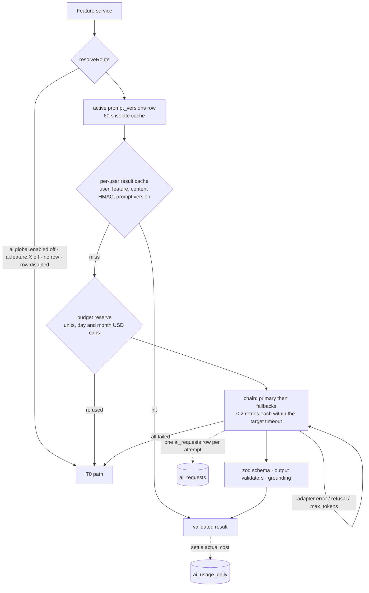

# Dijital Asistan: AI pipeline (as built)

Documented at `ec14e92`.

How the product uses language models, embeddings and speech as implemented. The design intent is
[AI_PIPELINE_PLAN.md](AI_PIPELINE_PLAN.md); every prompt is listed in
[AI_PROMPTS.md](AI_PROMPTS.md). This page and AI_PROMPTS.md are the only docs that name models.
The model tables below are **generated** from the seeds that migration 0005 embeds; the seeds are
insert-once defaults, and the backoffice (`/ai/models`, audited) owns the rows afterwards.

Code: [`supabase/functions/_shared/ai`](../supabase/functions/_shared/ai) (router, call
orchestration, budget, cache, pricing, telemetry, prompt registry, provider adapters, evals) and
[`_shared/services/ai`](../supabase/functions/_shared/services/ai) plus the feature services
(briefings, meetings, replies, capture, assistant, memory, voice).

## Tiers

| Tier | What runs | Examples |
|---|---|---|
| T0 | Code only | Mail prefilters (Gmail categories, `List-Unsubscribe`, `Precedence`, `Auto-Submitted`, no-reply, ESP DKIM domains, Cc-only), `priority_rules`, VIP, learned preferences, Turkish extractors (dates, times, amounts, tracking, flight, PNR), JSON-LD and sender parsers for life events, the commitment pre-signal, thread follow-up state, the slot finder, the assistant intent grammar, deterministic midday and evening briefings, template morning briefing |
| T1 | Small, fast model | Triage (≤ 5 mails per request), commitments, life-intel fallback, post-meeting notes, text and link capture, assistant intent, optional briefing polish |
| T2 | Large model | Morning briefing, thread summary, deep extraction, meeting prep, weekly review, reply and follow-up drafts, vision and PDF capture, grounded assistant answers |
| T3 | Escalation target | Configured on `capture_extract` (reasoning) and `assistant_qa` in the `balanced` profile and resolved only with `ai.model.large.enabled` and `ai.model.opus_escalation` on. Called once (`generateStructured({escalate:true})`: the escalation target alone, budget-reserved at its price, an `ai_requests` row with tier `t3`, cached apart from the T2 result): scanned PDFs go to it first; photo and text-PDF captures whose quotes failed verification, deep extractions that lost a field to grounding, and grounded assistant answers with coverage below 0.8 are asked again and the better result wins. No target, a refusal or a failure keeps the T2 result |

Every AI step has a T0 path: a refusal (kill switch, missing configuration, exhausted budget,
unavailable chain) returns `{kind:'t0', reason}` instead of throwing, background jobs keep the
deterministic result (`ai_status = 'skipped_budget' | 'skipped_flag'`), and interactive routes map the
reason to an API error (`QUOTA_EXCEEDED`, `FEATURE_DISABLED`, `EXTERNAL_CREDENTIAL_REQUIRED`).

## Call path

[`_shared/ai/call.ts`](../supabase/functions/_shared/ai/call.ts) `generateStructured` is the only
path to a structured model call; streaming answers, embeddings and speech go through
[`resolveRoute`](../supabase/functions/_shared/ai/router.ts) and the same telemetry and budget
settlement.

## Routing

### Route resolution

1. Kill switches: `ai.global.enabled` and `ai.feature.<feature>` off → T0.
2. Profile: `plan_limits.ai_routing_profile` of the user's effective plan, seeded `free → lean`,
   `pro → balanced`; system calls without a user use `balanced`.
3. The `ai_model_config` row for `(profile, feature)`; where a feature has two rows
   (`capture_extract`: `classifier` for text and links, `reasoning` for photos and PDFs) the caller
   names the role. A missing or disabled row → T0.
4. Chain = primary + `fallback_targets` in order. With `ai.model.large.enabled` off a T2 primary is
   skipped and the chain starts at its first fallback.
5. Targets are dropped when their provider switch is off (`ai.provider.anthropic|openai|voyage.enabled`),
   when no adapter has a credential, or when the circuit breaker is open
   (`private.ai_breaker_state`: at least 5 calls in the last 60 s with ≥ 50 % errors or timeouts).
   Nothing left → T0 `no_target`.
6. The escalation target is resolved only with `ai.model.large.enabled` and
   `ai.model.opus_escalation` on.

Config rows and profiles are cached per isolate for 60 s, breaker states for 5 s. Model-specific
request rules (thinking, effort, sampling, cache breakpoints, `inference_geo`) are keyed by the
target's `params` and optional `params.capabilities`, never by model name
([`providers/capabilities.ts`](../supabase/functions/_shared/ai/providers/capabilities.ts)).
Model ids are data: `scripts/functions/check-guards.ts` fails on a model-id literal in function
code outside adapter tests and fixtures, and the `ai_model_config` check constraint
(`private.model_routable`) refuses excluded models as primary, fallback or escalation target.

### Routing tables (seeded)

Generated by [`scripts/docs/gen-ai-routing.ts`](../scripts/docs/gen-ai-routing.ts) from
[`supabase/seed/ai_model_config.sql`](../supabase/seed/ai_model_config.sql)
(`--check` runs in `pnpm test:scripts`).

<!-- generated:routing:start -->

#### Profile `balanced` (21 rows)

| Feature | Role | Tier | Primary | Fallback chain (in order) | T3 escalation target | Batch | Cache | Max input tokens | Enabled |
|---|---|---|---|---|---|---|---|---|---|
| `email_triage` | classifier | T1 | `anthropic` `claude-haiku-4-5-20251001` · 1,500 out · 20 s | 1. `anthropic` `claude-sonnet-5` · effort low · thinking disabled · 1,500 out · 20 s 2. `openai` `gpt-5.6-luna` · effort minimal · 1,500 out · 20 s | – | `non_urgent` | `5m` | 12,000 | yes |
| `thread_summary` | reasoning | T2 | `anthropic` `claude-sonnet-5` · effort low · thinking adaptive · 1,200 out · 45 s | 1. `anthropic` `claude-haiku-4-5-20251001` · 1,200 out · 45 s 2. `openai` `gpt-5.6-terra` · effort low · 1,200 out · 45 s | – | `never` | `5m` | 8,000 | yes |
| `email_deep_extract` | reasoning | T2 | `anthropic` `claude-sonnet-5` · effort low · thinking adaptive · 2,500 out · 45 s | 1. `anthropic` `claude-haiku-4-5-20251001` · 2,500 out · 45 s 2. `openai` `gpt-5.6-terra` · effort low · 2,500 out · 45 s | – | `non_urgent` | `5m` | 8,000 | yes |
| `commitment_extract` | classifier | T1 | `anthropic` `claude-haiku-4-5-20251001` · 1,200 out · 20 s | 1. `anthropic` `claude-sonnet-5` · effort low · thinking disabled · 1,200 out · 20 s 2. `openai` `gpt-5.6-luna` · effort minimal · 1,200 out · 20 s | – | `non_urgent` | `5m` | 8,000 | yes |
| `life_intel_extract` | classifier | T1 | `anthropic` `claude-haiku-4-5-20251001` · 1,500 out · 20 s | 1. `anthropic` `claude-sonnet-5` · effort low · thinking disabled · 1,500 out · 20 s 2. `openai` `gpt-5.6-luna` · effort minimal · 1,500 out · 20 s | – | `non_urgent` | `5m` | 8,000 | yes |
| `briefing_morning` | reasoning | T2 | `anthropic` `claude-sonnet-5` · effort low · thinking adaptive · 2,000 out · 60 s | 1. `anthropic` `claude-haiku-4-5-20251001` · 2,000 out · 60 s 2. `openai` `gpt-5.6-terra` · effort low · 2,000 out · 60 s | – | `never` | `5m` | 8,000 | yes |
| `briefing_midday` | reasoning | T1 | `anthropic` `claude-haiku-4-5-20251001` · 600 out · 20 s | – | – | `never` | `5m` | 4,000 | yes |
| `briefing_evening` | reasoning | T1 | `anthropic` `claude-haiku-4-5-20251001` · 600 out · 20 s | – | – | `never` | `5m` | 4,000 | yes |
| `weekly_review` | reasoning | T2 | `anthropic` `claude-sonnet-5` · effort low · thinking adaptive · 1,500 out · 60 s | 1. `anthropic` `claude-haiku-4-5-20251001` · 1,500 out · 60 s | – | `always` | `1h` | 10,000 | yes |
| `meeting_prep` | reasoning | T2 | `anthropic` `claude-sonnet-5` · effort medium · thinking adaptive · 3,000 out · 60 s | 1. `anthropic` `claude-haiku-4-5-20251001` · 3,000 out · 60 s 2. `openai` `gpt-5.6-terra` · effort low · 3,000 out · 60 s | – | `never` | `5m` | 12,000 | yes |
| `post_meeting_parse` | classifier | T1 | `anthropic` `claude-haiku-4-5-20251001` · 800 out · 15 s | 1. `openai` `gpt-5.6-luna` · effort minimal · 800 out · 15 s | – | `never` | `5m` | 6,000 | yes |
| `capture_extract` | classifier | T1 | `anthropic` `claude-haiku-4-5-20251001` · 2,000 out · 45 s | 1. `anthropic` `claude-sonnet-5` · effort low · thinking disabled · 2,000 out · 45 s 2. `openai` `gpt-5.6-terra` · effort low · 2,000 out · 45 s | – | `never` | `5m` | 8,000 | yes |
| `capture_extract` | reasoning | T2 | `anthropic` `claude-sonnet-5` · effort low · thinking adaptive · 4,000 out · 90 s | 1. `openai` `gpt-5.6-terra` · effort low · 4,000 out · 90 s | `anthropic` `claude-opus-5-5` · effort low · 4,000 out · 90 s | `never` | `5m` | 16,000 | yes |
| `assistant_intent` | classifier | T1 | `anthropic` `claude-haiku-4-5-20251001` · 400 out · 8 s | 1. `openai` `gpt-5.6-luna` · effort minimal · 400 out · 8 s | – | `never` | `5m` | 6,000 | yes |
| `assistant_qa` | assistant | T2 | `anthropic` `claude-sonnet-5` · effort low · thinking adaptive · 1,500 out · 45 s | 1. `anthropic` `claude-haiku-4-5-20251001` · 1,500 out · 45 s 2. `openai` `gpt-5.6-terra` · effort low · 1,500 out · 45 s | `anthropic` `claude-opus-5-5` · effort low · 1,500 out · 45 s | `never` | `5m` | 16,000 | yes |
| `reply_draft` | reasoning | T2 | `anthropic` `claude-sonnet-5` · effort low · thinking adaptive · 2,500 out · 45 s | 1. `anthropic` `claude-haiku-4-5-20251001` · 2,500 out · 45 s 2. `openai` `gpt-5.6-terra` · effort low · 2,500 out · 45 s | – | `never` | `5m` | 8,000 | yes |
| `follow_up_draft` | reasoning | T2 | `anthropic` `claude-sonnet-5` · effort low · thinking adaptive · 800 out · 30 s | 1. `anthropic` `claude-haiku-4-5-20251001` · 800 out · 30 s 2. `openai` `gpt-5.6-terra` · effort low · 800 out · 30 s | – | `never` | `5m` | 6,000 | yes |
| `embedding_doc` | embedding | T1 | `voyage` `voyage-4` · 20 s · document · 1024-d | – | – | `non_urgent` | – | 32,000 | yes |
| `embedding_query` | embedding | T1 | `voyage` `voyage-4-lite` · 20 s · query · 1024-d | – | – | `never` | – | 32,000 | yes |
| `stt` | stt | T1 | `openai` `gpt-transcribe` · 30 s · tr | 1. `deepgram` `nova-3` · 30 s · tr | – | `never` | – | 16,000 | yes |
| `tts` | tts | T1 | `openai` `gpt-4o-mini-tts` · 30 s | – | – | `never` | – | 16,000 | yes |

#### Profile `lean` (21 rows)

| Feature | Role | Tier | Primary | Fallback chain (in order) | T3 escalation target | Batch | Cache | Max input tokens | Enabled |
|---|---|---|---|---|---|---|---|---|---|
| `email_triage` | classifier | T1 | `anthropic` `claude-haiku-4-5-20251001` · 1,500 out · 20 s | 1. `openai` `gpt-5.6-luna` · effort minimal · 1,500 out · 20 s | – | `non_urgent` | `5m` | 12,000 | yes |
| `thread_summary` | reasoning | T1 | `anthropic` `claude-haiku-4-5-20251001` · 1,200 out · 45 s | 1. `openai` `gpt-5.6-luna` · effort minimal · 1,200 out · 45 s | – | `never` | `5m` | 8,000 | yes |
| `email_deep_extract` | reasoning | T1 | `anthropic` `claude-haiku-4-5-20251001` · 2,500 out · 45 s | 1. `openai` `gpt-5.6-luna` · effort minimal · 2,500 out · 45 s | – | `non_urgent` | `5m` | 8,000 | yes |
| `commitment_extract` | classifier | T1 | `openai` `gpt-5.6-luna` · effort minimal · 1,200 out · 20 s | 1. `anthropic` `claude-haiku-4-5-20251001` · 1,200 out · 20 s | – | `non_urgent` | `5m` | 8,000 | yes |
| `life_intel_extract` | classifier | T1 | `openai` `gpt-5.6-luna` · effort minimal · 1,500 out · 20 s | 1. `anthropic` `claude-haiku-4-5-20251001` · 1,500 out · 20 s | – | `non_urgent` | `5m` | 8,000 | yes |
| `briefing_morning` | reasoning | T1 | `anthropic` `claude-haiku-4-5-20251001` · 2,000 out · 60 s | – | – | `never` | `5m` | 8,000 | yes |
| `briefing_midday` | reasoning | T1 | `anthropic` `claude-haiku-4-5-20251001` · 600 out · 20 s | – | – | `never` | `5m` | 4,000 | **no** |
| `briefing_evening` | reasoning | T1 | `anthropic` `claude-haiku-4-5-20251001` · 600 out · 20 s | – | – | `never` | `5m` | 4,000 | **no** |
| `weekly_review` | reasoning | T1 | `anthropic` `claude-haiku-4-5-20251001` · 1,500 out · 60 s | – | – | `always` | `1h` | 10,000 | yes |
| `meeting_prep` | reasoning | T2 | `anthropic` `claude-sonnet-5` · effort medium · thinking adaptive · 3,000 out · 60 s | 1. `anthropic` `claude-haiku-4-5-20251001` · 3,000 out · 60 s 2. `openai` `gpt-5.6-terra` · effort low · 3,000 out · 60 s | – | `never` | `5m` | 12,000 | yes |
| `post_meeting_parse` | classifier | T1 | `anthropic` `claude-haiku-4-5-20251001` · 800 out · 15 s | 1. `openai` `gpt-5.6-luna` · effort minimal · 800 out · 15 s | – | `never` | `5m` | 6,000 | yes |
| `capture_extract` | classifier | T1 | `anthropic` `claude-haiku-4-5-20251001` · 2,000 out · 45 s | 1. `openai` `gpt-5.6-terra` · effort low · 2,000 out · 45 s | – | `never` | `5m` | 8,000 | yes |
| `capture_extract` | reasoning | T2 | `anthropic` `claude-sonnet-5` · effort low · thinking adaptive · 4,000 out · 90 s | 1. `openai` `gpt-5.6-terra` · effort low · 4,000 out · 90 s | – | `never` | `5m` | 16,000 | yes |
| `assistant_intent` | classifier | T1 | `openai` `gpt-5.6-luna` · effort minimal · 400 out · 8 s | 1. `anthropic` `claude-haiku-4-5-20251001` · 400 out · 8 s | – | `never` | `5m` | 6,000 | yes |
| `assistant_qa` | assistant | T2 | `anthropic` `claude-sonnet-5` · effort low · thinking adaptive · 1,500 out · 45 s | 1. `anthropic` `claude-haiku-4-5-20251001` · 1,500 out · 45 s 2. `openai` `gpt-5.6-terra` · effort low · 1,500 out · 45 s | – | `never` | `5m` | 16,000 | yes |
| `reply_draft` | reasoning | T2 | `anthropic` `claude-sonnet-5` · effort low · thinking adaptive · 2,500 out · 45 s | 1. `anthropic` `claude-haiku-4-5-20251001` · 2,500 out · 45 s 2. `openai` `gpt-5.6-terra` · effort low · 2,500 out · 45 s | – | `never` | `5m` | 8,000 | yes |
| `follow_up_draft` | reasoning | T1 | `anthropic` `claude-haiku-4-5-20251001` · 800 out · 30 s | 1. `openai` `gpt-5.6-luna` · effort minimal · 800 out · 30 s | – | `never` | `5m` | 6,000 | yes |
| `embedding_doc` | embedding | T1 | `voyage` `voyage-4` · 20 s · document · 1024-d | – | – | `non_urgent` | – | 32,000 | yes |
| `embedding_query` | embedding | T1 | `voyage` `voyage-4-lite` · 20 s · query · 1024-d | – | – | `never` | – | 32,000 | yes |
| `stt` | stt | T1 | `openai` `gpt-transcribe` · 30 s · tr | 1. `deepgram` `nova-3` · 30 s · tr | – | `never` | – | 16,000 | yes |
| `tts` | tts | T1 | `openai` `gpt-4o-mini-tts` · 30 s | – | – | `never` | – | 16,000 | **no** |

<!-- generated:routing:end -->

`balanced` is the Pro profile, `lean` the Free profile. `lean` differs by: T1 primaries for thread
summary, deep extraction, morning briefing, weekly review and follow-up drafts; the small OpenAI
model as primary for commitments, life intel and assistant intent; no T3 escalation; midday and
evening polish and premium TTS rows disabled.

## Budgets, kill switches and degradation

**Per user** ([`_shared/ai/budget.ts`](../supabase/functions/_shared/ai/budget.ts),
`private.ai_budget_reserve` / `ai_budget_settle`): before every call the estimated cost (price of
the primary × `max_input_tokens` and its `max_output_tokens`) and the call's units are reserved
against the user's local day, serialised per user and day:

| `plan_limits` key | Free | Pro | Effect |
|---|---|---|---|
| `ai_daily_budget_units` | 50 | 600 | Units per local day (a triage request counts one unit per mail); briefings consume no units. Exhausted → refused (`units_exhausted`) |
| `ai_soft_cap_usd_day` | 0.02 | 0.20 | Above it the reservation is level `l1` (for example reply drafts then generate only the requested tone) |
| `ai_hard_cap_usd_day` | 0.03 | 0.60 | Refused (`hard_cap_day`); non-briefing features may use only `1 − ai_briefing_reserve_ratio` of it |
| `ai_hard_cap_usd_month` | 0.90 | 6.00 | Refused (`hard_cap_month`), calendar month in the user's time zone |
| `ai_briefing_reserve_ratio` | 0.25 | 0.15 | Share of the daily hard cap kept for briefings |

A refused reservation writes a `budget_blocked` telemetry row and returns T0
`ai_budget_exhausted`; interactive routes answer `QUOTA_EXCEEDED {limit_key}`. Unsettled holds are
released by `scheduler_tick`. Feature quotas (`email_analysis_daily`, `reply_drafts_daily`,
`assistant_messages_daily`, `semantic_search_daily`, `captures_daily`, `meeting_preps_daily`,
`transcribe_seconds_daily`) are checked separately through `check_plan_limit`, which counts usage
from `ai_usage_daily` and `ai_requests`.

**Organisation ceiling:** `private.ai_org_budget_evaluate` runs every 5 minutes (from
`scheduler_tick`) against today's UTC spend in `ai_requests` and the `ai.budget.org_daily_usd`
flag payload (seeded `{"usd": 50}`, an owner decision to confirm). It audits 50 %, 80 % and 100 %
once per day and at 100 % switches off `ai.model.large.enabled` and `ai.model.opus_escalation`
(audited, re-enabled in the backoffice).

**Switches** (`feature_flags`, evaluated per user with targeting; every change audited):

| Flag | Seeded | Effect as built |
|---|---|---|
| `ai.global.enabled` | on | Off → every feature on its T0 path |
| `ai.feature.<feature>` (one per `ai_feature`) | on | Off → that feature on T0 |
| `ai.provider.anthropic.enabled`, `…openai…`, `…voyage…` | on | Off → that provider's targets are skipped (Voyage off → search is FTS-only) |
| `ai.model.large.enabled` | on | Off → T2 primaries fall to their first fallback |
| `ai.model.opus_escalation` | off | Gates the T3 escalation calls above and the acceptance of scanned PDFs in capture |
| `ai.feature.briefing_polish` | off | Enables the optional T1 polish of midday and evening item copy |
| `ai.batch.enabled` | on | Weekly review through Message Batches |
| `ai.backfill.enabled` | on | Model work on backfilled mail (days 4–N of the initial sync, triage `origin: 'backfill'`): off → the T0 triage stays (`ai_status = 'skipped_flag'`) with no analysis or embedding; on → Pro users only (Free keeps its deterministic result) |
| `ai.budget.org_daily_usd` | on, 50 USD | The organisation ceiling above |
| `voice.stt_server`, `voice.tts_premium` | on, off | Server speech-to-text; premium text-to-speech |

## Cost model

- **Price book** (`ai_model_prices`, USD; the newest `effective_from` row applies; editable in the
  backoffice with `ai.models.write`). Anthropic and Voyage prices were verified on 2026-09-23;
  OpenAI and Deepgram prices come from secondary sources and must be re-verified on the vendor pages
  before production (manual step recorded in the seed header).

<!-- generated:prices:start -->

| Provider | Model | Input / MTok | Output / MTok | Cache write 5 m / MTok | Cache write 1 h / MTok | Cache read / MTok | Audio / min | Characters / 1 M | Effective from |
|---|---|---|---|---|---|---|---|---|---|
| `anthropic` | `claude-haiku-4-5-20251001` | $1 | $5 | $1.25 | $2 | $0.1 | – | – | 2026-09-23 |
| `anthropic` | `claude-sonnet-5` | $2 | $10 | $2.5 | $4 | $0.2 | – | – | 2026-09-23 |
| `anthropic` | `claude-opus-5-5` | $4 | $20 | $5 | $8 | $0.2 | – | – | 2026-09-23 |
| `voyage` | `voyage-4` | $0.06 | $0 | – | – | – | – | – | 2026-09-23 |
| `voyage` | `voyage-4-lite` | $0.02 | $0 | – | – | – | – | – | 2026-09-23 |
| `openai` | `gpt-5.6-luna` | $0.2 | $1.2 | – | – | – | – | – | 2026-09-23 |
| `openai` | `gpt-5.6-terra` | $2 | $12 | – | – | – | – | – | 2026-09-23 |
| `openai` | `gpt-transcribe` | $0 | $0 | – | – | – | $0.0045 | – | 2026-09-23 |
| `openai` | `gpt-4o-mini-tts` | $0 | $0 | – | – | – | $0.015 | – | 2026-09-23 |
| `deepgram` | `nova-3` | $0 | $0 | – | – | – | $0.0043 | – | 2026-09-23 |

<!-- generated:prices:end -->

- **Formula** ([`_shared/ai/pricing.ts`](../supabase/functions/_shared/ai/pricing.ts), integer
  pico-dollars with `BigInt`, no floating point):
  `input × in + cache_write_5m × cw5 + cache_write_1h × cw1h + cache_read × cr + output × out
  (+ audio minutes × audio + characters × chars / 10⁶)`, × (1 − `batch_discount`) for batches,
  × 1.1 with `inference_geo = "us"`. Prices are cached per isolate for 60 s.
- **Telemetry** ([`_shared/ai/telemetry.ts`](../supabase/functions/_shared/ai/telemetry.ts)): one
  `ai_requests` row per provider attempt, plus `cached`, `budget_blocked` and `killed` rows at cost
  0, restricted to an allow-list of columns (ids, feature, tier, provider, model, prompt version,
  schema, token counts, cost, latency, status, error code, grounding counters, fallback flags; never
  prompts, outputs, subjects, names or addresses). `ai_usage_daily` holds the per-user daily
  totals; `ai_metrics_daily` the aggregates for the backoffice AI pages.
- **Reconciliation:** from 03:30 UTC `reconciliation {scope:'ai_cost'}` compares yesterday's
  recorded spend per provider with the Anthropic cost report and the OpenAI costs API
  (`ANTHROPIC_ADMIN_API_KEY`, `OPENAI_ADMIN_API_KEY`); drift above 5 % writes a `degraded` health
  row and an audit alert, and a missing admin key is recorded as `external_credential_required`.

## Prompt assembly and injection defences

- **Untrusted content** (mail bodies, pages, notes, summaries derived from them, transcripts) enters
  only the user turn, inside `<untrusted_content id kind nonce>` blocks with `&`, `<` and `>`
  escaped, so it can neither close its block nor open a tag. Refs are request aliases (`m1`, `e2`,
  `p3`), never database or provider ids. The system block carries the fixed rule that these blocks
  are data, and the per-deploy canary `DA-CANARY-{8 hex}`
  ([`untrusted.ts`](../supabase/functions/_shared/ai/untrusted.ts),
  [`prompts/assemble.ts`](../supabase/functions/_shared/ai/prompts/assemble.ts)).
- **Before the model** ([`services/ai/hygiene.ts`](../supabase/functions/_shared/services/ai/hygiene.ts)):
  quoted history, signatures, legal disclaimers, unsubscribe footers and tracking URLs are stripped
  and the text is capped (triage 1,200 tokens per mail, deep extraction 4,000, thread messages
  700); IBANs (mod-97), card numbers (Luhn), TCKN (checksum), one-time codes and passwords are
  replaced by fixed markers; bodies from health senders never reach a model; security notices
  stay on T0.
- **Pre-scan:** `prescanInjection` (`@da/domain`) flags instruction-like text; the model's own
  `injection_suspected` is combined with it. A flagged source yields no proposals, no approvals and
  no commitments.
- **No tools:** extraction and assistant calls carry no tool definitions and no tool rounds; every
  side effect is a pending approval that the user taps (R-03).
- **Data Source Controls** (`user_preferences.ai_data_access`, five booleans; changes are
  audited) go through one guard,
  [`_shared/policy/data-access.ts`](../supabase/functions/_shared/policy/data-access.ts). Context
  builders tag every prompt part that carries a class; `callModel` drops tagged parts whose class is
  off (the result cache key includes the guard state), and the direct model callers (capture,
  reply drafts, the assistant) filter through the same functions:
  - `mail_body` off: no mail body reaches a model (triage uses headers and snippets, deep analysis
    is skipped, thread summaries and drafts answer `DATA_SOURCE_DISABLED`), and summaries or key
    points derived from bodies stay out of briefings, meeting prep, the assistant and memory;
  - `attachments` off: file and photo captures answer `DATA_SOURCE_DISABLED` (a queued one fails
    with that code in JOB-27 and its file is removed), attachment names never reach reply drafts;
  - `calendar` off: prompts keep an event's title and time only (no attendees, location or
    description) in briefings, meeting prep, post-meeting notes, briefing audio and the assistant;
  - `contacts` off: no contact book data (person profiles and facts, VIP marks in triage, person
    scopes and contact rows in the assistant, meeting-prep contacts);
  - `location_coarse` (off by default): nothing produces it; any future source must be tagged with
    it.
  The embedding job skips chunks of a class that is off, and chunks of that class already stored
  are filtered out of retrieval (assistant, search answer) until the class is on again.
- **Provider metadata:** requests carry an HMAC pseudonym of the user
  (`HMAC(AI_HASH_PEPPER, 'provider:'||user_id)`) for abuse monitoring, never the user id or e-mail.

## Grounding and output safety

"The model locates, code computes":

- Structured outputs cite a request alias and a verbatim quote (≤ 200 characters). Code verifies
  the quote against that document after Turkish normalisation and re-parses dates, times, amounts
  and identifiers from the verified span only, in the user's time zone
  ([`services/ai/grounding.ts`](../supabase/functions/_shared/services/ai/grounding.ts),
  `@da/domain` `grounding/`). Anything unverified is dropped and recorded in `dropped_fields`
  (shown as "Kaynakta kesinleşmiyor."); counters go to `ai_requests.grounding_*`.
- After zod, the output validators
  ([`output-validators.ts`](../supabase/functions/_shared/ai/output-validators.ts)) run on every
  string: the canary, instruction echoes and UUID-like identifiers are rejected; URLs, e-mail
  addresses and phone numbers that do not occur in the sources are dropped; markup is stripped;
  refs must be request aliases (the cross-user guard); proposals from an injection-suspected source
  are dropped. The cleaned object is parsed again; failure is `OUTPUT_REJECTED`.
- Reply drafts: recipients never come from model output; drafts are checked against word caps and
  may not invent a URL, address, phone or number. Capture: every field needs its quote in the
  source (or in the model's own transcript for images).
- Assistant answers stream on the `assistant_qa` route with the retrieved rows as `search_result`
  blocks; the server buffers to sentence boundaries and emits only sentences with at least one
  citation whose digits, month names and proper nouns occur in the cited results; a partly
  supported sentence gets "Kaynakta kesinleşmiyor.", and no verified sentence ends as
  `refused_ungrounded` with the "bulamadım" copy. Adapters without native streaming answer through
  `AssistantGroundedJsonV1` with verified quotes.

## Caching and batching

- **Result cache** (`ai_result_cache`): keyed by user, feature, content hash and prompt version;
  `content_hash = HMAC(HMAC(AI_HASH_PEPPER, user_id), normalised content)`, so equal content of two
  users never correlates. Only validated, grounded results are stored; entries expire with the
  user's retention policy.
- **Prompt caching:** the static system block is the cacheable prefix (`cache_ttl` per row, `5m`
  or `1h`); the per-request nonce and untrusted content are never part of it.
- **Batches:** `ai_batch` (JOB-28) runs the weekly review through Anthropic Message Batches when
  `ai.batch.enabled` is on: submit, collect every 5 minutes until the batch ends, fall back to the
  synchronous route after 17:30 local or 24 h, apply each result once, purge provider-side
  results. Triage is micro-batched (≤ 5 mails per request) in real time.

## Embeddings and retrieval

- **Memory chunks** ([`services/memory/chunk.ts`](../supabase/functions/_shared/services/memory/chunk.ts)):
  derived facts only (summaries, key points, events, commitments, life events, capture
  extractions, meeting-note summaries, person facts), never a raw mail body, at most 2,000
  characters, with the provenance of the source row, the contacts it concerns and the source's
  `expires_at`.
- **Embedding job** (JOB-16, Pro only): chunks are upserted by content hash and embedded through the
  `embedding_doc` route (1024-dimensional, `input_type: document`); without a provider or on a
  non-retryable failure the chunks stay without a vector and are still found by full-text search.
- **Search** (API-SRCH-01, [`services/memory/search.ts`](../supabase/functions/_shared/services/memory/search.ts)):
  a T0 parser lifts dates, types and person hints from the query; Pro users within
  `semantic_search_daily` get a query embedding (`embedding_query`, same space) and the vector leg
  of `search_user_content`, which runs with the caller's JWT under RLS and fuses FTS and vector
  results with RRF (k = 60). Without an embedding the mode is `fts_only`. Free users never see
  memory results.
- There is no hot cross-provider fallback for embeddings. Retention deletes a source's chunks and
  vectors with the source (`trg_*_purge_memory` triggers).
- **Disaster recovery** (AI_PIPELINE_PLAN §10.8, ADR-45): the `app_settings` key `ai.embedding_dr`
  (`{reembed, search, provider:'openai', model, dimensions:1024}`, backoffice Settings, audited;
  seeded off with OpenAI `text-embedding-3-small`). Turning `reembed` on queues
  `embedding {mode:'reembed'}` (JOB-16), which re-embeds, in keyset batches of 128 that queue the
  next, every chunk with a primary vector into `memory_chunks.embedding_dr` through that target
  (a system call: no user budget, an `ai_requests` row per attempt, the chunk owner's Data Source
  Controls honoured); turning it off stops at the next batch. With `search` on, the vector leg of
  `memory_vector_candidates` ranks by `embedding_dr` (an exact scan until the runbook creates its
  index) and the api embeds queries with the same DR target, so both sides share one space.

## Briefings, drafts and other features

| Feature | Tier and behaviour |
|---|---|
| Morning briefing (JOB-14) | Code selects and ranks items; the model writes the narrative over item JSON only (T2 on `balanced`, T1 on `lean`); failure → template briefing (`narrative_mode = 'template'`) |
| Midday and evening | Deterministic delta and lists (a midday with no meaningful change sends nothing); optional T1 polish behind `ai.feature.briefing_polish`, where numbers and times must survive unchanged |
| Weekly review | Statistics computed in code; a ≤ 80-word narrative citing them; batch with synchronous fallback |
| Meeting prep (JOB-15, Pro) | Precomputed 45–60 minutes ahead for meetings with external or VIP attendees, otherwise on request; regenerated only when the source set changes |
| Reply and follow-up drafts | `balanced` generates all tones in one call (level `l1` and `lean`: the requested tone only) |
| Capture (JOB-27, Pro) | Text and links T1; photos T2 vision with a verbatim transcript first; text PDFs T2 over per-page blocks; scanned PDFs only with `ai.model.opus_escalation` on, on the T3 escalation target first (the reasoning chain when the route has none); photos and PDFs whose quotes fail verification escalate once |
| Assistant | T0 intent grammar first, T1 `assistant_intent` only when it misses (labels only: a write intent becomes a pending approval); grounded QA as above |

## Voice

- **Speech-to-text:** on-device recognition first (`expo-speech-recognition`, tr-TR). The server
  fallback `POST /assistant/transcribe` (API-AST-03) needs `feature.voice` and `voice.stt_server`
  and uses the `stt` route (OpenAI transcription, Deepgram as fallback when
  `STT_SERVER_PROVIDER=deepgram` and `STT_API_KEY` are set), metered by
  `transcribe_seconds_daily`.
- **Text-to-speech:** the native synth-to-file module on the device by default. Premium audio
  (JOB-30 `briefing_audio`, briefings and the meeting prep "2 Dakikalık Özet") needs
  `voice.tts_premium` and a TTS credential; the `tts` route uses OpenAI TTS, and Azure or ElevenLabs
  adapters are selected by `TTS_PREMIUM_PROVIDER`. A missing credential or the flag off ends as
  `audio_status = 'failed'` and the app keeps native TTS.
- Audio and transcripts are never logged; recorded meeting notes keep text only.

## Evaluation

- **Fixture evals** (`pnpm ai:eval`: the prompt-seed drift check plus
  [`_shared/ai/evals`](../supabase/functions/_shared/ai/evals)) run the production service code
  (routing, prompt assembly, zod and refine, grounding, output guards) against the deterministic
  fixture provider on synthetic Turkish sets:

| Set | Cases | Gate |
|---|---|---|
| `triage-tr.jsonl` | 205 | Macro-F1 ≥ 0.85 through T0 + fixture T1 |
| `grounding.jsonl` | 24 | Verified quotes, dates and amounts kept; fabricated ones dropped |
| `injection.jsonl` | 60 | Zero approvals, commitments and executions; no pre-selected capture action; no echoed attacker address or URL |
| `retrieval-tr.jsonl` | 161 | Recall@6 ≥ 0.8 (T0 parser + lexical leg + fixture embeddings, RRF k = 60) |
| `post-meeting-tr.jsonl` | 36 | Proposal count accuracy ≥ 0.85, negation precision 1.0, quotes verbatim |
| `meeting-prep-tr.jsonl` | 8 | Talking-point citation validity 100 % |
| `assistant-intent-tr.jsonl` | 65 | Intent accuracy ≥ 0.9, no read labelled as a write |
| `assistant-claims-tr.jsonl` | 30 | Unanswerable claims dropped ≥ 0.9 |
| `reply-draft-tr.jsonl` | 20 | Draft validators; tones covered, word caps, nothing invented |
| `capture-tr.jsonl` | 25 | Item kinds ≥ 0.9, evidence verbatim 100 % |

- **Activation gates:** a prompt version becomes `active` only with `eval_passed` and a
  `schema_hash` equal to the deployed schema; a new primary model in `ai_model_config` requires a
  passing eval for the feature's active prompt (`private.model_eval_passed`). The seeded prompts
  carry the fixture baseline report.
- **Synthetic checks from the backoffice** (ADM-08/09, `admin-api/services/ai-probe.ts`) call the
  configured target with fictional cases only and check schema and grounding guards.
- **Gate runs (`ai_eval`, AI_PIPELINE_PLAN §5.4, §16.3):** six suites
  ([`evals/suites.ts`](../supabase/functions/_shared/ai/evals/suites.ts)) replay the golden sets
  through the production services on a *pinned* route per configured target — the primary and
  every fallback of the key's `balanced` and `lean` rows, one target at a time, without budget or
  cache, telemetry rows with `user_id = null` and `feature_variant = 'eval'`:

| Suite (prompt key) | Feature | Sets | Gates per target |
|---|---|---|---|
| `email_classification` | `email_triage` | triage, injection | macro-F1 ≥ 0.85, injection flagged ≥ 0.75, no unserved batch |
| `post_meeting` | `post_meeting_parse` | post-meeting | exact proposal count ≥ 0.85, no negation false positive, quotes verbatim |
| `meeting_prep` | `meeting_prep` | meeting-prep | citation validity 100 %, no empty prep |
| `assistant_intent` | `assistant_intent` | assistant-intent | accuracy ≥ 0.9, no read labelled as a write |
| `reply_draft` | `reply_draft` | reply-draft, injection | validators agree, tones complete, word caps, nothing invented, no echoed contact |
| `capture` | `capture_extract` | capture, injection | item kinds ≥ 0.9, quotes verbatim, injection caught ≥ 0.9, nothing pre-selected |

  Every suite also fails a target that left a case unserved (provider unavailable or refused).
  - *Worker job* ([`worker/handlers/ai_eval.ts`](../supabase/functions/worker/handlers/ai_eval.ts)):
    payload `{prompt_key, prompt_version_id?, trigger}`; the version under test (a draft too) is
    loaded with the key's model rows, the job works for ≤ 110 s and continues in a follow-up job
    (key `ai_eval:{feature}:{iso_week}:v{n}:{run}:{step}`, counters in the ≤ 8 KiB payload), and
    the final report is written through `public.ai_eval_record` (migration `20260924003510`):
    `prompt_versions.eval_report / eval_passed / eval_dataset_version` (`sha256:` of the sets) on
    the evaluated version and, only when that version is active, `ai_model_config.eval_status` of
    the rows whose primary was evaluated (`private.model_eval_passed` reads the recorded targets);
    audited as `system.ai_eval.recorded`. With `AI_FIXTURE_PROVIDER_ENABLED=true` the run uses the
    fixture provider and the report says `mode: fixture`. Setup failures (no set for the key,
    unknown version, no model row) end the job without retries.
  - *Producer:* the backoffice "Değerlendirme çalıştır" on `/ai/prompts/[key]` (ADM-09
    `POST /ai/prompts/:key/versions/:v/eval`, `prompts.write`, reason required, 202 with the job;
    `admin_api.ai_eval_request` coalesces one queued run per version and ISO week under
    `ai_eval:{feature}:{iso_week}:v{n}:pending` and audits `prompt.tested` with `details.run = 'eval'`).
    The version panel shows the last report (result, mode, dataset version, finish time, per-target
    pass/fail); keys without a set (`briefing_*`, `thread_summary`, …) show neither.
  - *Nightly* ([`.github/workflows/ai-eval.yml`](../.github/workflows/ai-eval.yml), 01:37 UTC and
    manual): `pnpm ai:eval` (fixture baseline) then `pnpm ai:eval:live`
    ([`_shared/system/ai-eval-cli.ts`](../supabase/functions/_shared/system/ai-eval-cli.ts)) against
    the `staging` environment's routes with the real providers, recording through the same RPC. A
    missing `SUPABASE_URL` / `SUPABASE_SECRET_KEY` or a provider key the configured routes need
    fails the job with "External credential required: …" before any provider call (exit 2); a
    failed gate fails it with exit 1. `AI_EVAL_SUITES` narrows the suites, `AI_EVAL_DRY_RUN=true`
    skips the write.
- **Not in the gate job:** the retrieval set (`embedding_doc` / `embedding_query` have no prompt
  version to record on), the cross-feature grounding set and the assistant-claims set (`assistant`
  / `assistant_qa`) stay fixture-only in `pnpm ai:eval`; the Turkish speech WER set remains an owner
  step.

## Fixture provider and demo

[`providers/fixture.ts`](../supabase/functions/_shared/ai/providers/fixture.ts) serves every target
at cost 0 (`ai_requests.provider = 'fixture'`) with `AI_FIXTURE_PROVIDER_ENABLED=true` outside
production, or while demo mode is allowed. Structured outputs come from recorded fixtures keyed by
the prompt input or are derived from the prompt's documents, and are always parsed with the
requested schema; embeddings are deterministic 1024-d feature-hashing vectors; STT and TTS return a
fixture transcript and silent audio.

## Known gaps

Observed at `ec14e92`; not deliberate differences:

- `commitment_extract` "escalation" uses the chain's first fallback (`skipPrimary`); its routes
  have no T3 target.

## Differences from the plan

| Plan | As built | Reason (source) |
|---|---|---|
| Non-urgent triage and backfill through Message Batches (AI_PIPELINE_PLAN §1.5, §8.8; `batch_policy = non_urgent` rows) | Only the weekly review uses `ai_batch`; triage and backfill run in real time (micro-batches of ≤ 5) | Integration notes D1; the `batch_policy` column is kept for later use |
| Org ceiling tripped by the `health_check` job | Evaluated every 5 minutes from `scheduler_tick` step 14 | Keeps the eight pg_cron jobs ([ARCHITECTURE.md](ARCHITECTURE.md#differences-from-the-plan)) |
| `AI_PROVIDER_OVERRIDE=fixture` | `AI_FIXTURE_PROVIDER_ENABLED=true` | `.env.example` key set (integration notes I) |
| Live-provider eval runs in the pipeline | Fixture baseline on every CI run; the live gate runs nightly in `ai-eval.yml` against `staging` and fails with "External credential required" until the owner adds the credentials | PR CI has no provider credentials or network (integration notes D1/D2); the nightly workflow is the credentialed path (GAP-4) |
| Eval results in their own table | Stored on `prompt_versions.eval_*` and `ai_model_config.eval_status`, eval calls as `ai_requests` rows with `feature_variant = 'eval'` | DATABASE_AND_RLS_PLAN §4.4 names these columns and no eval table (GAP-4) |
| TEST_PLAN §13 `ai-eval` pass rule: `injection_suspected` recall ≥ 0.9 and triage macro-F1 not below the previous active version | Absolute gates: macro-F1 ≥ 0.85 and injection flagged ≥ 0.75 (the T0 prescan, the same in fixture and live runs) | The gates are the ones the fixture baseline already enforces (`evals.test.ts`), so fixture and live runs share one threshold set; the relative macro-F1 rule was not built in GAP-4 (each stored report keeps its gate values, which such a rule would compare) |
| Every golden set gates model changes (§16.3) | Six prompt-keyed suites run in the `ai_eval` job; retrieval, grounding, assistant-claims and speech sets do not | Embedding and speech routes have no prompt version to record a report on; the grounding and claims sets need an `assistant` suite, not built in GAP-4 (they keep their fixture gates) |
| `GET /ai/models` without the voice rows (first admin build) | Voice rows (`stt`, `tts`) with role and per-profile cost estimate are returned | Closed in the backoffice gap pass (commit `4829722`, integration notes G2) |
| `ANTHROPIC_API_BASE_URL`, `OPENAI_API_BASE_URL`, `VOYAGE_API_BASE_URL` not specified | Test-only overrides for the mock provider server, refused in preview and production | Integration tier (commits `85bb05c`, `0303b2c`) |
