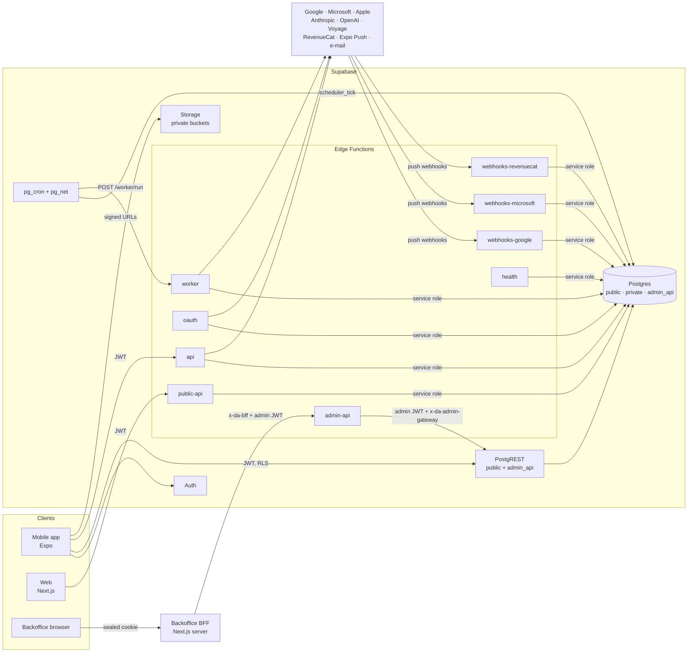
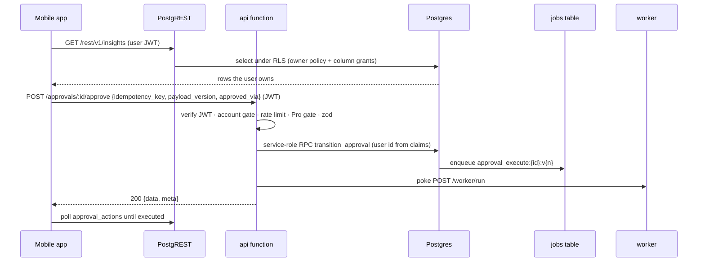
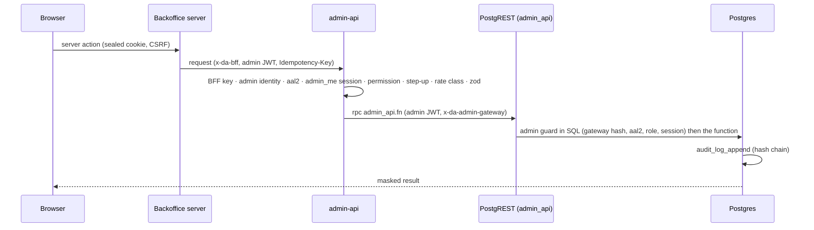
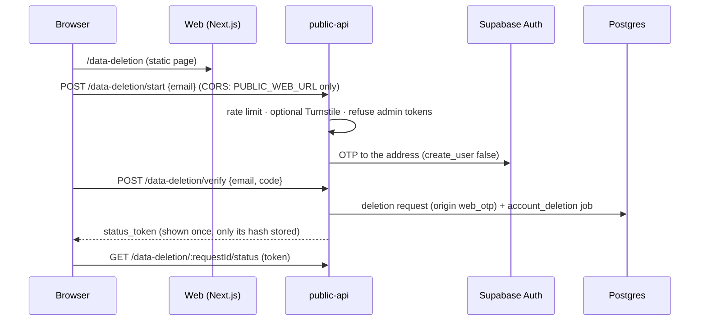
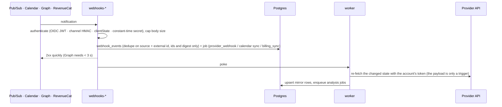
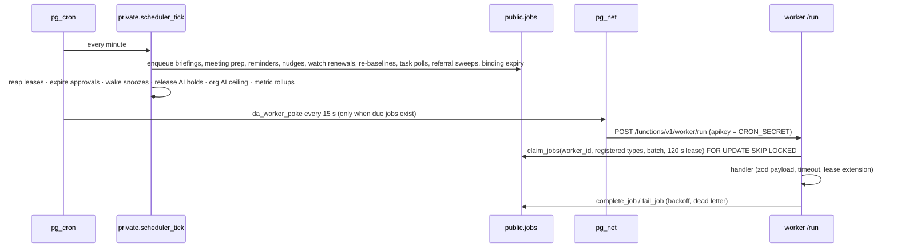

# Dijital Asistan: Architecture (as built)

Documented at `ec14e92`.

This page describes the system as it is implemented. The plans
([MASTER_PLAN.md](MASTER_PLAN.md), [ARCHITECTURE_DECISIONS.md](ARCHITECTURE_DECISIONS.md),
[API_CONTRACTS.md](API_CONTRACTS.md)) record the intent; where the build differs on purpose, the
difference is listed in [Differences from the plan](#differences-from-the-plan).

Related as-built pages: [DATABASE.md](DATABASE.md), [OAUTH.md](OAUTH.md),
[AI_PIPELINE.md](AI_PIPELINE.md), [AI_PROMPTS.md](AI_PROMPTS.md), [PRIVACY.md](PRIVACY.md),
[SECURITY.md](SECURITY.md), [MOBILE.md](MOBILE.md), [BACKOFFICE.md](BACKOFFICE.md),
[BACKOFFICE_RBAC.md](BACKOFFICE_RBAC.md), [TESTING.md](TESTING.md),
[DEPLOYMENT.md](DEPLOYMENT.md), [KNOWN_PLATFORM_LIMITATIONS.md](KNOWN_PLATFORM_LIMITATIONS.md).

## Monorepo layout

pnpm workspaces (`apps/*`, `packages/*`) with Turborepo; Node ≥ 22.13 runs the repository scripts
as TypeScript directly. The Edge Functions are Deno 2 code outside the pnpm workspaces; they import
the Deno-safe packages through a generated import map.

| Path | What it is |
|---|---|
| [`apps/mobile`](../apps/mobile) | `@da/mobile`: the Expo (React Native) app for iOS and Android, including the native modules in `apps/mobile/modules` (Android Notification Intelligence, share extension, widgets, native TTS). See [MOBILE.md](MOBILE.md) |
| [`apps/web`](../apps/web) | `@da/web`: the Next.js marketing site (home, pricing, privacy, terms, support, web account deletion, referral landing, OAuth result page, `.well-known` files) |
| [`apps/backoffice`](../apps/backoffice) | `@da/backoffice`: the Next.js admin console and its server-side BFF. See [BACKOFFICE.md](BACKOFFICE.md) |
| [`packages/domain`](../packages/domain) | `@da/domain` (Deno-safe): enums, entities, ids and idempotency keys, time zones, Turkish extractors, priority engine, notifications, grounding guards, provider contracts, entitlements, referrals, RBAC |
| [`packages/validation`](../packages/validation) | `@da/validation`: zod contracts: the 64 app routes, 145 admin routes, 8 public routes, webhooks, 18 AI output schemas, error codes, env schemas |
| [`packages/api-client`](../packages/api-client) | `@da/api-client`: the typed `api` client, Supabase client factory, SSE reader, query keys and the generated `database.types.ts` |
| [`packages/i18n`](../packages/i18n) | `@da/i18n`: Turkish and English message catalogues; Edge Functions import `messages/<locale>/<ns>.json` directly |
| [`packages/ui`](../packages/ui), [`packages/design-tokens`](../packages/design-tokens) | The React Native UI kit and the design tokens extracted from [`design/`](../design) |
| [`packages/config`](../packages/config) | Shared ESLint, Prettier and tsconfig presets |
| [`supabase/migrations`](../supabase/migrations) | Forward-only SQL migrations (schema, RLS, functions, cron, storage). See [DATABASE.md](DATABASE.md) |
| [`supabase/functions`](../supabase/functions) | The nine Edge Functions and `_shared/` (below) |
| [`supabase/prompts`](../supabase/prompts), [`supabase/seed`](../supabase/seed) | Prompt sources ([AI_PROMPTS.md](AI_PROMPTS.md)), the AI routing and price seeds, demo and E2E seed data |
| [`supabase/tests`](../supabase/tests) | pgTAP suites (`database/`), the tier-C compatibility shim (`shim/`) and the Edge integration suites (`integration/`) |
| [`scripts`](../scripts) | Repository tooling: DB tiers, type generation, import maps, quality gate, security scans, deploy checks, doc generators, E2E harness |
| [`.github/workflows`](../.github/workflows) | `ci.yml`, `deploy-supabase.yml`, `mobile-e2e.yml` |

## Runtime components and boundaries

### Who talks to whom

| Caller | Callee | Authentication | Notes |
|---|---|---|---|
| Mobile app | Supabase Auth | Apple / Google ID token, Microsoft and Apple-on-Android browser OAuth (PKCE), e-mail OTP | Sessions live in encrypted device storage. See [OAUTH.md](OAUTH.md#app-sign-in) |
| Mobile app | PostgREST (`public`) | User JWT + publishable key | Reads owner rows under RLS and calls the 25 user RPCs (for example `today_overview`, `flow_feed`, `set_insight_status`); column grants limit what it may read or write ([DATABASE.md](DATABASE.md)) |
| Mobile app | `api` (`/functions/v1/api`) | User JWT (`verify_jwt = true` plus in-code verification) | Every server action: integrations, approvals, reminders, captures, assistant (SSE), privacy, purchases, referrals, widgets, Android signals. Browser `Origin` requests are refused |
| Mobile app | Storage | Short-lived signed URLs minted by `api` | Uploads (`captures`) and downloads (`exports`, `briefing-audio`); clients have no write policy on `storage.objects` |
| Provider consent page | `oauth` | Single-use state (hash stored) | Callback only; the redirect back to the app carries a one-time completion code, never tokens |
| Web site | `public-api` | Anonymous, rate-limited; CORS only for `PUBLIC_WEB_URL` | Support form, web account deletion (e-mail OTP), referral landing, plans, web events |
| Backoffice browser | Backoffice BFF | Sealed session cookie, CSRF protection, `aal2` MFA | The browser never calls Supabase functions directly |
| Backoffice BFF | `admin-api` | `x-da-bff` (`ADMIN_BFF_SECRET`) + the admin's JWT | Server to server; `admin-api` refuses browser `Origin` requests |
| `admin-api` | PostgREST (`admin_api`) | The admin's JWT + `x-da-admin-gateway` (`ADMIN_GATEWAY_SECRET`, compared by hash in SQL) | Every `admin_api` function re-checks gateway, `aal2`, admin identity, session and permission |
| `admin-api` (`POST /health/run` from the backoffice), holders of the automations secret | `health` | An admin JWT with `health.read` / `health.run`, or the automations secret (`CRON_SECRET`) | Probes write `system_health_checks`; the same probe runner ([`health/run.ts`](../supabase/functions/health/run.ts)) also runs every 5 minutes in the worker as JOB-26 `health_check` |
| pg_cron | Postgres | Database role | `scheduler_tick` every minute and the other `da_*` jobs ([DATABASE.md](DATABASE.md#cron-jobs-pg_cron-utc)) |
| pg_net | `worker` | Automations secret (`CRON_SECRET`, from Vault `da_cron_secret`) | `POST /worker/run` every 15 s when due jobs exist, plus immediate pokes |
| Google Pub/Sub, Calendar, Microsoft Graph, RevenueCat | `webhooks-*` | Pub/Sub OIDC JWT; Calendar channel HMAC token; Graph `clientState`; RevenueCat `Authorization` | Payloads are triggers only: the worker re-fetches from the provider |
| `api`, `worker`, `oauth` | Providers and AI vendors | Encrypted per-account OAuth tokens; server API keys | See [OAUTH.md](OAUTH.md) and [AI_PIPELINE.md](AI_PIPELINE.md) |

### Who holds which secret

Secrets are set as Supabase function secrets, Vercel environment variables or EAS secrets; they are
never committed ([`.env.example`](../.env.example) lists key names only, tagged `client-safe`,
`SERVER-ONLY` or `build-time`). [SECURITY.md](SECURITY.md#secrets-handling) describes how they are
checked.

| Holder | Secrets |
|---|---|
| Mobile bundle | Publishable values only: `EXPO_PUBLIC_*` (Supabase URL and publishable key, Google client ids, RevenueCat public SDK keys, Sentry DSN, EAS project id) |
| Web | `NEXT_PUBLIC_*` in the bundle; the web server holds identifiers and legal labels only (store ids, Apple team id, region labels), no secret |
| Backoffice server | `ADMIN_BFF_SECRET` (also the HKDF source of the key that seals the `__Host-da_admin` session cookie) and the Supabase publishable key. It refuses to boot with the Supabase secret key, the DB URL, token keys, peppers, the gateway, cron or webhook secrets, AI keys or RevenueCat secret keys (`FORBIDDEN_ENV_KEYS` in [`apps/backoffice/src/env.ts`](../apps/backoffice/src/env.ts)) |
| Edge Functions (all) | `SUPABASE_URL`, `SUPABASE_SECRET_KEY` (injected by the platform), `HASH_PEPPER`, `TOKEN_ENC_KEY_V{n}` + `TOKEN_ENC_ACTIVE_VERSION`, `SENTRY_DSN` |
| `api`, `worker`, `oauth`, `webhooks-*` | Google and Microsoft OAuth client credentials (Microsoft uses a certificate: `MICROSOFT_CERT_PRIVATE_KEY`), Pub/Sub audience and service account, `WEBHOOK_HMAC_SECRET`, Apple SIWA key (`APPLE_SIWA_*`) |
| `api`, `worker`, `admin-api` (AI) | `ANTHROPIC_API_KEY`, `OPENAI_API_KEY`, `VOYAGE_API_KEY`, `STT_API_KEY` / `TTS_API_KEY`, `AI_HASH_PEPPER`; cost reconciliation uses `ANTHROPIC_ADMIN_API_KEY` / `OPENAI_ADMIN_API_KEY` |
| `worker`, `api` | `REVENUECAT_API_V2_SECRET_KEY`, `REVENUECAT_PROJECT_ID` (the purchase mirror is always re-fetched from RevenueCat) |
| `webhooks-revenuecat` | `REVENUECAT_WEBHOOK_AUTH` |
| `worker` | `EXPO_ACCESS_TOKEN` (push; also read by the `health` push probe), `EMAIL_PROVIDER` / `EMAIL_API_KEY` / `EMAIL_FROM_ADDRESS` (JOB-31 transactional e-mail) |
| `worker`, `health` | `CRON_SECRET` (also stored in Vault as `da_cron_secret` for pg_net, next to `da_project_url`) |
| `admin-api` | `ADMIN_BFF_SECRET`, `ADMIN_GATEWAY_SECRET` (its SHA-256 is in `app_settings.admin.gateway_secret_sha256`), `RECOVERY_CODE_PEPPER`, `PII_LOOKUP_PEPPER`, optional `SENTRY_AUTH_TOKEN` |
| `public-api` | `EMAIL_INBOUND_BASIC_AUTH` (inbound support mail), optional `TURNSTILE_SECRET_KEY`; web deletion codes are sent by Supabase Auth |

Only allow-listed modules may import the secret-key client (`serviceClient()`):
`_shared/db/clients.ts`, `_shared/system/`, `worker/`, `oauth/`, `webhooks-*/`, `admin-api/`,
`public-api/`, `health/` and `api/repos/system/` ([`scripts/functions/check-guards.ts`](../scripts/functions/check-guards.ts),
run by `pnpm functions:lint`). Everything else receives an injected client and passes the user id
from verified claims.

## Edge Functions

| Function | `verify_jwt` | Routes | Auth in code |
|---|---|---|---|
| [`api`](../supabase/functions/api) | `true` | The 64 app routes of `@da/validation` `api/routes.ts` | `requireUser` (`getClaims`, JWKS fallback); admin identities refused; account-state and client-version gate; rate limit; Pro gate (`PRO_ROUTE_FEATURES` → 402 `ENTITLEMENT_REQUIRED`); zod validation; HTTP idempotency on `[IK]` routes |
| [`oauth`](../supabase/functions/oauth) | `false` | `GET /google/callback`, `GET /microsoft/callback`, `GET /demo/callback`, `GET/POST /demo/authorize` (demo only) | Single-use state; see [OAUTH.md](OAUTH.md) |
| [`worker`](../supabase/functions/worker) | `false` | `POST /run` | Automations secret |
| [`webhooks-google`](../supabase/functions/webhooks-google) | `false` | `POST /gmail`, `POST /calendar` | Pub/Sub OIDC; Calendar channel HMAC |
| [`webhooks-microsoft`](../supabase/functions/webhooks-microsoft) | `false` | `POST /notifications`, `POST /lifecycle` | Graph `clientState` hash |
| [`webhooks-revenuecat`](../supabase/functions/webhooks-revenuecat) | `false` | `POST /` | Constant-time `Authorization` |
| [`admin-api`](../supabase/functions/admin-api) | `false` | The 145 admin routes of `@da/validation` `admin/routes.ts` | BFF key, admin JWT, `aal2`, `admin_me` session, permission, step-up, rate class, idempotency ([BACKOFFICE_RBAC.md](BACKOFFICE_RBAC.md)) |
| [`public-api`](../supabase/functions/public-api) | `false` | PUB-01…PUB-08 | Anonymous with rate limits; admin tokens refused; CORS for the web origin only |
| [`health`](../supabase/functions/health) | `false` | `GET /live`, `POST /run` | Automations secret or admin (`health.read` / `health.run`) |

Every function is built with `createApp` ([`_shared/http/app.ts`](../supabase/functions/_shared/http/app.ts)):
correlation and request ids, a JSON request log, security headers, optional CORS, browser-origin
rejection for native and server-to-server functions, a 1 MB body ceiling (tighter per route) and
the standard error envelope ([`_shared/errors.ts`](../supabase/functions/_shared/errors.ts)). Every
function except `health` calls `assertDemoAllowed()` at start-up and refuses to boot with demo mode
in production unless `ALLOW_DEMO_IN_PRODUCTION=true`.

`_shared/` holds the cross-cutting code: `env` (zod-parsed environment, credential groups),
`auth`, `db` (clients and the `DB_FN` catalogue of RPC names), `http`, `logging`, `observability`,
`ratelimit`, `idempotency`, `crypto` (token cipher, HMAC, PKCE, JWT signing), `security` (SSRF-safe
fetch, upload validation, HTML sanitiser), `jobs`, `providers`, `ai`, `webhooks`, `email`, `i18n`
and `services/` (the product logic per domain).

## Request paths

### Mobile → PostgREST and `api`

Reads that RLS can express go straight to PostgREST; anything that needs a secret, a provider
call, a state machine or an AI call goes through `api`. `api` handlers use the user-scoped client
where RLS applies and service-role repositories otherwise, always filtering by the verified user id.

### Backoffice → `admin-api`

### Web → `public-api`

The marketing site renders statically and calls `public-api` from the browser (CORS limited to
`PUBLIC_WEB_URL`) or from its server routes: `POST /support`, `POST /data-deletion/start`
(e-mail OTP), `POST /data-deletion/verify`, `GET /data-deletion/:requestId/status`,
`GET /referrals/:code`, `GET /plans`, `POST /web-events`, and the inbound-mail hook
`POST /support/inbound-email` (basic auth).

### Provider webhooks → worker

### Cron → worker

## Jobs and scheduling

- **Queue:** `public.jobs` with `job_attempts`; `enqueue_job` is idempotent on `idempotency_key`
  (the domain key builders in `@da/domain` `ids.ts`). `claim_jobs` leases jobs for 120 s with
  `FOR UPDATE SKIP LOCKED`; `extend_job_lease` keeps long jobs alive; a lost lease discards a late
  result. Failures retry with backoff until `max_attempts`, then `dead_letter`. The backoffice can
  retry or cancel per `private.job_admin_policy`.
- **Runner:** [`_shared/jobs/runner.ts`](../supabase/functions/_shared/jobs/runner.ts) drains jobs
  within a wall-clock budget (no new claims after 110 s or `budget_ms`) and claims only the types
  registered in [`worker/handlers/index.ts`](../supabase/functions/worker/handlers/index.ts).
  Default timeout 60 s; longer ones are set per type (`JOB_TIMEOUTS_MS`).
- **Schedules:** eight pg_cron jobs, all UTC ([DATABASE.md](DATABASE.md#cron-jobs-pg_cron-utc)).
  `private.scheduler_tick` runs every minute and does the per-user scheduling in the user's own
  time zone (DST-safe local wall time).

| Job type | Contract | Enqueued by | Handler |
|---|---|---|---|
| `initial_sync`, `gmail_sync`, `outlook_sync`, `calendar_sync`, `tasks_sync`, `device_calendar_ingest`, `watch_renewal`, `reconciliation`, `provider_webhook`, `integration_purge` | JOB-01…09, JOB-29 | OAuth completion, webhooks, `scheduler_tick` (watch renewals, re-baselines, 15-min task polls, binding expiry), `da_reconciliation` (every 6 h), disconnect | [`_shared/services/integrations/jobs.ts`](../supabase/functions/_shared/services/integrations/jobs.ts) |
| `email_triage`, `email_analysis`, `insight_refresh`, `embedding`, `briefing`, `ai_batch`, `reconciliation {scope:'ai_cost'}` | JOB-10…12, JOB-14, JOB-16, JOB-28, JOB-08 | Mail sync, `scheduler_tick` (briefing slots; nightly AI cost reconciliation from 03:30 UTC) | [`worker/handlers/intel-jobs.ts`](../supabase/functions/worker/handlers/intel-jobs.ts) |
| `first_analysis`, `meeting_prep`, `capture_analysis`, `briefing_audio` | JOB-13, JOB-15, JOB-27, JOB-30 | Onboarding, `scheduler_tick` (meeting prep 45–60 min ahead), `api` | `worker/handlers/*.ts` |
| `approval_execute` | JOB-17 | `transition_approval` on approve | [`worker/handlers/approval_execute.ts`](../supabase/functions/worker/handlers/approval_execute.ts) |
| `notification`, `push_receipts` | JOB-18, JOB-19 | Triggers, `scheduler_tick` (reminders, meeting prep, post-meeting, nudges), `da_push_receipts` (5 min) | [`worker/handlers/notification.ts`](../supabase/functions/worker/handlers/notification.ts) |
| `retention`, `export`, `history_deletion`, `account_deletion` | JOB-20…23 | `da_retention` (daily), retention-policy change trigger, `api`, `public-api`, admin retry | [`worker/handlers/privacy.ts`](../supabase/functions/worker/handlers/privacy.ts), [PRIVACY.md](PRIVACY.md) |
| `billing_sync`, `referral_evaluate` | JOB-24, JOB-25 | RevenueCat webhook, purchase sync, `da_billing_reconcile` (daily), `scheduler_tick` (15-min referral sweep) | `worker/handlers/billing_sync.ts`, `referral_evaluate.ts` |
| `transactional_email` | JOB-31 | Admin invites, support replies, deletion confirmations | [`_shared/email/transactional.ts`](../supabase/functions/_shared/email/transactional.ts) |
| `credential_reencrypt` | – | `da_reconciliation` once a day (00:00–06:00 UTC run) | [`_shared/services/credentials.ts`](../supabase/functions/_shared/services/credentials.ts) |
| `health_check` | JOB-26 | `da_health_check` every 5 min | [`worker/handlers/health_check.ts`](../supabase/functions/worker/handlers/health_check.ts): runs the probes of `POST /health/run` in process (`checked_by = 'cron'`), writes `system_health_checks` and completes; a bucket older than 10 minutes completes without probing; a `down` probe is logged and reported to Sentry; only a failed write retries |
| `embedding {mode:'reembed'}` | JOB-16 (DR) | Turning `ai.embedding_dr.reembed` on (trigger); each batch queues the next | [`worker/handlers/embedding_dr.ts`](../supabase/functions/worker/handlers/embedding_dr.ts) ([AI_PIPELINE.md](AI_PIPELINE.md#embeddings-and-retrieval)) |
| `ai_eval` | – (AI_PIPELINE_PLAN §5.4) | Backoffice "Değerlendirme çalıştır" (`admin_api.ai_eval_request`, one queued run per version and ISO week); each job queues its own continuation | [`worker/handlers/ai_eval.ts`](../supabase/functions/worker/handlers/ai_eval.ts): replays the key's golden sets on every configured target (pinned route, no budget or cache), ≤ 110 s per job, the report written through `public.ai_eval_record` ([AI_PIPELINE.md](AI_PIPELINE.md#evaluation)); the nightly `ai-eval.yml` runs the same suites from CI through `pnpm ai:eval:live` |

## Provider registry

[`_shared/providers/registry.ts`](../supabase/functions/_shared/providers/registry.ts) resolves the
adapter set (`OAuthProvider`, `MailProvider`, `CalendarProvider`, `TaskProvider`; contracts in
`@da/domain` `providers/types.ts`) for `google`, `microsoft` and `demo`:

- `google` and `microsoft` need their OAuth credential group, otherwise
  `EXTERNAL_CREDENTIAL_REQUIRED` with the missing key names;
- `demo` is available only while demo mode is allowed; a start request for Google or Microsoft
  without credentials falls back to the demo provider when demo mode is on;
- provider HTTP goes through [`_shared/providers/http.ts`](../supabase/functions/_shared/providers/http.ts):
  quota consumption per attempt (`consume_provider_quota`), a 10 s timeout, two quick retries for
  idempotent requests only, `Retry-After` handling, and error classification into the
  `ProviderErrorCode` set that drives account status ([OAUTH.md](OAUTH.md#error--account-status));
- access tokens come from the single-flight token source
  ([`_shared/providers/token-source.ts`](../supabase/functions/_shared/providers/token-source.ts)).

The integration runtime ([`_shared/system/integrations.ts`](../supabase/functions/_shared/system/integrations.ts))
wires the registry, the token keyring, the integration store and the webhook ledger once per
function; `api`, `oauth`, `worker` and `webhooks-*` share it.

## AI runtime

`generateStructured` ([`_shared/ai/call.ts`](../supabase/functions/_shared/ai/call.ts)) is the only
path to a model: route resolution from `ai_model_config` and the kill switches, the active prompt
version, the per-user result cache, a budget reservation, the provider chain with retries and
fallbacks, zod plus the output validators, one content-free `ai_requests` row per attempt and the
budget settlement. Any refusal returns a T0 reason instead of throwing, so background work falls
back to its deterministic path. Details: [AI_PIPELINE.md](AI_PIPELINE.md).

## Observability

| Signal | Where | Content rule |
|---|---|---|
| Structured logs | One JSON line per event from every function ([`_shared/logging/logger.ts`](../supabase/functions/_shared/logging/logger.ts)): `ts, level, fn, msg, correlation_id, request_id, job_id, user_hash` | E-mail addresses masked; tokens, JWTs, keys, PEM blocks and long base64 redacted; content-named fields dropped; bodies never logged |
| Correlation | `X-Correlation-Id` accepted or generated per request; propagated into jobs and webhook-triggered jobs | Ids only |
| Errors | Edge: a fetch-based Sentry adapter ([`_shared/observability/sentry.ts`](../supabase/functions/_shared/observability/sentry.ts)), no-op without `SENTRY_DSN`. Mobile: `@sentry/react-native`. Backoffice: `@sentry/nextjs` from `instrumentation.ts` (server, `SENTRY_DSN`) and the root layout (browser, `NEXT_PUBLIC_SENTRY_DSN`), both off without a DSN, scrubbed by [`lib/sentry-scrub.ts`](../apps/backoffice/src/lib/sentry-scrub.ts) | Error type, scrubbed message, frames and tags; no bodies, headers, cookies, e-mail addresses or user identifiers (ids masked); backoffice error boundaries tag the correlation id (digest) |
| AI telemetry | `ai_requests` (one row per attempt), `ai_usage_daily`, `ai_metrics_daily` | Counts, costs, hashes and ids only |
| Health | `health` probes write `system_health_checks` (database, storage, auth, cron, push, providers, AI, RevenueCat, webhooks, audit chain, …); the backoffice System Health page reads them | Status, latency and a detail code |
| Product metrics | `analytics_events` (catalogue-validated, opt-out honoured): app events through API-ANL-01 and the API_CONTRACTS §17.1 backend events through the one server emitter ([`_shared/services/analytics/emit.ts`](../supabase/functions/_shared/services/analytics/emit.ts)); `metrics_daily` rollups every 15 minutes from `scheduler_tick` | No free text ([PRIVACY.md](PRIVACY.md#analytics)) |
| Audit | `audit_logs`, append-only and hash-chained; the `health` audit-chain probe verifies the tail | Actor, action, target, result; PII masked |

## Known gaps

Observed in the code at `ec14e92`; they are not deliberate differences:

- None open for the job registry: every `job_type` has a worker definition since GAP-4 added
  `ai_eval`. The `cron` health probe still measures queue lag over the claimed types only
  ([`_shared/jobs/worker-types.ts`](../supabase/functions/_shared/jobs/worker-types.ts),
  `UNCLAIMED_JOB_TYPES` is empty; a registry test keeps the list equal to the definitions).

## Differences from the plan

| Plan | As built | Reason (source) |
|---|---|---|
| Partial admin failures answer `207`, missing credentials `424` (API_CONTRACTS draft) | `503 {partial, step}` and `503 EXTERNAL_CREDENTIAL_REQUIRED` | Contract decision recorded in API_CONTRACTS §12.1 / ADM-20 during the backoffice gap pass (commit `4829722`, integration notes G2/E) |
| Approving an expired approval answers `410` (WBS) | `409 APPROVAL_STATE_CONFLICT` | API_CONTRACTS is authoritative over the WBS (R-20; integration notes B) |
| The organisation AI ceiling is tripped by `health_check` (`ai.budget.org_daily_usd` flag description) | Evaluated every 5 minutes from `scheduler_tick` step 14 (`private.release_expired_budget_holds` → `private.ai_org_budget_evaluate`) | Keeps the eight pg_cron jobs unchanged (migration `20260924002400` header) |
| Device calendar snapshots travel in the job payload | Staged in `private.device_snapshot_uploads`; the job carries a reference | `jobs.payload` is capped at 8 KiB (integration notes A) |
| Migration file names per DATABASE_AND_RLS_PLAN §10 | WBS names `20260924000100…` | The implementation plan's names won; the plan table was corrected (integration notes) |
| AI provider override variable `AI_PROVIDER_OVERRIDE=fixture` | `AI_FIXTURE_PROVIDER_ENABLED=true` (outside production, or while demo mode is allowed) | Matches the `.env.example` key set (integration notes I) |
| Test-only provider base URLs not specified | `APPLE_ID_BASE_URL`, `REVENUECAT_API_BASE_URL`, `VOYAGE_API_BASE_URL`, `ANTHROPIC_API_BASE_URL`, `OPENAI_API_BASE_URL`, `MS_LOGIN_BASE_URL`, `MS_GRAPH_BASE_URL` honoured only outside preview/production | Needed by the integration tier's mock provider server (commit `85bb05c`, integration notes I/X) |
| Push payload `{type, entity_id, deeplink, v, nid}` (TEST_PLAN, INTEGRATION_PLAN) | Exactly `{type, entity_id, deeplink}` | Notification-leakage control CTL-3.12; docs were corrected (integration notes) |
