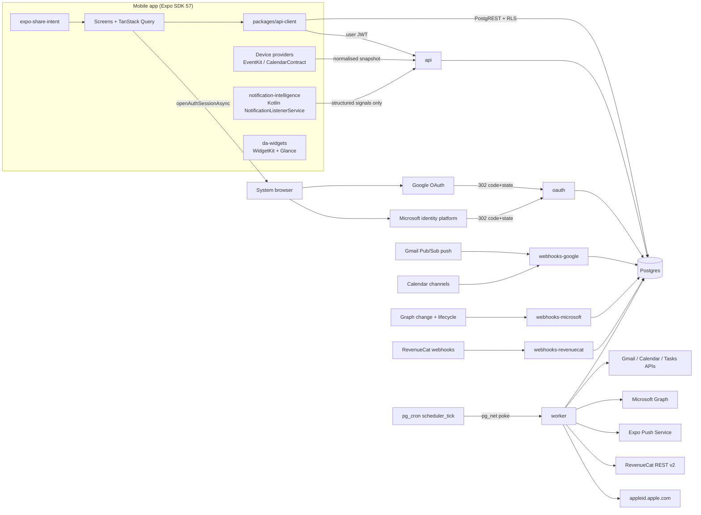
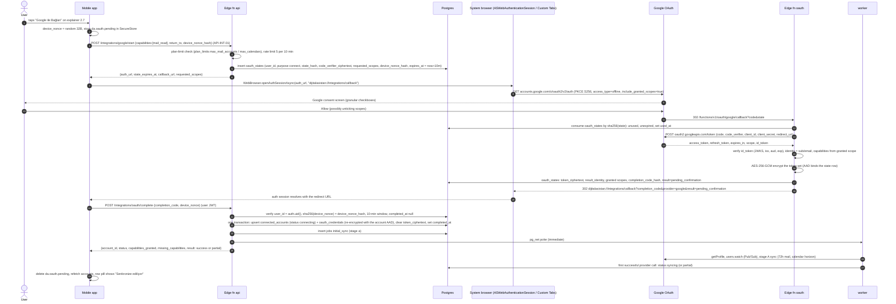
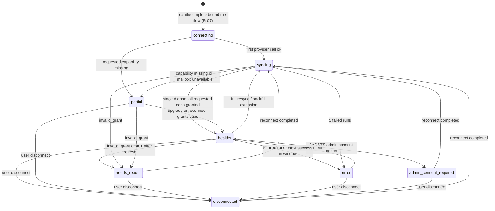
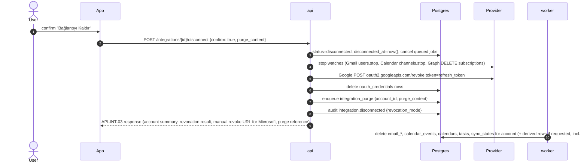
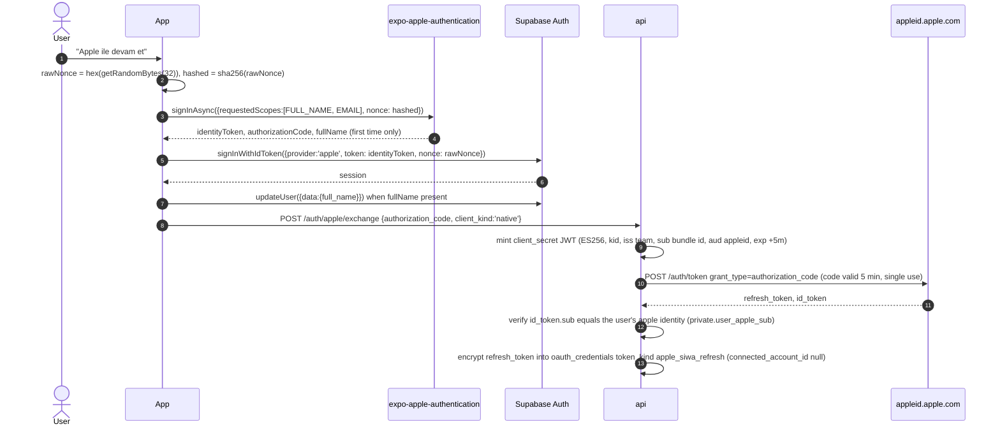
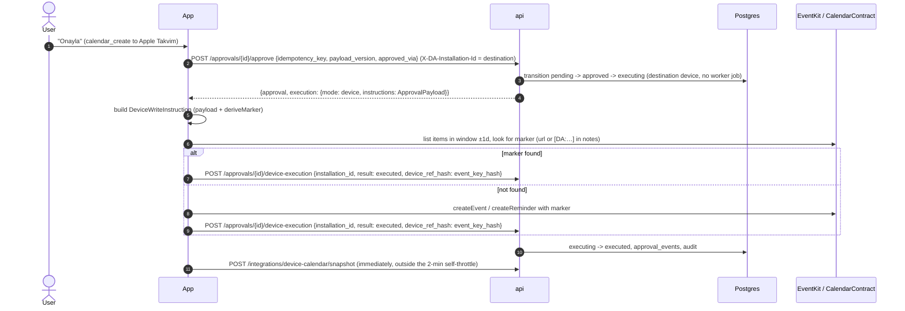
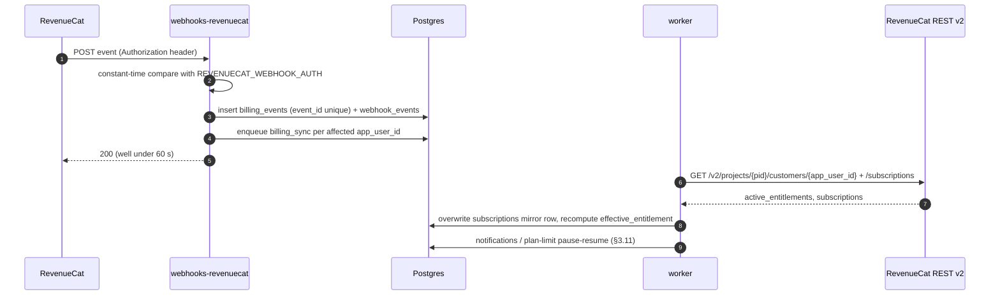

# Dijital Asistan: Integration Plan (`docs/INTEGRATION_PLAN.md`)

> **Status:** binding implementation plan, written in Plan Mode on 2026-09-23.
>
> **Canonical spine:** the master plan `root-claude-uploads-46bfff87-a0f2-5945-magical-fern.md`, specifically ADR-04/06/07/10/11/12, §5 (enums and tables), §5b (`api` routes), §7, §9, §14, §19, §20 and the reconciliation rulings §23b (R-01…R-25). The rulings override any other text, including this document.
>
> **Functional source:** MASTER_PROMPT, cited as `M§n`.
>
> **Research sources:** the audits `integrations` (primary; its URLs are kept as citations), `stack-versions`, `design-account-states-marketing`, `design-onboarding-today` and `secondary-docs`. The `secondary-docs` resolutions C-01…C-37 are honoured here, in particular C-11, C-12, C-14, C-17, C-35 and SREQ-15/16/20/49/51/52/62/63/67/68.
>
> **Scope:** one product. Every integration below is part of the shipped product.

---

## 0. Scope, sources and conventions

### 0.1 What this document binds
This document is binding for the following:
- the provider adapter contracts;
- the OAuth and token lifecycle;
- sync, watch and reconciliation for every provider;
- provider-level write idempotency;
- app authentication;
- push, RevenueCat, Sentry and email delivery wiring;
- the native capabilities (widgets, share, Android Notification Intelligence, device calendars, background tasks, permission strings, universal and app links);
- demo mode;
- the credential matrix, the `.env.example` key list and the owner-facing manual steps.

It does **not** bind the following. Where those documents cover a topic, they win:
- AI prompts, model routing and cost: `docs/AI_PIPELINE_PLAN.md`.
- Full column, index and RLS DDL: `docs/DATABASE_AND_RLS_PLAN.md`. It is also authoritative for column names, enum values, functions, cron jobs and Vault secret names (master plan R-20). This document lists only the columns the integration code needs (§3.1).
- Endpoint and RPC names, request/response schemas, error codes and SSE event names: `docs/API_CONTRACTS.md` (R-20). This document cites route IDs (for example API-INT-01) and repeats only the fields that matter for integrations.
- Feature-flag and kill-switch keys: master plan §23b R-10. Integration code reads only those keys (§12.5 uses the payload of `feature.android_ni`).

In the other direction, this document is the authority for environment-variable names (§15, R-20). It also specifies the OAuth lifecycle that R-07 fixes (§3.2).

### 0.2 Requirement trace (satisfied here)
- **M§75:** providers and the adapter interface.
- **M§76:** least privilege, progressive authorization, server-side tokens, revoke, "Bağlantıyı yenile."
- **M§88:** authentication, with login kept separate from integrations.
- **M§89:** demo mode.
- **M§90:** the external credential rule.
- **M§36:** Android Notification Intelligence.
- **M§37:** widgets.
- **M§28:** share extensions.
- **M§43 and M§44:** RevenueCat and Free/Pro enforcement.
- **M§96:** scheduling.
- **M§116:** consistency.
- **M§117:** sync design.
- **M§149:** the credential matrix.
- **M§107 and M§108:** env and identifiers.
- **M§86 and M§87:** notification and local security.
- **M§33 and M§115:** approvals and write safety.
- **M§34:** First Analysis over 72 h.
- **M§40, M§41 and M§129:** privacy copy, retention and deletion.
- **M§52, M§53 and M§67:** backoffice integration, jobs and health data.
- **M§91:** platform limitations.
- **M§94:** offline behaviour.
- **M§97:** provenance.
- **M§112:** store preparation.
- **M§126 and M§127:** logging and job safety.
- **M§151 and M§152:** data boundary and secrets.

### 0.3 Citation legend and the verification rule
Evidence tags carried over from the integrations audit:

| Tag | Meaning |
|---|---|
| **[OFF]** | Official source read directly. |
| **[OFF-S]** | Official source, seen only as a search excerpt. |
| **[SEC]** | Third-party source. |
| **[verify]** | Must be confirmed against the live official page during execution, before the related code merges. §17 lists every such item. |

Numbers marked [verify] are still implemented as written, and each one sits behind a config constant in `packages/domain/src/integrations/limits.ts`, so a correction is a one-line change.

### 0.4 Canonical names used in this document
All names come from the master plan.

| Kind | Names |
|---|---|
| **Provider enum** | `google`, `microsoft`, `apple_device`, `android_device`, `demo` |
| **Capability enum** | `mail_read`, `mail_send`, `calendar_read`, `calendar_write`, `tasks_read`, `tasks_write` |
| **account_status enum** | `connecting`, `healthy`, `syncing`, `partial`, `needs_reauth`, `admin_consent_required`, `error`, `disconnected` |
| **Integration tables** | `connected_accounts`, `oauth_credentials`, `oauth_states`, `calendars`, `sync_states`, `provider_quota_usage`, `webhook_events` |
| **Content tables touched** | `email_threads`, `email_messages`, `calendar_events`, `tasks`, `reminders`, `contacts`, `life_events`, `captures`, `android_notification_signals` |
| **Other tables touched** | `app_installations`, `push_tokens`, `notifications`, `push_tickets`, `subscriptions`, `billing_events`, `entitlement_grants`, `approval_actions`, `approval_events`, `jobs`, `job_attempts`, `feature_flags`, `audit_logs`, `system_health_checks`, `user_preferences`, `notification_preferences`, `profiles`, `data_deletion_requests` |
| **Edge Functions** | `api`, `oauth`, `webhooks-google`, `webhooks-microsoft`, `webhooks-revenuecat`, `worker`, `admin-api`, `public-api`, `health` |
| **Job types used** | `initial_sync`, `gmail_sync`, `outlook_sync`, `calendar_sync`, `tasks_sync`, `device_calendar_ingest`, `watch_renewal`, `reconciliation`, `provider_webhook`, `first_analysis`, `approval_execute`, `notification`, `push_receipts`, `billing_sync`, `health_check`, `account_deletion`, `history_deletion`, `retention` |
| **Proposed job types (§18)** | `credential_reencrypt`, `integration_purge` |

### 0.5 Identifiers per build variant (M§108; all values configurable through env)

| EAS profile | `APP_ENV` | iOS bundle ID / Android package | URL scheme | App Group | Demo allowed |
|---|---|---|---|---|---|
| `development` | `development` | `com.dijitalasistan.app.dev` | `dijitalasistan-dev` | `group.com.dijitalasistan.app.dev` | yes |
| `preview` | `preview` | `com.dijitalasistan.app.preview` | `dijitalasistan-preview` | `group.com.dijitalasistan.app.preview` | yes |
| `e2e` | `e2e` | `com.dijitalasistan.app.preview` | `dijitalasistan-preview` | `group.com.dijitalasistan.app.preview` | yes (required) |
| `production` | `production` | `com.dijitalasistan.app` | `dijitalasistan` | `group.com.dijitalasistan.app` | no, unless `ALLOW_DEMO_IN_PRODUCTION=true` |

Extension bundle IDs:
- Share extension: `<bundle>.share-extension` (the expo-share-intent default).
- Widget: `<bundle>.widget` (apple-targets `bundleIdentifier: '.widget'`).

Default production domains. All are set through the "App URLs" env keys, and owning them is a manual step (§16):

| Domain | Purpose |
|---|---|
| `dijitalasistan.app` | Web and universal links |
| `admin.dijitalasistan.app` | Backoffice |
| `api.dijitalasistan.app` | Supabase custom domain, serving Auth and Edge Functions |
| `mail.dijitalasistan.app` | Email sending subdomain |

Examples in this document use these values.

---

## 1. Architecture overview

### 1.1 Components



### 1.2 Code layout

| Path | Contents | Runtime rule |
|---|---|---|
| `packages/domain/src/integrations/` | Enums, normalised models, adapter **interfaces**, error taxonomy, capability↔scope registry, idempotency-marker derivation, status precedence, deep-link mapping, limits constants | Pure TypeScript with explicit `.ts` imports. It is Deno-safe and RN-safe, contains **no provider-specific logic**, and does no I/O. |
| `packages/validation/src/integrations/` | zod 4 schemas: start/upgrade/complete requests, `DeviceCalendarSnapshot`, `DeviceWriteInstruction`, `AndroidNotificationSignal`, `WidgetSnapshot`, webhook envelopes, RevenueCat webhook body | Deno-safe |
| `supabase/functions/_shared/providers/google/` | `GoogleOAuth`, `GmailAdapter`, `GoogleCalendarAdapter`, `GoogleTasksAdapter`, raw→normalised mappers, MIME builder | Deno 2.1 |
| `supabase/functions/_shared/providers/microsoft/` | `MicrosoftOAuth` (client assertion), `OutlookMailAdapter`, `GraphCalendarAdapter`, `TodoAdapter`, subscription manager | Deno 2.1 |
| `supabase/functions/_shared/providers/demo/` | `DemoOAuth`, `DemoMailAdapter`, `DemoCalendarAdapter`, `DemoTaskAdapter`, backed by the deterministic fixture generator in `supabase/seed/demo/fixtures.ts` | Deno 2.1; refuses to construct unless demo gating passes (§13) |
| `supabase/functions/_shared/integrations/` | Token vault (AES-GCM), token source with single-flight refresh, quota gate, retry classifier, webhook verification (Google OIDC JWT, channel HMAC, Graph clientState), sync engine (stage A/B, incremental, reconciliation), approval executors | Deno 2.1 |
| `supabase/functions/_shared/push/`, `…/billing/` | Expo push client, RevenueCat v2 client | Deno 2.1 |
| `apps/mobile/src/integrations/` | OAuth launcher (`openAuthSessionAsync`), pending-flow store holding the device nonce (R-07, §3.2), device providers `apple/` and `android/`, snapshot builder, device write executor | RN |
| `apps/mobile/modules/notification-intelligence/` | Local Expo module (Kotlin), plus an iOS stub | Android native |
| `apps/mobile/modules/da-widgets/` | Local Expo module: iOS App Group writer and timeline reload; Android Glance widgets and receivers | Native |
| `apps/mobile/targets/widget/` | `@bacons/apple-targets` SwiftUI WidgetKit extension | iOS native |

### 1.3 Invariants (hard rules)
1. OAuth refresh and access tokens exist only as AES-256-GCM ciphertext in Postgres. They are decrypted only inside Edge Functions, and never reach a client, a log, Sentry, analytics or the backoffice (M§76, M§152).
2. App login (Supabase Auth) and integrations are separate grants. `provider_token` from Supabase Auth is **never** used for Gmail, Graph or Tasks (M§88).
3. Scopes are requested per capability, and write scopes only at the first approved write (M§76).
4. Every external write runs only from `approval_execute`, only after the `approval_actions` row is `approved`, and carries a provider-level idempotency marker (M§115, M§33).
5. Raw mail bodies, event descriptions and Android notification text are never persisted. The pipeline processes them transiently, and "Orijinal Mail" is fetched on demand (ADR-05, M§87).
6. Every job is idempotent through `jobs.idempotency_key`, has a timeout, can be retried, and can be dead-lettered (M§127).
7. When a credential is missing, the adapter reports `external_credential_required` instead of failing silently or faking success (M§90).
8. Demo adapters cannot run in production without the explicit double flag (M§89).

---

## 2. Provider adapter contracts (`packages/domain`)

### 2.1 Primitives and context

```ts
// packages/domain/src/integrations/primitives.ts
export const PROVIDERS = ['google', 'microsoft', 'apple_device', 'android_device', 'demo'] as const;
export type Provider = (typeof PROVIDERS)[number];
export type ServerProvider = 'google' | 'microsoft' | 'demo';
export type DeviceProvider = 'apple_device' | 'android_device';

export const CAPABILITIES = ['mail_read', 'mail_send', 'calendar_read', 'calendar_write', 'tasks_read', 'tasks_write'] as const;
export type Capability = (typeof CAPABILITIES)[number];
export const READ_CAPABILITIES = ['mail_read', 'calendar_read', 'tasks_read'] as const satisfies readonly Capability[];
export const WRITE_CAPABILITY_FOR: Record<'mail_read' | 'calendar_read' | 'tasks_read', Capability> =
  { mail_read: 'mail_send', calendar_read: 'calendar_write', tasks_read: 'tasks_write' };

export type AccountStatus =
  | 'connecting' | 'healthy' | 'syncing' | 'partial'
  | 'needs_reauth' | 'admin_consent_required' | 'error' | 'disconnected';

export type IsoDateTime = string; // RFC 3339, UTC ("2026-09-23T05:42:00Z")
export type IsoDate = string;     // "YYYY-MM-DD" (all-day / date-only)

export interface Page<T> { items: T[]; nextPageToken: string | null }
export interface Clock { now(): Date }

/** Structured, content-free logger: field values must never contain tokens, email addresses, subjects or bodies. */
export interface ContentFreeLogger {
  info(event: string, fields?: Record<string, string | number | boolean | null>): void;
  warn(event: string, fields?: Record<string, string | number | boolean | null>): void;
  error(event: string, fields?: Record<string, string | number | boolean | null>): void;
}

export type QuotaBucket =
  | 'gmail_user_units' | 'gmail_project_units_day'
  | 'gcal_user_requests' | 'gtasks_project_requests_day'
  | 'graph_mailbox_requests' | 'graph_subscription_ops';
export type QuotaPriority = 'interactive' | 'sync' | 'backfill';

export interface QuotaGate {
  /** Waits until `units` fit in the bucket's window; throws ProviderError('rate_limited') once maxWaitMs is exceeded. */
  acquire(bucket: QuotaBucket, units: number, opts?: { maxWaitMs?: number; priority?: QuotaPriority }): Promise<void>;
}

export interface AccessTokenSource { get(opts?: { forceRefresh?: boolean }): Promise<string> }

export interface DataSourceToggles { // connected_accounts.data_source_toggles (DATABASE_AND_RLS_PLAN keys); SREQ-68; enforced server-side
  mail_read: boolean;                    // ingestion and watches pause when false
  attachments_analyze: boolean;          // attachments are neither downloaded nor parsed when false
  deadline_detect: boolean;              // deadline extraction is skipped
  draft_replies: boolean;                // reply generation is refused
  calendar_read: boolean;
  schedule_suggest: boolean;             // planning proposals are skipped
  calendar_write_with_approval: boolean; // gates calendar_write together with the granted capability
  tasks_read: boolean;
}

export interface ProviderAccountRef {
  connectedAccountId: string;
  userId: string;
  provider: Provider;
  providerAccountId: string;          // Google `sub`; Graph `oid`; device: installation-scoped key
  email: string | null;
  tenantId: string | null;            // Graph `tid`
  tenantType: 'personal' | 'work' | null;
  capabilitiesGranted: readonly Capability[];   // connected_accounts.capabilities_granted
  dataSourceToggles: DataSourceToggles;         // connected_accounts.data_source_toggles
}

export interface ProviderContext {
  readonly account: ProviderAccountRef;
  readonly tokens: AccessTokenSource;
  readonly quota: QuotaGate;
  readonly clock: Clock;
  readonly log: ContentFreeLogger;
  readonly correlationId: string;
  readonly signal?: AbortSignal;
}
```

### 2.2 Normalised models

```ts
// packages/domain/src/integrations/models.ts
export interface EmailAddress { address: string; name: string | null }

export interface DeterministicHeaders {           // triage allow-list only (AI_PIPELINE_PLAN pre-filter)
  listUnsubscribe: boolean;
  listId: string | null;
  precedence: string | null;                       // bulk | list | junk
  autoSubmitted: string | null;                    // auto-generated | auto-replied
  authentication: { dkim: 'pass' | 'fail' | 'none' | null; spf: 'pass' | 'fail' | 'none' | null;
                    dmarc: 'pass' | 'fail' | 'none' | null; dkimDomain: string | null } | null;
  priority: 'high' | 'normal' | 'low' | null;      // X-Priority / Importance
}

export interface NormalizedMailMessage {
  providerMessageId: string;        // Gmail id | Graph immutable id
  providerThreadId: string;         // Gmail threadId | Graph conversationId
  rfc822MessageId: string | null;   // Message-ID | internetMessageId (cross-account dedupe)
  inReplyTo: string | null;
  references: string[];             // last 20 kept
  folder: 'inbox' | 'sent' | 'archive' | 'other';
  labels: string[];                 // provider labels/categories, normalised upper-case
  providerCategory: 'primary' | 'promotions' | 'social' | 'updates' | 'forums' | 'focused' | 'other' | null;
  from: EmailAddress | null;
  replyTo: EmailAddress[];
  to: EmailAddress[];               // capped at 50
  cc: EmailAddress[];               // capped at 50
  subject: string;                  // ≤ 500 chars
  snippet: string;                  // ≤ 200 chars, whitespace-normalised, HTML-free
  sentAt: IsoDateTime | null;
  receivedAt: IsoDateTime;
  isRead: boolean;
  isFlagged: boolean;               // Gmail STARRED | Graph flag.flagStatus === 'flagged'
  providerImportance: 'high' | 'normal' | 'low' | null;
  hasAttachments: boolean | null;
  sizeBytes: number | null;
  headers: DeterministicHeaders;
  webLink: string | null;           // Graph webLink; Gmail built via GmailAdapter.webLinkFor
  deleted: boolean;
}

/** Never persisted, never logged; lives only inside one pipeline step. */
export interface TransientMailBody {
  text: string;                     // plain text, ≤ 200 KB
  html: string | null;              // raw HTML (sanitised only when returned by GET /mail/:id/original)
  truncated: boolean;
  attachments: Array<{ providerAttachmentId: string; filename: string; mimeType: string; sizeBytes: number; inline: boolean }>;
}

export interface NormalizedCalendar {
  providerCalendarId: string;
  name: string;
  color: string | null;
  timeZone: string | null;
  accessRole: 'owner' | 'writer' | 'reader' | 'free_busy_reader'; // calendars.access_role values
  isPrimary: boolean;
  canWrite: boolean;                // Google: owner (calendar.events.owned); Graph: canEdit
  kind: 'default' | 'holidays' | 'birthdays' | 'shared' | 'other';
  deleted: boolean;
}

export interface NormalizedAttendee { email: string; name: string | null; responseStatus: 'accepted' | 'declined' | 'tentative' | 'needs_action' | null; isSelf: boolean; isOrganizer: boolean }

export type EventTime = { dateTime: IsoDateTime; timeZone: string | null } | { date: IsoDate };

export interface NormalizedEvent {
  providerEventId: string;          // instance id for occurrences
  providerCalendarId: string;
  iCalUid: string | null;
  seriesMasterId: string | null;
  originalStart: EventTime | null;  // for modified occurrences
  isOccurrence: boolean;
  status: 'confirmed' | 'tentative' | 'cancelled';
  title: string;                    // ≤ 300
  descriptionSnippet: string | null;// sanitised plain text ≤ 500 chars; full description only transient
  location: string | null;          // ≤ 300
  start: EventTime;
  end: EventTime;
  allDay: boolean;
  organizer: EmailAddress | null;
  userIsOrganizer: boolean;
  attendees: NormalizedAttendee[];  // capped at 100
  conferenceUrl: string | null;     // hangoutLink / conferenceData video URI / onlineMeeting.joinUrl (allow-listed domains)
  transparency: 'busy' | 'free';
  visibility: 'default' | 'public' | 'private' | 'confidential';
  etag: string | null;
  updatedAt: IsoDateTime | null;
  daApprovalId: string | null;      // extendedProperties.private.da_approval_id / Graph extended property
  deleted: boolean;
}

export interface NormalizedTaskList { providerListId: string; name: string; isDefault: boolean; deleted: boolean }
export interface NormalizedTask {
  providerTaskId: string;
  providerListId: string;
  title: string;                    // ≤ 1,024 (Google limit)
  notesSnippet: string | null;      // ≤ 500
  status: 'open' | 'completed';
  due: { date: IsoDate } | { dateTime: IsoDateTime; timeZone: string } | null; // Google Tasks: date only
  completedAt: IsoDateTime | null;
  importance: 'low' | 'normal' | 'high' | null;
  updatedAt: IsoDateTime | null;
  daMarker: string | null;          // "[DA:…]" found in notes / linkedResources.externalId
  deleted: boolean;
}
```

### 2.3 Idempotency markers and write specs

```ts
// packages/domain/src/integrations/idempotency.ts  (pure derivation, unit-tested)
export interface IdempotencyMarker {
  approvalId: string;               // approval_actions.id (uuid)
  idempotencyKey: string;           // approval_actions.idempotency_key
  rfc822MessageId: string;          // `<approval-${approvalId}@${MAIL_MESSAGE_ID_DOMAIN}>`
  googleEventId: string;            // 'da' + base32hex(uuid 16 bytes), lower-case, no padding (28 chars, charset a-v0-9)
  graphTransactionId: string;       // approvalId
  textMarker: string;               // `[DA:${sha256hex(idempotencyKey).slice(0, 12)}]`
  deepLinkUrl: string;              // `${PUBLIC_WEB_URL}/app/approvals/${approvalId}`
}
export function deriveMarker(approvalId: string, idempotencyKey: string, cfg: { mailDomain: string; webUrl: string }): IdempotencyMarker;

export type WriteOutcome =
  | { kind: 'created'; providerId: string; providerThreadId?: string | null; webLink?: string | null }
  | { kind: 'already_exists'; providerId: string; webLink?: string | null }
  | { kind: 'updated'; providerId: string };

export interface OutboundReply {
  inReplyToProviderMessageId: string;
  providerThreadId: string;
  originalRfc822MessageId: string | null;
  originalReferences: string[];
  from: EmailAddress;               // must equal the connected mailbox; enforced by executor
  to: EmailAddress[];
  cc: EmailAddress[];
  subject: string;                  // exactly as approved
  bodyText: string;                 // exactly as approved, ≤ 20,000 chars
  marker: IdempotencyMarker;
}

export interface EventWriteSpec {
  providerCalendarId: string;
  title: string;
  description: string | null;       // approved text only
  start: EventTime; end: EventTime;
  location: string | null;
  attendees: EmailAddress[];        // empty unless the approval explicitly lists attendees
  sendUpdates: 'all' | 'none';      // 'all' only when attendees non-empty; disclosed as a side effect in the approval
  reminderMinutes: number[];        // ≤ 5 entries
  marker: IdempotencyMarker;
}
export interface EventPatchSpec {
  providerCalendarId: string; providerEventId: string; expectedEtag: string | null;
  start?: EventTime; end?: EventTime; title?: string; location?: string | null;
  sendUpdates: 'all' | 'none';
  marker: IdempotencyMarker;
}
export interface TaskWriteSpec {
  providerListId: string;
  title: string;
  notes: string | null;
  due: { date: IsoDate } | { dateTime: IsoDateTime; timeZone: string } | null;
  importance: 'low' | 'normal' | 'high';
  marker: IdempotencyMarker;
}
```

### 2.4 OAuth contract

```ts
// packages/domain/src/integrations/oauth.ts
export interface TokenSet {
  accessToken: string;
  accessTokenExpiresAt: IsoDateTime;
  refreshToken: string | null;      // Google: omitted on refresh; Microsoft: rotated on every use
  grantedScope: string;             // space-delimited, as returned by the token endpoint
  idToken: string | null;
}
export interface ProviderIdentity {
  providerAccountId: string; email: string | null; displayName: string | null;
  tenantId: string | null; tenantType: 'personal' | 'work' | null;
}
export type RevokeResult = { mode: 'provider_revoked' } | { mode: 'local_only'; userActionUrl: string } | { mode: 'device_local' };

export interface OAuthProvider {
  readonly provider: 'google' | 'microsoft' | 'demo';
  scopesFor(capabilities: readonly Capability[], opts: { includeIdentity: boolean }): string[];
  buildAuthorizationUrl(p: { state: string; codeChallenge: string; scopes: string[]; redirectUri: string;
    loginHint?: string | null; prompt?: 'consent' | 'select_account' | null; locale: 'tr' | 'en' }): string;
  exchangeCode(p: { code: string; codeVerifier: string; redirectUri: string }): Promise<TokenSet>;
  refresh(p: { refreshToken: string; tenantId?: string | null }): Promise<TokenSet>;
  revoke(p: { refreshToken: string }): Promise<RevokeResult>;
  identify(tokens: TokenSet): Promise<ProviderIdentity>;
  capabilitiesFromGrantedScope(grantedScope: string): Capability[];
  classifyError(e: unknown): ProviderErrorCode;
}
```

### 2.5 `MailProvider`

```ts
export interface MailWindowQuery {
  folder: 'inbox' | 'sent';
  receivedAfter: IsoDateTime;
  receivedBefore?: IsoDateTime;
  excludeBulkCategories: boolean;   // Gmail: -category:promotions -category:social -category:forums
  fromAnyOf?: string[];             // VIP / explicit-rule senders (≤ 20 per query)
}
export interface MailCursor { kind: 'gmail_history' | 'graph_delta' | 'demo_clock'; value: string; folder?: 'inbox' | 'sentitems' }
export interface MailChangeSet {
  upserts: NormalizedMailMessage[];              // Graph delta returns full selected fields
  needsMetadata: string[];                       // Gmail history returns ids only
  labelChanges: Array<{ providerMessageId: string; labels: string[]; isRead: boolean | null }>;
  deleted: string[];
  nextCursor: MailCursor;
  pageToken: string | null;                      // non-null ⇒ call again before committing nextCursor
}
export interface WatchHandle { resource: string; resourceKey: string; watchId: string; providerResourceId: string | null; expiresAt: IsoDateTime; tokenHash: string | null }
// → sync_states.resource / resource_key (§3.5.2), watch_id, watch_resource_id, watch_expires_at, watch_token_hash

export interface MailProvider {
  readonly provider: ServerProvider;
  getProfile(ctx: ProviderContext): Promise<ProviderIdentity & { mailboxCursorHint: string | null }>;
  countMessages(ctx: ProviderContext, q: MailWindowQuery): Promise<number>;          // cheap list-only count (First Analysis "N mail bulundu")
  listMessageIds(ctx: ProviderContext, q: MailWindowQuery, pageToken?: string | null): Promise<Page<{ id: string; threadId: string }>>;
  getMessagesMetadata(ctx: ProviderContext, ids: string[]): Promise<Array<NormalizedMailMessage | { providerMessageId: string; notFound: true }>>;
  getMessageBody(ctx: ProviderContext, providerMessageId: string, opts: { maxBytes: number }): Promise<TransientMailBody>;
  getAttachment(ctx: ProviderContext, providerMessageId: string, providerAttachmentId: string, opts: { maxBytes: number }): Promise<{ bytes: Uint8Array; mimeType: string }>;
  baseline(ctx: ProviderContext, folder: 'inbox' | 'sentitems'): Promise<MailCursor>;
  changesSince(ctx: ProviderContext, cursor: MailCursor, pageToken?: string | null): Promise<MailChangeSet>; // throws cursor_invalid
  watch(ctx: ProviderContext, resourceKey: string): Promise<WatchHandle>;
  renewWatch(ctx: ProviderContext, handle: WatchHandle): Promise<WatchHandle>;
  stopWatch(ctx: ProviderContext, handle: WatchHandle): Promise<void>;
  sendReply(ctx: ProviderContext, reply: OutboundReply): Promise<WriteOutcome>;
  findSentByMarker(ctx: ProviderContext, marker: IdempotencyMarker, reply: OutboundReply, sentAfter: IsoDateTime): Promise<WriteOutcome | null>;
  webLinkFor(ctx: ProviderContext, msg: Pick<NormalizedMailMessage, 'providerMessageId' | 'providerThreadId' | 'webLink'>): string | null;
}
```

### 2.6 `CalendarProvider`

```ts
export interface CalendarWindow { start: IsoDateTime; end: IsoDateTime }
export interface CalendarCursor { kind: 'gcal_sync_token' | 'graph_calendar_view_delta' | 'demo_clock'; value: string; window?: CalendarWindow }
export interface CalendarChangeSet { upserts: NormalizedEvent[]; deleted: string[]; nextCursor: CalendarCursor | null; pageToken: string | null }

export interface CalendarProvider {
  readonly provider: ServerProvider;
  listCalendars(ctx: ProviderContext): Promise<NormalizedCalendar[]>;
  getUserTimeZone(ctx: ProviderContext): Promise<string | null>;
  fullSync(ctx: ProviderContext, providerCalendarId: string, window: CalendarWindow, pageToken?: string | null): Promise<CalendarChangeSet>;
  changesSince(ctx: ProviderContext, providerCalendarId: string, cursor: CalendarCursor, pageToken?: string | null): Promise<CalendarChangeSet>; // throws cursor_invalid on 410
  expandSeries(ctx: ProviderContext, providerCalendarId: string, seriesMasterId: string, window: CalendarWindow): Promise<NormalizedEvent[]>;
  getEvent(ctx: ProviderContext, providerCalendarId: string, providerEventId: string): Promise<NormalizedEvent | null>;
  getEventDescription(ctx: ProviderContext, providerCalendarId: string, providerEventId: string, opts: { maxBytes: number }): Promise<string | null>; // transient
  watch(ctx: ProviderContext, providerCalendarId: string): Promise<WatchHandle>;
  renewWatch(ctx: ProviderContext, handle: WatchHandle): Promise<WatchHandle>;
  stopWatch(ctx: ProviderContext, handle: WatchHandle): Promise<void>;
  createEvent(ctx: ProviderContext, spec: EventWriteSpec): Promise<WriteOutcome>;
  updateEvent(ctx: ProviderContext, patch: EventPatchSpec): Promise<WriteOutcome>;
  findEventByMarker(ctx: ProviderContext, providerCalendarId: string, marker: IdempotencyMarker, around: CalendarWindow): Promise<WriteOutcome | null>;
}
```

### 2.7 `TaskProvider`

```ts
export interface TaskCursor { kind: 'gtasks_updated_min' | 'graph_todo_delta' | 'demo_clock'; value: string }
export interface TaskChangeSet { upserts: NormalizedTask[]; deleted: string[]; nextCursor: TaskCursor; pageToken: string | null }

export interface TaskProvider {
  readonly provider: ServerProvider;
  listTaskLists(ctx: ProviderContext): Promise<NormalizedTaskList[]>;
  changesSince(ctx: ProviderContext, providerListId: string, cursor: TaskCursor | null, pageToken?: string | null): Promise<TaskChangeSet>;
  createTask(ctx: ProviderContext, spec: TaskWriteSpec): Promise<WriteOutcome>;
  findTaskByMarker(ctx: ProviderContext, providerListId: string, marker: IdempotencyMarker, createdAfter: IsoDateTime): Promise<WriteOutcome | null>;
}

export interface ServerProviderAdapters { oauth: OAuthProvider; mail?: MailProvider; calendar?: CalendarProvider; tasks?: TaskProvider }
export type ServerProviderRegistry = Record<ServerProvider, ServerProviderAdapters>;
```

### 2.8 Device snapshot and device write contracts (`packages/validation`, zod; types re-exported from `packages/domain`)

The snapshot wire shape is the API-INT-06 body `DeviceSnapshotBody` (API_CONTRACTS is authoritative, R-20). It is repeated here with a note on how the device derives each field.

```ts
export const DeviceCalendarSnapshot = z.strictObject({             // = API-INT-06 DeviceSnapshotBody
  snapshot_id: z.uuid(),
  provider: z.enum(['apple_device', 'android_device']),
  installation_id: z.uuid(),
  window: z.object({ start: z.iso.datetime({ offset: true }), end: z.iso.datetime({ offset: true }) }), // device sends [now−7 d, now+30 d]; server max span 60 d
  snapshot_at: z.iso.datetime({ offset: true }),
  content_hash: z.string().regex(/^[a-f0-9]{64}$/),                // sha256 over the canonical JSON of calendars + events + reminders
  calendars: z.array(z.object({
    device_calendar_hash: z.string().regex(/^[a-f0-9]{64}$/),     // sha256hex(installation salt + native calendar id)
    title: z.string().max(120),
    source_title: z.string().max(60),                              // "iCloud" | "Google" | "Exchange" | "Yerel" | account type
    color: z.string().max(9).nullable(),
    allows_modifications: z.boolean(),
    selected: z.boolean(),
  })).max(50),
  events: z.array(z.object({
    event_key_hash: z.string().regex(/^[a-f0-9]{64}$/),           // sha256hex(salt + native id + occurrence start) → calendar_events.provider_event_id
    device_calendar_hash: z.string().regex(/^[a-f0-9]{64}$/),
    title: z.string().max(300),
    start_at: z.iso.datetime({ offset: true }), end_at: z.iso.datetime({ offset: true }),
    all_day: z.boolean(),
    location: z.string().max(300).nullable(),
    attendee_count: z.int().min(0).max(500),                       // attendee identities never leave the device
    organizer_is_self: z.boolean().nullable(),
    meeting_url: z.url().nullable(),                               // the server keeps it only for allow-listed https conferencing hosts
    status: z.enum(['confirmed', 'tentative', 'cancelled']),
    last_modified_at: z.iso.datetime({ offset: true }).nullable(), // iOS only
  })).max(3000),
  reminders: z.array(z.object({                                    // iOS Apple Reminders only; Android with reminders → 422
    reminder_key_hash: z.string().regex(/^[a-f0-9]{64}$/),
    list_hash: z.string().regex(/^[a-f0-9]{64}$/),
    title: z.string().max(300),
    due_at: z.iso.datetime({ offset: true }).nullable(),
    completed: z.boolean(),
  })).max(1000).optional(),
});

// Device-local type, never sent over the wire. The device builds it from the approved ApprovalPayload returned as
// `execution.instructions` by API-APR-03 (API_CONTRACTS §6.7) plus `deriveMarker()` (§2.3).
export const DeviceWriteInstruction = z.object({
  approval_id: z.uuid(),
  idempotency_key: z.string(),
  action_type: z.enum(['calendar_create', 'calendar_update', 'task_create', 'reminder_create']),
  destination: z.object({ provider: z.enum(['apple_device', 'android_device']), installation_id: z.uuid(),
                          device_calendar_hash: z.string().regex(/^[a-f0-9]{64}$/).nullable(),
                          list_hash: z.string().regex(/^[a-f0-9]{64}$/).nullable() }),
  event: z.object({ title: z.string().max(200), start_at: z.iso.datetime({ offset: true }), end_at: z.iso.datetime({ offset: true }), all_day: z.boolean(),
                    location: z.string().max(200).nullable(), notes: z.string().max(2000).nullable(),
                    alarm_minutes_before: z.array(z.int().min(0).max(10080)).max(5),
                    target_event_key_hash: z.string().regex(/^[a-f0-9]{64}$/).nullable() }).nullable(),
  reminder: z.object({ title: z.string().max(200), due_at: z.iso.datetime({ offset: true }).nullable(), notes: z.string().max(2000).nullable() }).nullable(),
  marker: z.object({ url: z.url(), text: z.string().max(20) }),  // deepLinkUrl + textMarker
});
```

### 2.9 Error taxonomy

```ts
export type ProviderErrorCode =
  | 'auth_invalid_grant'           // refresh token revoked/expired/idle
  | 'auth_token_rejected'          // 401 after a forced refresh
  | 'consent_admin_required'       // AADSTS65001 (admin variant) / AADSTS90094 / AADSTS90095
  | 'consent_denied'               // access_denied at authorize, or user cancelled
  | 'scope_missing'                // granular consent unticked / 403 insufficientPermissions
  | 'account_mismatch'             // reconnect/upgrade returned a different sub/oid
  | 'mailbox_unavailable'          // Gmail not enabled / MailboxNotEnabledForRESTAPI
  | 'conditional_access_blocked'   // AADSTS53003
  | 'rate_limited'                 // 429, 403 rateLimitExceeded/userRateLimitExceeded, MailboxConcurrency
  | 'quota_exhausted_daily'        // our project-day budget reached
  | 'cursor_invalid'               // Gmail history 404, Calendar 410, Graph 410/syncStateNotFound
  | 'not_found'                    // 404 on item
  | 'conflict_exists'              // Calendar 409 on deterministic id
  | 'precondition_failed'          // 412 etag mismatch
  | 'not_organizer'                // attendee trying to move an event
  | 'provider_unavailable'         // 5xx, network, timeout
  | 'client_credential_invalid'    // invalid_client, AADSTS7000215, AADSTS700027 (our side)
  | 'external_credential_required' // env/config missing
  | 'payload_invalid'              // 400 caused by our request (bug)
  | 'unknown';

export class ProviderError extends Error {
  constructor(readonly code: ProviderErrorCode, readonly httpStatus: number | null,
              readonly retryAfterMs: number | null, readonly providerReason: string | null) { super(code); }
}
```

### 2.10 Implementations

| Implementation | Location | Mail | Calendar | Tasks | Notes |
|---|---|---|---|---|---|
| `google` | `_shared/providers/google` | Gmail | Google Calendar | Google Tasks | Web OAuth client with PKCE and a client secret. |
| `microsoft` | `_shared/providers/microsoft` | Outlook (Graph) | Graph calendar | Microsoft To Do | Certificate client assertion; `Prefer: IdType="ImmutableId"` on every call. |
| `demo` | `_shared/providers/demo` | Deterministic fixtures | Deterministic fixtures | Deterministic fixtures | Gated (§13). Writes mutate the demo fixture state and never report success without applying the change. |
| `apple_device` | `apps/mobile/src/integrations/device/apple` | — | EventKit events | EventKit reminders | Runs on the device; uploads `DeviceCalendarSnapshot`; executes `DeviceWriteInstruction`. |
| `android_device` | `apps/mobile/src/integrations/device/android` | — | CalendarContract | — | Same model as `apple_device`. |

### 2.11 Capability ↔ scope registry (single source: `packages/domain/src/integrations/scopes.ts`)

| Provider | Capability | Scopes requested | Classification | Turkish label in Privacy Center and Permissions |
|---|---|---|---|---|
| google | identity (added to the first request only) | `openid email profile` | basic | — |
| google | `mail_read` | `https://www.googleapis.com/auth/gmail.readonly` | **restricted** (CASA) [OFF-S] | "Mailleri okuma" |
| google | `mail_send` | `https://www.googleapis.com/auth/gmail.send` | sensitive | "Gönderme (onaylı)" |
| google | `calendar_read` | `…/auth/calendar.events.readonly …/auth/calendar.calendarlist.readonly …/auth/calendar.settings.readonly` | sensitive | "Takvimi okuma" |
| google | `calendar_write` | `…/auth/calendar.events.owned`; if it is refused on the consent screen, `…/auth/calendar.events` [verify availability on consent screen] | sensitive | "Etkinlik oluşturma/taşıma (onaylı)" |
| google | `tasks_read` | `…/auth/tasks.readonly` | sensitive | "Görevleri okuma" |
| google | `tasks_write` | `…/auth/tasks` | sensitive | "Görev oluşturma (onaylı)" |
| microsoft | identity + `mail_read` | `openid profile email offline_access User.Read Mail.Read` | user-consentable [OFF] | "Mailleri okuma" |
| microsoft | `mail_send` | `Mail.Send` | user-consentable | "Gönderme (onaylı)" |
| microsoft | `calendar_read` | `Calendars.Read` (+ `offline_access`) | user-consentable | "Takvimi okuma" |
| microsoft | `calendar_write` | `Calendars.ReadWrite` | user-consentable | "Etkinlik oluşturma/taşıma (onaylı)" |
| microsoft | `tasks_read` | `Tasks.Read` | user-consentable | "Görevleri okuma" |
| microsoft | `tasks_write` | `Tasks.ReadWrite` | user-consentable | "Görev oluşturma (onaylı)" |

Rules:
- **Never requested:** `gmail.compose`, `gmail.modify`, `gmail.metadata` (it is restricted as well and blocks `q`), `https://mail.google.com/`, `Mail.ReadWrite`, `Mail.ReadBasic`, `Calendars.Read.Shared` and any Graph application permission.
- **Design string correction.** The design 7.2 string "Taslak oluşturma" is **removed**: we do not hold a draft scope. AI drafts live in `reply_drafts` (SREQ-16 decision, §4.5.9).
- **Granted vs requested.** `capabilitiesFromGrantedScope` returns a capability only when **all** of its scopes appear in the granted scope string. For `calendar_write`, either `calendar.events.owned` or `calendar.events` satisfies it.

---

## 3. Shared integration infrastructure

### 3.1 Table contracts the integration code depends on
`DATABASE_AND_RLS_PLAN` owns the DDL and is authoritative for every table, column, enum value, function, cron job and Vault name (R-20). The names below are its names. Columns marked ➕ are integration additions, listed in §18 for DATABASE_AND_RLS_PLAN to carry. Every other column already exists there. RLS column visibility for each table:
- `connected_accounts`: owner SELECT; no user write grants. Toggles and calendar selection change only through `PATCH /integrations/:accountId/data-sources` (API-INT-05). Start, upgrade, complete and disconnect go through `api`.
- `calendars`: owner SELECT. `selected` changes only through API-INT-05 (backed by `trg_calendars_plan_limit`).
- `sync_states`: owner SELECT on the non-secret columns granted in DATABASE_AND_RLS_PLAN (`status`, `last_success_at`, `last_incremental_sync_at`, `last_error_code`, …). Cursors, page tokens, leases and watch secrets stay hidden.
- `oauth_credentials`, `oauth_states`, `webhook_events`, `provider_quota_usage`: system tables with RLS forced and no `anon`/`authenticated` policies.

| Table | Columns the integration code uses |
|---|---|
| `connected_accounts` | `id`, `user_id`, `provider`, `provider_account_id` (Google `sub`; Graph `oid:tid` per OAUTH-02; device: `installation_id`), `account_email`, `display_label`, `tenant_type` (`personal` or `work`), `tenant_id`, `status` (account_status), `status_reason` (DB vocabulary: `invalid_grant`, `scope_missing`, `admin_consent_required`, `provider_error`, `quota`, `revoked_by_user`, `watch_failed`, `permission_denied` or `external_credential_required`), `last_error_code` (the ProviderErrorCode of §2.9), `last_error_at`, `granted_scopes text[]`, `capabilities_granted capability[]`, `data_source_toggles jsonb` (§2.1 `DataSourceToggles`; all true by default), `connected_at`, `last_sync_at`, `last_successful_sync_at`, `reauth_required_at`, `disconnected_at`, `revocation_mode` (`provider_revoked`, `local_only` or `device_local`), `credential_expires_at`, ➕`paused_reason` (`plan_limit` or `user`, nullable), ➕`demo_flavor` (`google` or `microsoft`; a check allows it only when `provider='demo'`), `created_at`, `updated_at`. **Unique** `(user_id, provider, provider_account_id)`; reconnecting reuses the row. |
| `oauth_credentials` | `id`, `user_id`, `connected_account_id` (null only for `token_kind='apple_siwa_refresh'`), `provider`, `token_kind` (`refresh`, `access` or `apple_siwa_refresh`), `key_version smallint`, `iv bytea` (12 B), `ciphertext bytea` (GCM tag appended), `aad_hash`, `access_expires_at`, `scope_snapshot`, `rotated_at`, ➕`client_id_hint` (Apple: bundle ID or Services ID), ➕`refresh_lock_until`, ➕`refresh_lock_owner`, `created_at`, `updated_at`. **Unique** `(connected_account_id, token_kind) where connected_account_id is not null`; `(user_id, token_kind) where connected_account_id is null`. |
| `oauth_states` | `id` (= `state_id`), `user_id`, `provider` (➕ the check also admits `demo` while `DEMO_MODE=true`), `purpose` (`connect`, `reauth` or `upgrade`), `state_hash` (sha256 of the opaque `state`, unique), `connected_account_id` (reauth and upgrade), `requested_capabilities capability[]`, `requested_scopes text[]`, `code_verifier_ciphertext` / `code_verifier_iv` / `key_version`, `nonce_hash`, `return_to` (the final redirect URL: the variant's `OAUTH_RESULT_REDIRECT_URI` or `https://…/oauth/done`), ➕`device_nonce_hash` (R-07), ➕`completion_code_hash` (R-07), ➕`approval_id` (upgrade resume), ➕`token_ciphertext` / ➕`token_iv` (token set held from the callback until `complete`), ➕`result_identity jsonb` (provider account ID, email, display name, tenant; never tokens), ➕`result` (`pending_confirmation`, `denied`, `error` or `completed`), ➕`error_code`, `expires_at` (+10 min), `used_at` (callback consumed), ➕`completed_at` (R-07), `created_at`. |
| `calendars` | `id`, `user_id`, `connected_account_id`, `provider`, `provider_calendar_id` (device: `device_calendar_hash`), `name`, `color`, `time_zone`, `access_role` (`owner`, `writer`, `reader` or `free_busy_reader`), `is_primary`, `selected`, `can_write`, ➕`kind` (`default`, `holidays`, `birthdays`, `shared` or `other`), `created_at`, `updated_at`. **Unique** `(connected_account_id, provider_calendar_id)`. When the provider removes a calendar, the row is hard-deleted and its events go with it (cascade). Calendars have no soft-delete column. |
| `sync_states` | `id`, `user_id`, `connected_account_id`, `calendar_id` (nullable), `resource` + `resource_key` (§3.5.2), `cursor`, `status` (`idle`, `running`, `backfilling`, `resync_required`, `error` or `paused`), `cursor_invalidated_at`, `last_full_sync_at`, `last_incremental_sync_at`, `last_success_at`, `last_error_code`, `last_error_at`, `consecutive_failures`, `backfill_until`, `backfill_cursor`, `window_start` / `window_end`, `rebaseline_due_at`, `watch_kind` (`none`, `gmail_watch`, `gcal_channel` or `graph_subscription`), `watch_id`, `watch_resource_id`, `watch_token_hash`, `watch_history_id`, `watch_expires_at`, `watch_renew_after`, `lifecycle_last_event`, `lifecycle_last_at`, ➕`page_token`, ➕`next_poll_at`, ➕`stats jsonb` (counts only), ➕`lease_owner`, ➕`lease_expires_at`. **Unique** `(connected_account_id, resource, resource_key)`; `(watch_kind, watch_id) where watch_id is not null`. Watch health is derived from `watch_expires_at` and `lifecycle_last_event`; there is no separate watch-status column. |
| `provider_quota_usage` | ➕ Reshaped (accepted registry decision): `id`, `bucket` (QuotaBucket), `connected_account_id` (null for project buckets), `user_id` (nullable), `window_start`, `window_seconds`, `units_used`, `units_limit`, `updated_at`. **Unique** `(bucket, coalesce(connected_account_id,'00000000-…'), window_start)`. RPC `private.consume_provider_quota(bucket, account_id, units, limit, window_seconds) → wait_ms int`. |
| `webhook_events` | `id`, `source` (`google_gmail`, `google_calendar`, `microsoft_graph`, `microsoft_lifecycle` or `revenuecat`), `external_id`, `user_id`, `connected_account_id`, `signature_valid`, `status` (`received`, `enqueued`, `ignored`, `rejected` or `failed`), `job_id`, `payload_digest` (sha256 of the raw body), `payload jsonb` (minimal, content-free), `received_at`. **Unique** `(source, external_id)`. Retention 30 days. |

### 3.2 OAuth connect: generic flow (Google shown; Microsoft differences in §5.3)

#### 3.2.1 Why there is a completion step (master plan R-07)
The provider redirect lands on our `oauth` function without any user session. Without a completion step, an attacker could start a flow for *their* Dijital Asistan user and trick a victim into consenting with the victim's Google account (consent phishing and account injection). The callback therefore **never finalises the connection on its own**:
1. At start the app generates a random `device_nonce` (32 B, base64url) and sends only `device_nonce_hash = sha256hex(device_nonce)`. The `api` stores it in `oauth_states.device_nonce_hash` together with `user_id = auth.uid()`.
2. The `oauth` callback exchanges the code, verifies the identity, and holds the encrypted token set in `oauth_states.token_ciphertext` / `token_iv` together with `result_identity`. It creates **no** `connected_accounts` or `oauth_credentials` row, enqueues no job and fetches no mailbox data. It generates a one-time `completion_code` (32 B, base64url), stores only `completion_code_hash`, and redirects to the app with the code.
3. The app calls **`POST /integrations/oauth/complete {completion_code, device_nonce}`** with its own JWT. The server accepts only when all of these hold: `oauth_states.user_id = auth.uid()`, `sha256(device_nonce) = device_nonce_hash`, `used_at` is set, `completed_at` is null and `now() < used_at + 10 min`. Otherwise nothing is connected. On success it upserts the account and the credentials in one transaction and sets `completed_at`.
4. A completion code is useless without the initiating user's session and the device nonce, so a leaked or hijacked redirect gains nothing.

The app keeps one pending flow at a time in SecureStore (key `da.oauth.pending`, TTL 10 min): `{device_nonce, provider, purpose, return_screen, approval_id?}`. A cold start after the browser can therefore still complete, and `return_screen` (the API-INT-01 `return_to` value) decides where the app navigates afterwards. Starting a new flow replaces the entry, and the old state expires on its own.

#### 3.2.2 Sequence



This flow does not start First Analysis. The onboarding analysis screen calls `POST /onboarding/first-analysis` (API-ONB-01) itself after `complete` has returned.

#### 3.2.3 Rules

| Step | Rule |
|---|---|
| `state` | 32 random bytes, base64url. Only `sha256(state)` is stored. Single use (`used_at`). TTL 10 min. An unknown or expired state leads to a redirect with `result=error&error_code=state_invalid`. |
| PKCE | `code_verifier` is 64 chars from `[A-Za-z0-9-._~]`; `code_challenge = base64url(sha256(verifier))`, method `S256`. The verifier is stored encrypted (AAD `v1|oauth_state|{state_id}|code_verifier`). |
| `login_hint` | Set to the account email on reauth and upgrade. On the first connect it is set to the login email when the login provider matches. |
| `prompt` | Google: `consent` on first connect, reauth and upgrade (this guarantees a refresh token). Microsoft: `select_account` on first connect, `consent` on reauth and upgrade (API-INT-01). Also `select_account` when the user taps "Başka hesap". |
| Final redirect | `OAUTH_RESULT_REDIRECT_URI` (custom scheme per variant), stored as `oauth_states.return_to`. A custom scheme is used because `openAuthSessionAsync` intercepts a custom-scheme callback reliably on iOS 16.4+ and Android Custom Tabs; HTTPS callback matching needs iOS 17.4+. **This redirect never carries a provider token or an authorization code.** It carries only `completion_code`, `provider`, `result` and `error_code`. The `completion_code` is useless without the initiating user's JWT and device nonce (R-07), so scheme hijacking gains nothing. `https://dijitalasistan.app/oauth/done` is the universal-link fallback page, used when the flow completed outside the auth session. It shows "Uygulamaya dön" and opens `https://dijitalasistan.app/app/integrations/callback?...` with the same parameters. |
| `complete` | `POST /integrations/oauth/complete {completion_code, device_nonce}` with the user JWT; rate limit 20 per 10 min. An unknown or foreign code returns `NOT_FOUND`, so existence is never leaked. An already completed flow or a passed window returns `STATE_CONFLICT`. The UI shows "Bağlantı tamamlanamadı. Tekrar dene." with [Tekrar Dene]. Repeating a successful call returns the completed account. |
| Cancelled | `openAuthSessionAsync` returns `{type:'cancel'}`: silent return, and the state expires. |
| Denied | `?error=access_denied` leads to `result=denied`. UI: "Erişim izni reddedildi." / "Google hesabında izin onaylanmadı. Tekrar denemek için aşağıya dokun." / [Tekrar Dene] [İptal]. |
| Zero requested capabilities granted | The held token set is revoked and discarded. The redirect carries `result=denied`, `error_code=scope_missing`, and the same copy is shown. |
| Some capabilities granted | `complete` creates the account, which reaches status `partial`. The response lists `missing_capabilities`, and the card follows §3.9. |
| Reauth / upgrade | Identity must match the row (`sub`, or `oid:tid`). A mismatch gives `result=error&error_code=account_mismatch`, revokes the new token, and shows "Farklı bir hesap seçildi. Lütfen {email} hesabıyla devam et." The new token set stays in `oauth_states.token_ciphertext` and is swapped into `oauth_credentials` atomically at `complete`, so unbound tokens never replace working ones. |
| Cold start | `app/+native-intent.tsx` (§18) rewrites `integrations/callback` on an `initial` launch to `/settings/accounts?completion_code=…&result=…`. That screen calls `complete` with the device nonce from `da.oauth.pending`. On a warm start it returns the current path (no navigation), because the auth-session promise handles completion. |
| Cleanup | The daily `retention` job (pg_cron `da_retention`, 02:30 UTC) deletes `oauth_states` rows with `expires_at < now() − 1 day`. Some rows still hold a token set (`token_ciphertext` not null and `completed_at` null). Before deleting one of those, the job revokes the refresh token at Google and writes the audit entry `integration.binding_expired`. For Microsoft the token is simply discarded, because no per-app revoke exists. |

#### 3.2.4 Progressive authorization (upgrade) at the first approved write (M§76)

```mermaid
sequenceDiagram
  autonumber
  actor U as User
  participant App
  participant API as api
  participant BR as Browser
  participant P as Provider consent
  participant OA as oauth
  participant W as worker
  U->>App: "Onayla" on email_send approval
  App->>API: POST /approvals/{id}/approve {idempotency_key, payload_version, approved_via} (API-APR-03)
  API-->>App: 424 PROVIDER_SCOPE_MISSING {details.upgrade: ScopeUpgrade}; the approval stays pending
  App->>U: sheet "Gönderme izni gerekiyor"
  U->>App: "Google ile İzin Ver"
  App->>App: device_nonce = random 32B, store da.oauth.pending {purpose: upgrade, approval_id}
  App->>API: POST /integrations/{accountId}/upgrade {capability: mail_send, resume:{approval_id}, device_nonce_hash} (API-INT-02)
  API-->>App: {already_granted: false, auth_url, state_expires_at, missing_scopes} with scope gmail.send, include_granted_scopes, login_hint, prompt=consent
  App->>BR: openAuthSessionAsync
  BR->>P: consent for gmail.send only
  P->>OA: callback code+state
  OA->>OA: exchange, verify same sub, hold the token set in oauth_states.token_ciphertext
  OA-->>App: dijitalasistan://integrations/callback?completion_code&result=pending_confirmation
  App->>API: POST /integrations/oauth/complete {completion_code, device_nonce}
  API->>API: swap credentials, capabilities_granted += mail_send, clear the approval's blocked reason
  App->>API: POST /approvals/{id}/approve {same idempotency_key, same payload_version}
  API->>W: approval_execute
```

Upgrade sheet copy:

| Element | Text |
|---|---|
| Title | "Gönderme izni gerekiyor" |
| Body | "Bu yanıtı senin adına gönderebilmem için {Sağlayıcı}'dan gönderme izni istemem gerekiyor. Yalnızca onayladığın mailler gönderilir." |
| Actions | [{Sağlayıcı} ile İzin Ver] [Vazgeç] |
| Calendar variant | "Takvime yazma izni gerekiyor" / "Etkinliği takvimine ekleyebilmem için {Sağlayıcı}'dan izin istemem gerekiyor. Takviminde yalnızca onayladığın değişiklikler yapılır." |
| If still refused | The approval stays `pending`. Inline error: "Gönderme izni verilmedi." |

### 3.3 Token encryption (ADR-05)

| Item | Specification |
|---|---|
| Algorithm | AES-256-GCM via WebCrypto `crypto.subtle` (Deno 2.1). 96-bit random IV per encryption; 128-bit tag appended to the ciphertext. |
| Keys | `TOKEN_ENC_KEY_V{n}`: 32 random bytes, base64 (generate with `openssl rand -base64 32`). `TOKEN_ENC_ACTIVE_VERSION=n`. Edge secrets only. |
| AAD | For `oauth_credentials`: UTF-8 of `v1|{connected_account_id or user_id}|{provider}|{token_kind}` (`user_id` only for `apple_siwa_refresh`). Its sha256 is stored in `aad_hash` (DATABASE_AND_RLS_PLAN). Ciphertexts held in `oauth_states` use `v1|oauth_state|{state_id}|{field}` (`code_verifier` or `token_set`). A ciphertext moved to another row fails to decrypt. |
| Stored | `key_version`, `iv`, `ciphertext`. Nothing is decrypted in SQL, and no `pgsodium` or Vault is used for tokens. |
| Rotation | (1) Add `TOKEN_ENC_KEY_V2` and set `TOKEN_ENC_ACTIVE_VERSION=2` (deploy). (2) Reads use the row's version; writes use the active version; every refresh re-encrypts. (3) The daily `credential_reencrypt` job (§18) re-encrypts up to 500 rows per run with `key_version <> active`. The 00:07 UTC run of pg_cron `da_reconciliation` enqueues it with key `credential_reencrypt:{utc_date}`. (4) The `health` card shows the row count per version. (5) When the V1 count is 0, delete the V1 secret. |
| Hygiene | Plaintext buffers are overwritten after use (`fill(0)`). The log redactor drops any field named `token`, `code`, `state`, `authorization`, `assertion` or `secret`. |

### 3.4 Token source: refresh and rotation

`TokenSource.get()` for account A:
1. Read the `token_kind='access'` row. If `access_expires_at > now + 5 min`, decrypt it and return.
2. Try the lock: `private.try_lock_credential_refresh(A, owner, 30s)` does an atomic `UPDATE … WHERE refresh_lock_until IS NULL OR refresh_lock_until < now() RETURNING`.
3. If the lock is not acquired, poll the access-token row 4× at 500 ms. If it is still stale, throw `provider_unavailable` (the job retries in about 5 s).
4. Call `OAuthProvider.refresh`. Persist the new access token, and the new refresh token when one is returned (Microsoft rotates on **every** use [OFF]), in **one transaction** before using the token. Then release the lock.
5. `invalid_grant` (Google), or AADSTS700082/50173/70008 (Microsoft) [verify codes]:
   - `status = needs_reauth`, `status_reason = 'invalid_grant'`, `last_error_code = 'auth_invalid_grant'`, `reauth_required_at = now()`;
   - an `account` notification, enqueued by the DB trigger `trg_connected_accounts_status_notify` with key `account_reauth:{A}:{utc_date}`;
   - audit `integration.needs_reauth`;
   - queued jobs for A complete with `last_error='skipped:needs_reauth'`;
   - webhook events for A are marked `ignored`.
6. A 401 from an API call triggers a single `get({forceRefresh:true})` retry. A second 401 is treated as `auth_token_rejected`, which also maps to `needs_reauth`.

Provider token facts:

| Provider | Facts |
|---|---|
| Google | 100 refresh tokens per account per client; creating more silently invalidates the oldest. Tokens die after 6 months unused, on password change when Gmail scopes are held, and on user revoke. In **Testing** status refresh tokens expire after **7 days** (except basic scopes) and there is a 100-test-user cap. [OFF-S] (https://developers.google.com/identity/protocols/oauth2#expiration) |
| Microsoft | Refresh tokens last 90 days by default and are replaced on every use. They survive a password change for confidential clients, and are revoked by admin reset or "revoke all". [OFF] (https://learn.microsoft.com/en-us/entra/identity-platform/refresh-tokens) |

### 3.5 Jobs, idempotency keys, coalescing and schedules (M§96, M§117, M§127)

#### 3.5.1 Job catalogue for integrations
`epoch30 = floor(unix_seconds / 30)`. Coalescing is safe because every sync job syncs from the stored cursor up to "now". A duplicate enqueue inside the same bucket is a no-op (`INSERT … ON CONFLICT (idempotency_key) DO NOTHING`).

| `job_type` | Enqueued by | Payload | `idempotency_key` | Max attempts | Wall-clock budget per run |
|---|---|---|---|---|---|
| `initial_sync` | `complete`, reconnect after `disconnected` | `{account_id, stage:'a'\|'b', seq}` | `initial_sync:{account}:{stage}:{connected_at_epoch}:{seq}` | 8 | 100 s; continuation `seq+1` enqueued while pages remain |
| `gmail_sync` | `provider_webhook`, scheduler (poll fallback), manual sync | `{account_id, reason}` | `gmail_sync:{account}:{epoch30}` | 8 | 100 s |
| `outlook_sync` | same | `{account_id, folder?}` | `outlook_sync:{account}:{folder\|all}:{epoch30}` | 8 | 100 s |
| `calendar_sync` | webhook, scheduler, manual, rebaseline | `{account_id, calendar_id?, mode:'incremental'\|'full'\|'rebaseline'\|'series_window'}` | `calendar_sync:{account}:{calendar\|all}:{mode}:{epoch30}` | 8 | 100 s |
| `tasks_sync` | scheduler (15 min), foreground | `{account_id}` | `tasks_sync:{account}:{floor(unix/300)}` | 5 | 60 s |
| `device_calendar_ingest` | `POST /integrations/device-calendar/snapshot` (API-INT-06, every accepted snapshot) | the validated snapshot + `connected_account_id` (≤1 MiB) | `device_ingest:{account}:{content_hash}` (an identical snapshot is a no-op) | 4 | 60 s |
| `watch_renewal` | `scheduler_tick` (`watch_renew_after <= now()`), WH-04 lifecycle events, disconnect or calendar deselect (`mode:'stop'`) | `{account_id, resource, resource_key, mode}` | `watch_renewal:{account}:{resource}:{resource_key}:{mode}:{yyyymmddhh}` | 10 | 30 s |
| `reconciliation` | pg_cron `da_reconciliation` (`7 */6 * * *`, `private.enqueue_reconciliation()`, one job per healthy account); WH-04 `missed` / `subscriptionRemoved` | `{account_id, reason?}` | `reconciliation:{account}:{6h bucket}` | 5 | 100 s |
| `provider_webhook` | `webhooks-google`, `webhooks-microsoft` | `{webhook_event_id}` | `provider_webhook:{webhook_event_id}` | 5 | 10 s |
| `first_analysis` | `POST /onboarding/first-analysis` | `{user_id}` | `first_analysis:{user_id}` (one per user; re-entry returns the same job) | 3 | orchestrates; see §3.15 |
| `approval_execute` | `POST /approvals/:id/approve` | `{approval_id, idempotency_key}` | `approval_execute:{idempotency_key}` | 5 | 60 s |
| `billing_sync` | `webhooks-revenuecat`, `/purchases/sync`, daily safety net | `{app_user_id, reason, event_id?}` | `billing_sync:{app_user_id}:{event_id \| manual:{floor(unix/10)} \| daily:{yyyymmdd}}` | 8 | 30 s |
| `push_receipts` | pg_cron `da_push_receipts` (`*/5 * * * *`) | `{}` | `push_receipts:{YYYYMMDDHH24MI of the 5-min bucket}` | 3 | 60 s |
| `notification` | decision engine | `{notification_id}` | `notification:{notification_id}` | 5 | 30 s |
| `health_check` | pg_cron `da_health_check` (`*/5 * * * *`) | `{}` | `health:{YYYYMMDDHH24MI of the 5-min bucket}` | 1 | 60 s |
| ➕`credential_reencrypt` | the 00:07 UTC run of pg_cron `da_reconciliation` (daily) | `{batch:500}` | `credential_reencrypt:{utc_date}` | 3 | 60 s |
| ➕`integration_purge` | disconnect (API-INT-03) | `{account_id, purge_content:boolean}` | `integration_purge:{account}:{disconnected_at_epoch}` | 5 | 100 s; continuation |

Worker constraints:
- Supabase Edge wall clock is 400 s (paid) and CPU is **2 s per request** [OFF] (https://supabase.com/docs/guides/functions/limits). Every run checkpoints `sync_states.cursor` and `page_token` after each page. JSON parsing of large pages stays within CPU because page sizes are capped (below).
- Every job carries `correlation_id`, threaded into provider logs, `ai_requests` and `notifications`.

**Single flight per account resource.** A sync job first acquires the row lease `sync_states.lease_owner` / `lease_expires_at` (`UPDATE … SET lease_owner=$job, lease_expires_at=now()+120s WHERE lease_expires_at IS NULL OR lease_expires_at < now()`). If the lease is held, the job reschedules itself +20 s without consuming an attempt.

**Cancellation.** Jobs for a disconnected account are completed with `last_error='cancelled:account_disconnected'`, and these are excluded from failure alerting.

#### 3.5.2 `sync_states` resources (`resource` + `resource_key`, DATABASE_AND_RLS_PLAN values)

| Provider | `resource` | `resource_key` | `cursor` | `watch_kind` |
|---|---|---|---|---|
| Gmail | `gmail_mailbox` | `''` | `historyId`. Backfill (stage B) runs on the same row: `status='backfilling'`, `backfill_until`, `backfill_cursor`. | `gmail_watch` |
| Google Calendar | `google_calendar` | `calendars.id` | `nextSyncToken` | `gcal_channel` |
| Google Tasks | `google_tasks` | provider task-list ID | `updatedMin` (ISO) | `none` (polled through `next_poll_at`) |
| Graph mail | `graph_mail_inbox`, `graph_mail_sentitems` | `''` | `@odata.deltaLink`. Backfill runs on each folder row (`status='backfilling'`, `backfill_until`, `backfill_cursor`). | `graph_subscription` |
| Graph calendar | `graph_calendar_view` | `calendars.id` | calendarView `@odata.deltaLink` plus `window_start` / `window_end`; `rebaseline_due_at` = the next 03:00 local | `graph_subscription` |
| Microsoft To Do | `todo_list` | provider task-list ID | `@odata.deltaLink` | `none` (polled through `next_poll_at`) |
| Device | `device_calendar` (Apple or Android), `device_reminders` (Apple) | `''` | none; `last_success_at` = the latest applied `snapshot_at` | `none` |
| Demo | the `resource` values of the provider named by `demo_flavor` | as for that provider | `demo_clock` (last seen fixture timestamp) | `none` |

Discovering calendar lists and task lists needs no `sync_states` row. `calendarList.list` / `GET /me/calendars` run in `initial_sync` and in the daily 00:07 UTC `reconciliation` pass, and the diff maintains `calendars`. Every `tasks_sync` run lists the task lists first (one extra call).

#### 3.5.3 Schedules (`private.scheduler_tick()` every minute plus the `da_*` pg_cron jobs; UTC; 8 cron jobs in total per DATABASE_AND_RLS_PLAN §9)

| Source | Condition evaluated | Enqueues |
|---|---|---|
| `scheduler_tick` (watch renewals) | `sync_states.watch_renew_after <= now()`. The value is set whenever a watch is stored: Gmail +24 h with jitter; Calendar channel expiry − 24 h; Graph subscription expiry − 48 h. | `watch_renewal` |
| `scheduler_tick` (Graph re-baseline) | `sync_states.rebaseline_due_at <= now()` on `graph_calendar_view` rows | `calendar_sync` mode `rebaseline` |
| `scheduler_tick` (Tasks poll) | `google_tasks` / `todo_list` rows with `next_poll_at <= now()` (15-min cadence) | `tasks_sync` |
| `scheduler_tick` (poll fallback) | `gmail_mailbox` / `graph_mail_*` rows whose watch is missing or expired (`watch_expires_at is null or watch_expires_at <= now()`) and `next_poll_at <= now()` (10-min cadence) | `gmail_sync` / `outlook_sync` |
| `scheduler_tick` (device approvals) | Device-target approvals `executing` for more than 10 min | `private.fail_stale_device_approvals()` inline (§3.12) |
| `da_reconciliation` (`7 */6 * * *`) | One job per healthy account via `private.enqueue_reconciliation()`. The 00:07 run also enqueues `credential_reencrypt` and carries the daily-only checks: calendar-list diff, Google `series_window` materialisation, scope re-check and the weekly Graph backfill slice. | `reconciliation`, `credential_reencrypt` |
| `da_push_receipts` (`*/5 * * * *`) | Every 5 min | `push_receipts` |
| `da_health_check` (`*/5 * * * *`) | Every 5 min | `health_check` |
| `da_retention` (`30 2 * * *`) | Daily; includes the `oauth_states` cleanup of §3.2.3 | `retention` |
| `da_billing_reconcile` (`45 3 * * *`) | Mirrors that are `is_active` with `expires_at < now()`, or whose `synced_at` is older than 7 days (§10.7) | `billing_sync` |

### 3.6 Quotas, concurrency and retry/backoff (numbers)

| Provider / API | Documented limit | Our budget (constants in `limits.ts`) | Handling |
|---|---|---|---|
| Gmail, per user | **6,000 quota units/min per user per project** for projects created on or after 2026-05-01 [OFF-S/SEC] (https://developers.google.com/workspace/gmail/api/reference/quota) [verify] | 4,000/min shared across all our work. Priority classes: `interactive` (original fetch, send) always admitted; `sync` capped at 3,000/min; `backfill` capped at 2,000/min. | Token bucket `gmail_user_units` |
| Gmail, per project | 1,200,000 units/min; **80,000,000 units/day billing threshold** (not charged yet) [OFF-S] [verify] | Alert at 50% (40M/day). Backfill pauses at 60% (48M); incremental work is never paused. | `gmail_project_units_day` |
| Gmail method costs | `messages.list` 5, `history.list` 2, `messages.get` **20**, `messages.send` 100; `threads.get` 10 or 40 (sources conflict); watch/labels unconfirmed [SEC] [verify] | The cost table is a config constant. | — |
| Gmail batch | ≤100 calls per batch; 50 advised; each call is charged [SEC] | Batches of 50 `messages.get`. | — |
| Gmail push | 1 notification/sec per watched user; excess is dropped [OFF-S] | Reconciliation covers dropped notifications. | — |
| Google Calendar | 600 req/min/user; 10,000/min/project; 1,000,000/day billing threshold (projects created on or after 2026-05-01) [SEC] [verify] | 400/min/user | `gcal_user_requests` |
| Google Tasks | Per-project daily quota; default visible in Cloud Console [verify value] | 15-min poll; ≤ (1 + number of lists) calls per poll | `gtasks_project_requests_day` |
| Graph (Outlook), per app per mailbox | **10,000 requests / 10 min, 4 concurrent**, 150 MB upload / 5 min [OFF] (https://learn.microsoft.com/en-us/graph/throttling-limits) | 8,000 per 10 min; concurrency 3 for sync, 1 reserved for interactive | `graph_mailbox_requests` plus the in-process semaphore |
| Graph JSON batch | ≤20 requests per batch; ≤4 run in parallel against Outlook [OFF] | 20 per batch; `dependsOn` only when order matters | — |
| Graph subscriptions API | POST/PATCH/DELETE 2,000 per 20 s per app (500 per tenant); GET list 40 per 20 s; ≤1,000 subscriptions per mailbox [OFF] | Never list subscriptions (state kept in `sync_states`) | `graph_subscription_ops` |
| Expo Push | 600 notifications/s per project; 100 messages per request; getReceipts 1,000 IDs [OFF] (https://docs.expo.dev/push-notifications/sending-notifications/) | 500/s | — |
| RevenueCat REST v2 | Rate limit reported in response headers; about 60 req/min per the audit [OFF-S] [verify] | 40/min | 429 leads to `Retry-After` |

**Retry and backoff policy** (`packages/domain/src/integrations/retry.ts`, used by the worker):

| Error class | Action |
|---|---|
| `rate_limited` | Reschedule at `max(Retry-After, base)`. Consumes an attempt, but the job's `max_attempts` is raised to 12 for this class. |
| `provider_unavailable` | Exponential backoff: `base = 30 s × 2^(attempt-1)`, jitter ±20%, cap 30 min. |
| `cursor_invalid` | Immediate bounded resync (no backoff): Gmail last 7 days, Calendar full horizon, Graph new delta baseline. |
| `auth_invalid_grant`, `auth_token_rejected`, `consent_admin_required`, `conditional_access_blocked` | No retry. Change status (§3.9). |
| `scope_missing`, `mailbox_unavailable` | No retry. Status `partial`; the capability is disabled. |
| `not_found` | Handled inline as a reconcile delete. |
| `conflict_exists` | Treated as success (`already_exists`) after `getEvent`. |
| `client_credential_invalid`, `external_credential_required` | No retry. Account status `error`; System Health turns red; ops alert. |
| `payload_invalid` | `dead_letter` plus a Sentry error. |
| In-run retries (idempotent GETs only) | 2 quick retries (250 ms, then 1 s) on 5xx or network errors. **Writes never retry in-run**; they rely on the job retry plus the idempotency probe (§3.12). |
| Account escalation | 5 consecutive failed runs, or no success for 6 h (push-enabled resource) or 1 h past poll (polled resource), leads to status `error`. The next success returns the account to `healthy` or `partial`. |

### 3.7 Webhook ingestion pattern (shared by the three `webhooks-*` functions)
1. **Verify authenticity first.** Google: OIDC JWT or channel HMAC. Microsoft: clientState hash. RevenueCat: Authorization secret. Every comparison is constant-time.
2. `INSERT INTO webhook_events … ON CONFLICT (source, external_id) DO NOTHING`. A duplicate returns 2xx without enqueueing (replay protection).
3. Enqueue `provider_webhook` (or `billing_sync`), poke the worker via `EdgeRuntime.waitUntil(fetch(worker))`, and respond immediately:
   - Pub/Sub: 204;
   - Calendar channel: 200;
   - Graph: 202 **within 3 s** [OFF] (https://learn.microsoft.com/en-us/graph/change-notifications-delivery-webhooks);
   - RevenueCat: 200 **within 60 s**.
4. The webhook functions import only `_shared/webhooks/*` and the jobs client. This keeps cold starts well under Graph's 3 s budget.

### 3.8 `account_status` state machine



**Precedence when several conditions hold** (implemented in `packages/domain` `resolveAccountStatus()`): `disconnected` > `needs_reauth` > `admin_consent_required` > `error` > `partial` > `syncing` > `connecting` > `healthy`.

**Sync lag is not a status.** It is computed from `sync_states.last_success_at` and drives the design's "Senkronizasyon gecikti." card:
- mail and calendar with an active watch: lag > 15 min;
- polled resources: lag > 45 min;
- device calendars: shown as provenance only (§6.3).

Backoffice mapping (M§52):
- `healthy` → healthy;
- `needs_reauth` → needs reconnect / refresh error;
- `error` with `last_error_code` in `client_credential_invalid`, `consent_*` → OAuth error;
- `status_reason='watch_failed'`, or a watched resource whose `watch_expires_at` has passed or whose `lifecycle_last_event='subscriptionRemoved'` is unresolved → watch/subscription issue;
- `last_successful_sync_at` → last sync.

Raw tokens are never shown.

### 3.9 Error → status → UI copy (design 08 copy verbatim where it exists; M§76 "Bağlantıyı yenile.")
`{Hizmet}` takes one of: Gmail, Outlook, Google Takvim, Microsoft Takvim, Google Görevler, Microsoft To Do, Apple Takvim, Apple Anımsatıcılar, Cihaz Takvimi.
`{Sağlayıcı}` takes one of: Google, Microsoft.
Catalog keys live under `integrations.status.*` in `packages/i18n` (tr and en).

| Trigger | Status | Account row pill (Settings → Hesaplar) | Card title | Card body | Actions |
|---|---|---|---|---|---|
| `invalid_grant`, 401 after refresh | `needs_reauth` | "Bağlantıyı yenile." (coral) | "{Hizmet} bağlantısı yenilenmeli." | Mail: "{Sağlayıcı} oturumu süresi doldu. Yeniden bağlanana kadar yeni mailler analiz edilmez." Calendar: "{Sağlayıcı} oturumu süresi doldu. Yeniden bağlanana kadar yeni etkinlikler görünmez." Tasks: "…yeni görevler görünmez." | [Yeniden Bağlan] (reconnect flow) · [Sonra] (snooze card until next session) |
| Granular consent unticked, `insufficientPermissions` | `partial` | "Kısmi izin" (amber) | "{Hizmet} izni eksik." | "İzin ekranında {yetenek} seçilmedi. Bu özellik kapalı; diğer her şey çalışıyor." | [İzin Ver] (reconnect with only the missing capability) · [Neden gerekli?] (explainer sheet) |
| Gmail not enabled / Graph mailbox unsupported | `partial` | "Kısmi izin" | "Bu hesapta posta kutusu kullanılamıyor." | "Bu {Sağlayıcı} hesabında mail hizmeti etkin değil veya desteklenmiyor. Takvim ve görevler çalışmaya devam eder." | [Tamam] |
| AADSTS65001 (admin), 90094, 90095 [verify] | `admin_consent_required` | "Yönetici onayı gerekli" | "Kurum yöneticisinin onayı gerekiyor." | "Kurumunuzun yöneticisi bu uygulamaya onay vermeli. Onay verildiğinde yeniden bağlanabilirsin." | [Nasıl yapılır?] (opens `https://dijitalasistan.app/support#kurum-yoneticileri`) · [Tamam] |
| AADSTS53003 | `error` | "Hata" | "Kurum politikası bağlantıyı engelledi." | "Kurumunun erişim politikası bu bağlantıya izin vermiyor. BT ekibinle görüşebilirsin." | [Tamam] |
| Persistent provider failures (§3.6) | `error` | "Hata" | "{Hizmet} şu an eşitlenemiyor." | "Son başarılı eşitleme {HH:mm}. Otomatik olarak yeniden deniyoruz." | [Şimdi Dene] (`POST /integrations/:accountId/sync`) · [Tamam] |
| Sync lag over threshold (not a status) | — | "Bağlı" | "Senkronizasyon gecikti." | "Son başarılı analiz {HH:mm}. Yeniden deniyoruz; gösterilenler {n} dakika eski olabilir." | [Şimdi Dene] · [Tamam] |
| Initial sync running | `syncing` | "Senkronize ediliyor" (spinner) | — | Meta: "İlk analiz sürüyor" or "Geçmiş mailler taranıyor" | — |
| Flow completed, first provider call pending | `connecting` | "Bağlanıyor…" | — | — | — |
| Consent declined | (no row) | — | "Erişim izni reddedildi." | "{Sağlayıcı} hesabında izin onaylanmadı. Tekrar denemek için aşağıya dokun." | [Tekrar Dene] · [İptal] |
| Device calendar OS permission denied | device-local state from the OS permission check (no snapshot is uploaded; the server row ages into the sync-lag card) | "İzin kapalı" | "Takvim izni verilmedi." | "Toplantı hazırlığı ve çakışma uyarıları takvim erişimi gerektirir. Diğer her şey çalışıyor." | [İzin Ver] (`Linking.openSettings()` when `canAskAgain=false`) · [Neden gerekli?] |
| Server credentials missing (dev/preview only) | (start returns 503 `EXTERNAL_CREDENTIAL_REQUIRED`) | — | "Harici kimlik bilgisi gerekli" | "Bu bağlantı için sunucuda {Sağlayıcı} kimlik bilgileri tanımlı değil." When demo mode is on, also: "Demo bağlantıyla deneyebilirsin." | [Demo ile Dene] (demo mode only) · [Tamam] |
| User disconnected | `disconnected` | "Bağlı değil" | — | — | [Bağla] |
| Plan limit (Free) | (start returns 402 `ENTITLEMENT_REQUIRED`) | — | Contextual Pro gate (design 7.6) | "Free planda 1 mail hesabı ve 1 takvim bağlanabilir." | [Pro'ya Geç] · [Şimdi Değil] |
| Paused after a Pro→Free downgrade | status kept; `paused_reason='plan_limit'` | "Duraklatıldı" | "Bu hesap duraklatıldı." | "Pro sona erdi; Free planda 1 mail hesabı ve 1 takvim eşitlenir." | [Pro'ya Geç] · [Hesapları Yönet] |

### 3.10 Data minimisation (M§87, M§151, ADR-05)

| Data | Stored | Never stored |
|---|---|---|
| **Mail** | Header subset (§2.2), snippet ≤200 chars, labels, provider IDs, AI outputs with verified evidence spans ≤300 chars (AI_PIPELINE_PLAN) | Raw bodies, raw HTML, attachments, full `References` chains beyond 20, full header dumps |
| **Mail bodies** | — | Fetched **only** for (a) triage survivors, transiently (budget ≤40 bodies in First Analysis, ≤200/day per account for incremental); (b) `GET /mail/:messageId/original`, sanitised and returned with `Cache-Control: no-store`, never cached, never logged |
| **Attachments** | Derived entities only | Downloaded only if `data_source_toggles.attachments_analyze=true` and triage flags a document (invoice or ticket). Cap 10 MB. Parsed in the isolated capture path and discarded. |
| **Events** | Title, times, location, attendee emails/names (for person intelligence), organizer, conference URL (allow-listed domains only: `meet.google.com`, `teams.microsoft.com`, `*.zoom.us`), `descriptionSnippet` ≤500 chars | Full description; it is read transiently for Meeting Prep |
| **Tasks** | Title, due, status, `notesSnippet` ≤500 | — |
| **Device snapshots** | The zod contract only (hashed native IDs) | Attendee identities (only `attendee_count`) |
| **Android notifications** | Structured signals only (§12.5) | Raw notification text; it never leaves the device and is not persisted on it |
| **Logs and analytics** | IDs, counts, latencies | Content and addresses (hashed only when needed) |

**Data Source Controls take effect server-side before any fetch.** `private.account_can(account_id, capability)` checks the granted capability, the toggle, the account status and the plan. When `data_source_toggles.mail_read=false`:
- ingestion pauses and the watch is stopped;
- the account row shows "Duraklatıldı";
- the explainer text is: "Bu ayar izni geri almaz; yalnızca Dijital Asistan'ın bu işlemi yapmasını durdurur. İzni tamamen kaldırmak için bağlantıyı kaldır."

### 3.11 Multi-account, multi-calendar and plan limits (M§44)
- **One `connected_accounts` row per provider identity.** A Google account holds any subset of Gmail, Calendar and Tasks capabilities. A second Google account is a second row.
- **Free plan: 1 mail account + 1 selected calendar in total**, across Google, Microsoft and device sources. Tasks accounts are not counted.
- **Server enforcement points:**
  - `POST /integrations/:provider/start` counts active mail accounts and selected calendars against the `plan_limits` keys `max_mail_accounts` / `max_calendars` (R-22). Over the limit it returns `402 ENTITLEMENT_REQUIRED {feature:'mail_accounts', limit_key:'max_mail_accounts', limit, current}`;
  - `PATCH /integrations/:accountId/data-sources` rejects selecting a calendar beyond the limit with `402 ENTITLEMENT_REQUIRED {feature:'calendars', limit_key:'max_calendars', limit, current}`;
  - `POST /integrations/oauth/complete` re-checks the limit (a second device may have connected in the meantime), revokes the held token and returns the same error;
  - the DB triggers `trg_connected_accounts_plan_limit` and `trg_calendars_plan_limit` (function `private.enforce_calendar_selection_limit()`) back this up.
- **Default calendar selection on connect:**
  - Free: the primary calendar only.
  - Pro: every calendar where `access_role in (owner, writer)` and `kind='default' or 'other'`.
  - Holidays (`*holiday@group.v.calendar.google.com`), birthdays/contacts calendars and Graph "Birthdays" are unselected.
  - Device calendars whose `source_title` is Google, Exchange or Outlook are unselected when the user already has a server integration for that provider. The row shows "Bu takvim zaten {Sağlayıcı} bağlantısından geliyor."
- **Downgrade (Pro→Free),** detected by `billing_sync` through `effective_entitlement`:
  - keep the earliest-connected mail account and the earliest-selected calendar;
  - set `paused_reason='plan_limit'` on the others and stop their watches;
  - `worker` skips paused accounts;
  - upgrading clears `paused_reason` and enqueues an incremental sync, falling back to a resync if the cursor has expired.
- **Cross-account dedupe (M§116):**
  - mail by `rfc822_message_id`, so a single insight is produced when both addresses received the same mail;
  - events by `iCalUID + start` across providers;
  - device events against server events by normalised `(title, start, end)` within a user, preferring the server source.

### 3.12 Provider-level write idempotency and approval execution (M§33, M§115, M§116)

**`approval_execute` algorithm, identical for every destination:**
1. `private.transition_approval(id, 'approved' → 'executing')`. The job refuses anything other than `approved`, or `executing` owned by a crashed prior attempt of the same `idempotency_key`.
2. Derive `IdempotencyMarker`.
3. **Probe** the provider for the marker (always, not only on retry). If found, jump to step 6 with `already_exists`.
4. Check the capability (`private.account_can`). `POST /approvals/:id/approve` already refuses a missing scope with 424 `PROVIDER_SCOPE_MISSING`, and the approval stays `pending` (§3.2.4). If the scope or the token disappears between approve and execution, the job goes to `failed` with `failure.code` `PROVIDER_SCOPE_MISSING` or `PROVIDER_REAUTH_REQUIRED` (`retryable:false`). After the upgrade or reconnect, "Tekrar dene" re-approves (`failed → executing` with the same key).
5. Write once.
6. Persist the provider IDs to `approval_actions.result` and the marker to `provider_idempotency_ref`, then emit `approval_events`.
7. **Re-fetch** the created or updated object from the provider and upsert it into the content tables. The UI refresh reflects provider truth (F-10), not a local insert.
8. Transition to `executed` and send a notification (`approval` category) when the user is not in the app.
9. On a terminal error, transition to `failed` with a user-facing reason code.

| Destination | Write call | Marker placed | Probe before write |
|---|---|---|---|
| Gmail `email_send` | `users.messages.send {raw, threadId}` | Header `Message-ID: <approval-{approvalId}@mail.dijitalasistan.app>` | `messages.list q="rfc822msgid:<approval-…>"` (5 units). Gmail preserving a client-set Message-ID is [verify]. Fallback probe: `in:sent after:{executing_at-60s} subject:"{subject}"`, then compare a normalised body hash from `messages.get format=full`. |
| Graph `email_send` | `POST /me/messages/{immutableId}/reply {message:{toRecipients,ccRecipients, singleValueExtendedProperties:[{id:"String {DA_EXT_GUID} Name da_approval_id", value: approvalId}]}, comment:"<approved text>"}`; `comment` and `message.body` are never both set [OFF] | Extended property `da_approval_id` [verify that reply honours message properties] | `GET /me/mailFolders/sentitems/messages?$filter=singleValueExtendedProperties/any(ep: ep/id eq 'String {DA_EXT_GUID} Name da_approval_id' and ep/value eq '{approvalId}')&$select=id,conversationId&$top=1`. If the filter is unsupported, the fallback lists Sent Items with `$filter=conversationId eq '{conv}' and sentDateTime ge {executing_at-60s}` and compares a normalised `bodyPreview` hash. |
| Google Calendar `calendar_create` | `events.insert(calendarId, {id: googleEventId, …, extendedProperties:{private:{da_approval_id}}}, sendUpdates)` | Deterministic event `id`, plus the private extended property | `events.get(calendarId, googleEventId)`. A 200 means `already_exists`. An insert that returns **409** is also treated as `already_exists`. |
| Google Calendar `calendar_update` | `events.patch(calendarId, eventId, fields, sendUpdates)` with `If-Match: {etag}` [verify ETag support] | `extendedProperties.private.da_last_approval_id` | `events.get`: if `da_last_approval_id == approvalId`, the patch already happened. A 412 leads to `failed` with reason `source_changed`; the UI re-proposes. If the user is not the organizer, the result is `not_organizer`, and the approval offers the "yeni saat öner" reply draft instead (SREQ-20). |
| Graph `calendar_create` | `POST /me/calendars/{id}/events {…, transactionId: approvalId, singleValueExtendedProperties:[da_approval_id]}` | `transactionId` (Graph de-duplicates client retries) [OFF] plus the extended property | `GET /me/calendars/{id}/events?$filter=singleValueExtendedProperties/any(ep: … eq '{approvalId}')` |
| Graph `calendar_update` | `PATCH /me/events/{id}` with `If-Match` etag | Extended property `da_last_approval_id` | `GET` the event and compare the property. Graph sends attendee updates automatically when the organizer changes an event, and the approval discloses "Katılımcılara güncelleme gönderilir". |
| Google Tasks `task_create` / external `reminder_create` | `tasks.insert(tasklist, {title, notes: notes + "\n" + textMarker, due})` | `textMarker` in notes (no client ID is supported) | `tasks.list(tasklist, updatedMin=executing_at-5min, showHidden, showCompleted)`, then search notes for the marker |
| To Do `task_create` / external `reminder_create` | `POST /me/todo/lists/{id}/tasks {title, body, dueDateTime, reminderDateTime, isReminderOn, importance, linkedResources:[{webUrl: deepLinkUrl, applicationName:"Dijital Asistan", externalId: approvalId, displayName:"Dijital Asistan onayı"}]}` | `linkedResources.externalId` | List tasks with `$filter=createdDateTime ge {…}&$expand=linkedResources`, then match `externalId` [verify filter support] |
| Apple / Android device (`calendar_*`, `task_create`, `reminder_create`) | Executed **on the device** (§6.4) through `DeviceWriteInstruction` | iOS: `url = deepLinkUrl` (plus `textMarker` in notes). Android: `textMarker` in notes. | The device lists items in window ±1 day, or reminders, and looks for the marker |
| In-app `reminder_create` / `commitment_create` (no provider side effect) | DB insert | `reminders (user_id, idempotency_key)`, `commitments (user_id, dedupe_key)` unique | Unique violation means already done |

**Gmail MIME contract** (`_shared/providers/google/mime.ts`):
- Headers:
  - `From` = mailbox (display name from `profiles.display_name`);
  - `To` and `Cc` exactly as approved;
  - `Subject` = the approved subject. The default proposal prefixes "Re: " unless the original already starts with `Re:`, `RE:`, `YNT:`, `Ynt:` or `AW:`; Gmail threading requires a matching subject [OFF].
  - `In-Reply-To: <orig Message-ID>`;
  - `References: <orig References…> <orig Message-ID>`;
  - `Message-ID` (marker);
  - `Date`;
  - `MIME-Version: 1.0`;
  - `Content-Type: multipart/alternative` with `text/plain; charset=UTF-8` (base64) and an escaped `text/html` rendition of the same text;
  - `Subject` RFC 2047 `=?UTF-8?B?…?=` encoded when non-ASCII.
- Encoding: base64url.
- Send: `messages.send {raw, threadId}`.
- Maximum size: 35 MB [OFF]; ours is ≤ 1 MB.

**Device-owned destinations** (API_CONTRACTS §6.7). A device-target approval executes only on its destination installation:
- Approving it there returns `execution: {mode:'device', instructions}`, and the status becomes `executing` without a worker job.
- The server compares `X-DA-Installation-Id` with the destination installation and rejects an approve from any other installation with `APPROVAL_STATE_CONFLICT`. On such an installation, the Approval Center card shows "Bu işlem {cihaz adı} cihazındaki takvime yazılır; onaylamak için o cihazı kullan." instead of the approve button.
- If no `POST /approvals/:id/device-execution` result arrives within 10 min, `private.fail_stale_device_approvals()` (run by `scheduler_tick`) marks the approval `failed` with `failure.code='DEVICE_RESULT_MISSING'`. The retry path re-checks the marker on the device first (§6.4).

### 3.13 Provider update/delete reconciliation (M§116, M§117)

| Provider change | Detection | Our action |
|---|---|---|
| Mail deleted or trashed | Gmail `history` `messageDeleted` or `labelAdded TRASH/SPAM`; Graph delta `@removed`; 404 on metadata or body | `email_messages.provider_deleted_at=now()`. Insights sourced only from it become `expired` (reason `source_deleted`). Pending reply approvals keep `pending`, show "Kaynak mail silinmiş", and execution proceeds only if the thread still exists. |
| Label or read-state change | `labelAdded` / `labelRemoved`; Graph `isRead` | Update `labels` and `is_read`, then enqueue `insight_refresh` through the AI pipeline |
| User replied in the thread (new SENT message) | New message in `folder='sent'` with the same thread | The deterministic rule resolves `reply_needed` → `done`; follow-up state recomputed |
| Event cancelled or deleted | Google `status=cancelled`; Graph `@removed`; device key missing from the snapshot window (API-INT-06) | `calendar_events.provider_deleted_at`; `meeting_preps` expire; conflict insights resolved; queued meeting notifications suppressed (dedupe key includes start time) |
| Event moved or edited | `updated` changes | Row updated; Meeting Prep regenerated if the start is within 24 h; notifications re-planned |
| Event created by our approval later edited by the user | Carries `da_approval_id` | Normal update; the approval stays `executed`; audit untouched |
| Task completed or deleted at provider | Google `status=completed` / `deleted:true`; To Do delta | `tasks.status`; linked in-app `reminders` cancelled |
| Calendar removed or unshared | calendarList diff; Graph 404 | The channel or subscription is stopped first. Then the `calendars` row is hard-deleted and its `calendar_events` go with it (cascade). Insights sourced from them expire (`source_deleted`). |
| Missed webhooks | `reconciliation` (every 6 h; the scope re-check runs in the 00:07 UTC pass) | Gmail: compare `messages.list after:{now-48h}` IDs with the DB and fetch missing ones. Calendar: run incremental and check each channel's `watch_expires_at` (re-create the channel if it expired). Graph: run delta and verify subscriptions. Tasks: normal poll. Also re-checks `granted_scopes` through tokeninfo (Google) and `/me` (Graph); a mismatch triggers a status update. |
| Backfilled Graph mail outside the delta filter | Weekly slice of `reconciliation` | JSON batch `GET /me/messages/{id}?$select=id` for 1/7 of backfilled IDs; 404 marks the message deleted |

### 3.14 Disconnect, reconnect and revoke (M§76, M§41, M§129)

`POST /integrations/:accountId/disconnect` (API-INT-03) takes the body `{confirm: true, purge_content: boolean}`. The app always sends `purge_content` explicitly; the sheet's checkbox (on by default) sets it. `integration_purge` always deletes the mail, event and task copies from the account. `purge_content=true` also deletes the analyses derived from them. The confirmation sheet:

| Element | Text |
|---|---|
| Title | "{Hizmet} bağlantısını kaldır" |
| Body | "Dijital Asistan bu hesaptan yeni veri almaz. Bu hesaptan alınan mail, etkinlik ve görev kopyaları silinir." |
| Checkbox (default on) | "Bu hesaptan üretilen analizleri de sil" |
| Microsoft addition | "Microsoft tarafında erişimi tamamen kaldırmak için hesabından uygulama iznini de kaldırmalısın." |
| Actions | [Bağlantıyı Kaldır] (coral) · [Vazgeç] |



| Provider | Revoke behaviour | `revocation_mode` |
|---|---|---|
| Google | `POST https://oauth2.googleapis.com/revoke` with `Content-Type: application/x-www-form-urlencoded` and body `token=<refresh_token>`. This removes the whole grant for the integration client, including all incremental scopes [OFF-S]. A 400 `invalid_token` counts as already revoked. Login is unaffected, because login uses a separate client. | `provider_revoked` |
| Microsoft | No per-app delegated revoke exists; `revokeSignInSessions` would log the user out everywhere and is **not** used [OFF]. We delete the tokens locally and show the user the removal link: personal accounts `https://account.live.com/consent/Manage`, work accounts `https://myapps.microsoft.com` [verify URLs]. | `local_only` |
| Apple / Android device | Delete the server copies. The app stops snapshots, and the user can revoke the OS permission through [Ayarları Aç]. | `device_local` |

Watch and revoke calls use a 5 s timeout each. A failure is logged and retried by `integration_purge`; the UI never waits more than 8 s.

**Reconnect** follows §3.2 with `oauth_states.purpose='reauth'` (API-INT-01 with `account_id`):
- From `needs_reauth`: cursors are kept and incremental sync resumes. A Gmail `historyId` older than about 1 week returns 404 and triggers a bounded 7-day resync.
- From `disconnected`: full `initial_sync` (stage A then B).

Account deletion (`account_deletion` job) runs the disconnect path for every account, then the Apple revoke (§6.2) and the RevenueCat customer delete (§10.8).

### 3.15 First Analysis and backfill (M§34; design 2.10/2.11)

`POST /onboarding/first-analysis` (API-ONB-01) creates or returns the `first_analysis` job. `GET /onboarding/first-analysis/:jobId` (API-ONB-02) returns the job status, `jobs.progress` and the top items. `jobs.progress` holds:
```json
{ "steps": [
    {"key":"scan_mail","status":"done","count":127},
    {"key":"classify","status":"done","count":8},
    {"key":"calendar","status":"done","count":4},
    {"key":"open_loops","status":"running","count":2}],
  "counts": {"mails_found":127,"potential_important":8,"upcoming_events":4,"possible_followups":2},
  "partial": false }
```
The mobile screen polls `GET /onboarding/first-analysis/:jobId` every 1.5 s (`poll_after_ms`), backs off to 5 s after 60 s and stops at a terminal status. Supabase Realtime is not used (R-19; `jobs` is a system table). Counters animate to real values only; there are no timers (F-08).

**Windows.**
- Mail: the last 72 h (M§34).
- Calendar: [now − 24 h, now + 7 d] from the materialised horizon.
- Tasks: open tasks due within 7 days.
- Copy: "Son 72 saat · {bağlı kaynaklar}".

The design footer "Mail içerikleri cihazında özetlenir, hiçbir şey gönderilmez" is **false** for this architecture. It is replaced by the canonical footer "Son 72 saat analiz edildi. Mail içeriğinin tamamı saklanmaz." (R-15, M§40). Wherever storage is explained in more detail, the canonical sentence is "Mail içeriğinin tamamı saklanmaz; yalnızca özetler, kısa alıntılar ve analiz sonuçları saklama süren boyunca tutulur."

**Stage A (per mail account, inside `initial_sync` stage `a`).**

Gmail:
1. `users.getProfile` stores `historyId` as the incremental cursor start, so there is no gap.
2. `users.watch`.
3. Count: `messages.list q="after:{unix72h} -in:spam -in:trash -in:chats"`, list only, giving "N mail bulundu".
4. Candidates:
   - `in:inbox after:{t} -category:promotions -category:social -category:forums`;
   - `in:sent after:{t}` (needed for `awaiting_their_reply`);
   - VIP and explicit-rule senders inside bulk categories: `after:{t} from:(a OR b …) (category:promotions OR category:social OR category:forums)`.
5. `messages.get format=metadata` (batches of 50).
6. Deterministic triage, then bodies for survivors (≤40).

Graph:
- baseline delta per folder with `$filter=receivedDateTime ge {now-72h}`;
- the first delta round **is** stage A;
- store `@odata.deltaLink`;
- count from `$count` on the list call (`ConsistencyLevel: eventual`) [verify].

Calendars: full sync over the horizon (§4.6, §5.6), with the First Analysis window processed first.

**First Analysis timing.**
- The orchestrator waits for every account's stage A up to **90 s**.
- After 90 s it proceeds with what is ready (`partial: true`) and shows "Biraz uzun sürüyor; hazır olunca haber vereyim." with [Bugün'e Geç].
- The remaining work continues, and a `morning`-category push "İlk analizin hazır." is sent when done.
- Zero findings: "Son 72 saatte acil bir şey yok. Yeni bir şey olursa haber veririm."

**Stage B (backfill).**
- Horizon = retention window: `d30` → 30 days, `d90` → 90 days, `d365` and `until_deleted` → **365 days cap**, bounding quota and AI cost. The cap is documented in KNOWN_PLATFORM_LIMITATIONS.
- Metadata-first, deterministic triage only; AI selection follows AI_PIPELINE_PLAN (Message Batches).
- Paced at the `backfill` quota class, with `sync_states.backfill_cursor` checkpoints (row `status='backfilling'`) and newest first.
- Pauses when the project daily budget passes 60% (§3.6), and resumes at the next UTC day.
- A retention increase extends `backfill_until` and re-opens stage B. A retention decrease is handled by the `retention` job only.
- Graph backfill uses a non-delta list: `GET /me/mailFolders/{inbox|sentitems}/messages?$filter=receivedDateTime ge {horizon} and receivedDateTime lt {now-72h}&$orderby=receivedDateTime desc&$top=50&$select=…`.

**Status.** `syncing` lasts until stage A completes. Stage B runs under `healthy`, and the account detail meta shows "Geçmiş mailler taranıyor · %{n}".

### 3.16 Observability and health probes (M§67, M§126)

**Log line per provider call** (JSON): `{ts, level, event:"provider.call", correlation_id, job_id, account_id, provider, endpoint:"gmail.history.list", http_status, latency_ms, quota_units, attempt, error_code}`. Emails are only ever hashed (`sha256(lower(email)).slice(0,16)`), and never appear otherwise.

**Sentry.** Error events are tagged `provider` and `error_code`. Breadcrumbs strip query strings.

**`health` function probes** (results written to `system_health_checks`; the probe never reports green without a real call):

| Check | Probe | Green when |
|---|---|---|
| Google OAuth client | `POST /token` with `grant_type=authorization_code&code=invalid` | `invalid_grant` (not `invalid_client`) |
| Gmail API | GET the discovery doc, plus watch coverage from `sync_states` (`resource='gmail_mailbox'`) | ≥99% of active Gmail accounts have `watch_expires_at > now()+24h` |
| Gmail push | Newest `webhook_events` with `source='google_gmail'` | Within 6 h while ≥1 active account exists |
| Microsoft OAuth | Client-assertion token request with an invalid code | `invalid_grant` (a certificate or assertion error is red) |
| Graph subscriptions | `sync_states` coverage (`watch_kind='graph_subscription'`) | ≥99% of active Graph resources have `watch_expires_at > now()+24h` and no unresolved `subscriptionRemoved` |
| Credential expiry | `MICROSOFT_CERT_NOT_AFTER`, `MICROSOFT_LOGIN_SECRET_NOT_AFTER`, `APPLE_SIWA_WEB_SECRET_NOT_AFTER`, `GOOGLE_CASA_LOA_NOT_AFTER` | > 30 days (amber at 30, red at 7) |
| Push | `POST exp.host/--/api/v2/push/getReceipts {ids:[]}` with the access token | HTTP 200 |
| RevenueCat | `GET /v2/projects/{id}` | HTTP 200 |
| Apple SIWA | `POST appleid.apple.com/auth/token` with an invalid code and a freshly minted client secret | `invalid_grant` |
| Token encryption | Count of `oauth_credentials` rows not on the active key version | Reported (informational) |
| Webhooks | Share of `webhook_events` with `status='failed'` in the last 1 h | < 1% |
| Cron | Last `scheduler_tick` run | < 3 min ago |

---

## 4. Google (Gmail, Calendar, Tasks)

### 4.1 Console setup (Manual external step; owner, §16 G1–G9)
Two GCP projects:
- **`dijitalasistan-dev`**: Testing publishing status, test users only, used for local, development and preview.
- **`dijitalasistan-prod`**.

Each project needs the following:

| # | Step | Exact values |
|---|---|---|
| 1 | Enable APIs | Gmail API, Google Calendar API, Google Tasks API, Cloud Pub/Sub API |
| 2 | Google Auth Platform → Branding | App name "Dijital Asistan"; support email `destek@dijitalasistan.app`; logo 120×120 PNG; home `https://dijitalasistan.app`; privacy `https://dijitalasistan.app/privacy` (must contain the Limited Use statement: "Dijital Asistan'ın Google API'lerinden aldığı bilgilerin kullanımı ve aktarımı, Sınırlı Kullanım gereklilikleri dahil olmak üzere Google API Services User Data Policy'ye uygundur." plus the English original); terms `https://dijitalasistan.app/terms`; authorized domain `dijitalasistan.app` |
| 3 | Audience | External. Production: "In production". Dev: Testing, with the owner's accounts as test users. |
| 4 | Data access | Add **every** scope from §2.11 (initial and progressive), each with a justification written from the explainer copy. All progressive scopes must be present in the verification submission from the start [OFF-S]. |
| 5 | Clients → Web application "DA Integrations" | Redirect URIs, prod: `https://api.dijitalasistan.app/functions/v1/oauth/google/callback`. Dev: `http://127.0.0.1:54321/functions/v1/oauth/google/callback` and `https://<dev-project-ref>.supabase.co/functions/v1/oauth/google/callback`. This client is also the Supabase Google provider audience and the native `webClientId`. |
| 6 | Clients → iOS | One per bundle ID variant (§0.5). Yields the iOS client ID and the reversed-client-ID URL scheme. |
| 7 | Clients → Android | One per package and signing certificate: debug keystore SHA-1 (dev), EAS upload key SHA-1, Play App Signing SHA-1 (production). |
| 8 | Pub/Sub (prod and dev) | See the table below. |
| 9 | Search Console | Verify the domain property `dijitalasistan.app` (DNS TXT) with a Google account that is Owner or Editor on the GCP project. |

Pub/Sub setup (step 8):

| Resource | Value |
|---|---|
| Topic | `projects/<project>/topics/gmail-push` |
| Topic IAM | `roles/pubsub.publisher` to `gmail-api-push@system.gserviceaccount.com`. Without it `watch` succeeds but nothing is delivered [OFF-S]. |
| Service account | `gmail-push-invoker@<project>.iam.gserviceaccount.com` |
| Push subscription | `gmail-push-sub`, endpoint `https://api.dijitalasistan.app/functions/v1/webhooks-google/gmail` |
| Authentication | Enabled, using the service account above; audience = the endpoint URL |
| Delivery settings | Ack deadline 10 s; retry exponential 10 s → 600 s; message retention 7 d |
| Dead-letter | Topic `gmail-push-dlq`, max 10 delivery attempts. Grant the Pub/Sub service agent publisher on the DLQ and subscriber on the subscription. |

Verification and CASA follow §16. Until they pass, see §16 G8 (100-user cap and unverified warning).

### 4.2 Scopes and classification
The scopes are listed in §2.11. Gmail `gmail.readonly` is **restricted**, which means an annual CASA security assessment and a restricted-scope review [OFF-S] (https://developers.google.com/identity/protocols/oauth2/production-readiness/restricted-scope-verification, https://support.google.com/cloud/answer/13464325). `gmail.send`, Calendar and Tasks scopes are **sensitive**: brand verification only.

`gmail.metadata` is also restricted and gives no audit advantage, so it is not used.

### 4.3 OAuth specifics
- **Authorize:** `https://accounts.google.com/o/oauth2/v2/auth` with:
  - `client_id`, `redirect_uri`, `response_type=code`;
  - `scope` (identity scopes on the first connect only, plus capability scopes);
  - `access_type=offline`, `include_granted_scopes=true`;
  - `state`, `code_challenge`, `code_challenge_method=S256`;
  - `prompt=consent`, `login_hint`, `hl=tr|en`.
- **Token:** `POST https://oauth2.googleapis.com/token` with `grant_type=authorization_code`, `code`, `code_verifier`, `client_id`, `client_secret`, `redirect_uri`.
- **id_token verification:**
  - JWKS `https://www.googleapis.com/oauth2/v3/certs`, using `jose@6.2.12` (`npm:jose`);
  - `iss ∈ {accounts.google.com, https://accounts.google.com}`;
  - `aud = GOOGLE_OAUTH_CLIENT_ID`;
  - `exp` checked;
  - `email_verified=true` required.
- **Granular consent:**
  - Parse the space-delimited `scope` from the token response (never assume the requested set).
  - Capabilities whose scopes are absent are listed in `missing_capabilities`.
  - Re-ask only when the user taps [İzin Ver] [OFF-S] (https://developers.google.com/identity/protocols/oauth2/resources/granular-permissions).
- **Refresh:** `grant_type=refresh_token` does not return a new refresh token; keep the stored one.
- **Android custom-scheme redirects are disabled for new Android OAuth clients** [OFF-S]. They are irrelevant here, because our Google redirect is HTTPS on the Web client.

### 4.4 Gmail sync

| Aspect | Specification |
|---|---|
| Initial | §3.15 stage A/B. `messages.list` `maxResults=500` for IDs; `messages.get format=metadata` with `metadataHeaders=From,To,Cc,Reply-To,Subject,Date,Message-ID,In-Reply-To,References,List-Unsubscribe,List-Id,Precedence,Auto-Submitted,Authentication-Results,X-Priority,Importance` and `fields=id,threadId,labelIds,snippet,internalDate,sizeEstimate,historyId,payload(mimeType,headers)`. Batches of 50. |
| Incremental | Pub/Sub push → `webhooks-google/gmail` → `provider_webhook` → resolve the account by `emailAddress` (active google rows with `mail_read`) → coalesced `gmail_sync`. `history.list startHistoryId={cursor}&historyTypes=messageAdded&historyTypes=messageDeleted&historyTypes=labelAdded&historyTypes=labelRemoved&maxResults=500`, paginated by `pageToken`. Added IDs are filtered to INBOX or SENT and fetched as metadata. Commit `cursor = response.historyId` only after the last page. |
| Cursor loss | `history.list` 404 ("historyId typically valid for at least a week" [OFF]) → bounded resync of the last 7 days: IDs reconciled, a new `historyId` taken from `getProfile`. |
| Pagination | `nextPageToken` is persisted in `sync_states.page_token` after each page (checkpoint). |
| Watch | `users.watch {topicName: GOOGLE_PUBSUB_TOPIC, labelIds:["INBOX","SENT"], labelFilterBehavior:"include"}`; `labelFilterAction` is deprecated [OFF]. The response gives `historyId` and `expiration` (ms) → `watch_expires_at`. Renewed **daily** (Google recommends daily; the hard maximum is 7 days) by `watch_renewal`. `users.stop` on disconnect or pause. Without an active watch, fall back to a 10-min poll. |
| Push verification | `Authorization: Bearer <OIDC JWT>`. Verify the signature against Google JWKS, `aud == GOOGLE_PUBSUB_PUSH_AUDIENCE`, `email == GOOGLE_PUBSUB_PUSH_SERVICE_ACCOUNT`, `email_verified=true` and `exp` [OFF-S] (https://docs.cloud.google.com/pubsub/docs/authenticate-push-subscriptions). Body: `message.data` is base64 JSON `{emailAddress, historyId}`. `external_id = message.messageId`. |
| Rate limits | §3.6. `userRateLimitExceeded` / `rateLimitExceeded` (403) and 429 back off with `Retry-After`. |
| Original mail | `GET /mail/:messageId/original` → `messages.get format=full` (interactive class). MIME parts are decoded and HTML is preferred. Sanitised by an allow-list: `script`, `style`, `iframe`, forms and event handlers are removed; remote images are blocked by default; `cid:` images are omitted; links are kept with their domain shown. Cap 2 MB. Response `{html, text, truncated}` with `Cache-Control: no-store`. Requires `data_source_toggles.mail_read=true` (otherwise 403 `DATA_SOURCE_DISABLED`). |
| Web link | `https://mail.google.com/mail/?authuser={email}#all/{threadId}` (unofficial pattern; the fallback is `https://mail.google.com/mail/?authuser={email}`) (SREQ-15). |
| Label map | `INBOX`→inbox; `SENT`→sent; `UNREAD`→`is_read=false`; `STARRED`→flagged; `IMPORTANT` is kept as a signal; `CATEGORY_PERSONAL`→primary; `CATEGORY_PROMOTIONS`, `_SOCIAL`, `_UPDATES`, `_FORUMS`→category; `SPAM` and `TRASH` → treated as deleted. |
| Send | §3.12. Needs `mail_send`. Quota cost 100. |

**Draft handoff (SREQ-16 decision).**
- No provider drafts are created, because we hold no `gmail.compose` and no `Mail.ReadWrite`.
- Drafts live in `reply_drafts`.
- The "Gmail'de Aç" / "Outlook'ta Aç" action opens the original thread through its web link and copies the draft text to the clipboard with the toast "Taslak panoya kopyalandı". This is a real handoff.
- "Göndermeyi Onayla" follows the approval path.

### 4.5 Google Calendar sync

| Aspect | Specification |
|---|---|
| Calendar list | `calendarList.list` (`calendar.calendarlist.readonly`), polled at connect and daily plus on reconciliation; the diff maintains `calendars`. `settings.get('timezone')` pre-fills a timezone *suggestion* only; `user_preferences.timezone` comes from the device. |
| Horizon | Past 30 d / future 90 d, materialised. Stored rows older than retention are removed by `retention`. |
| Full sync (per selected calendar) | `events.list(calendarId, timeMin=now-30d, singleEvents=false, maxResults=250, fields=items(id,status,summary,description,location,start,end,attendees(email,displayName,responseStatus,self,organizer),organizer,recurrence,recurringEventId,originalStartTime,hangoutLink,conferenceData/entryPoints,updated,iCalUID,etag,transparency,visibility,eventType,extendedProperties/private),nextPageToken,nextSyncToken)`. The `description` is reduced to `descriptionSnippet` in memory. Store `nextSyncToken`, which appears only on the last page [OFF]. |
| Recurrence | Masters and exceptions are stored from sync. Instances inside [today−1 d, today+60 d] are materialised through `events.instances(masterId, timeMin, timeMax)` for masters changed in a sync, and daily in `calendar_sync` mode `series_window`. Instance rows use Google's instance IDs. |
| Incremental | `events.list(calendarId, syncToken, maxResults=250)`. Deleted items are included. `syncToken` cannot be combined with `timeMin`, `timeMax`, `q`, `orderBy`, `updatedMin`, `iCalUID` or `privateExtendedProperty` [OFF]. **410 GONE** → wipe that calendar's rows, then full sync. |
| Watch | `events.watch(calendarId, {id: uuid, type:"web_hook", address:"https://api.dijitalasistan.app/functions/v1/webhooks-google/calendar", token: base64url(HMAC-SHA256(WEBHOOK_HMAC_SECRET, channelId)), params:{ttl:"604800"}})`. Store `resourceId` and `expiration`. Renew when <24 h is left: create the new channel, then `channels.stop` the old one. |
| Push verification | Recompute the HMAC from `X-Goog-Channel-ID` and compare constant-time with `X-Goog-Channel-Token`. `X-Goog-Resource-ID` must equal the stored `watch_resource_id`. `X-Goog-Resource-State: sync` → 200, ignored. `exists` / `not_exists` → coalesced `calendar_sync`. `external_id = channelId + ':' + X-Goog-Message-Number`. If channel creation fails with an unauthorized-webhook error, verify `api.dijitalasistan.app` in Search Console [verify]. |
| Write | §3.12. `calendar_write` targets calendars with `access_role='owner'` (the `events.owned` scope). `sendUpdates` defaults to `none` when there are no attendees, and to `all` when the approval lists attendees (disclosed). Google warns that `none` "can have significant adverse effects" when attendees exist, so `none` is never used with attendees [OFF]. |
| Attendee availability | Not checked; no free/busy scope is requested. The conflict UI states "Katılımcıların uygunluğu kontrol edilemiyor." (SREQ-20, M§91). |

### 4.6 Google Tasks

| Aspect | Specification |
|---|---|
| Lists | `tasklists.list maxResults=100` at connect and daily. Default list = `@default`. |
| Sync | Poll every 15 min plus on app foreground (≥5 min apart): `tasks.list(tasklist, updatedMin=cursor-60s, showDeleted=true, showHidden=true, showCompleted=true, maxResults=100)`, paginated. First run without `updatedMin`, restricted to open tasks plus tasks completed in the last 30 d. **There is no push and no sync token** [OFF]. |
| Due | Date only: "Only date information is recorded" [OFF]. Stored as `{date}`. A time-of-day reminder stays an in-app `reminders` row, and the approval states "Google Görevler yalnızca tarih saklar; saat hatırlatması Dijital Asistan'dan gelir." |
| Limits | Title ≤1,024 characters, notes ≤8,192 (the marker is appended within this limit). |
| Write | §3.12 (`tasks_write` progressive). |

---

## 5. Microsoft (Outlook Mail, Calendar, To Do)

### 5.1 Entra app registration (Manual external step; §16 M1–M7)
There is one production registration, **"Dijital Asistan"**, and a separate "Dijital Asistan Dev".

| Setting | Value |
|---|---|
| Supported account types | "Accounts in any organizational directory and personal Microsoft accounts" (tenant `common`) |
| Redirect URIs (Web) | `https://api.dijitalasistan.app/functions/v1/oauth/microsoft/callback` (integrations) and `https://api.dijitalasistan.app/auth/v1/callback` (Supabase login). Dev: `http://127.0.0.1:54321/functions/v1/oauth/microsoft/callback` and `http://127.0.0.1:54321/auth/v1/callback`. |
| Credentials | **Certificate**, used by our Edge Functions; Microsoft advises against secrets in production [OFF] (https://learn.microsoft.com/en-us/entra/identity-platform/how-to-add-credentials). The certificate is RSA 3072, valid 12 months, and generated by the owner (commands below). A **client secret** is also created, used **only** by Supabase Auth's azure provider, which supports secrets only. It is valid 12 months, and its expiry is tracked in `MICROSOFT_LOGIN_SECRET_NOT_AFTER`. This is a documented residual risk. |
| API permissions (delegated, listed for transparency; requested dynamically) | `openid`, `profile`, `email`, `offline_access`, `User.Read`, `Mail.Read`, `Mail.Send`, `Calendars.Read`, `Calendars.ReadWrite`, `Tasks.Read`, `Tasks.ReadWrite`. All are user-consentable and available for personal accounts [OFF] (https://learn.microsoft.com/en-us/graph/permissions-reference). |
| Token configuration | ID token optional claims `email` and `xms_edov` (Supabase login spoofing protection [OFF], https://supabase.com/docs/guides/auth/social-login/auth-azure) |
| Authentication | Public client flows **No**; implicit grant off |
| Branding | Publisher domain `dijitalasistan.app`, verified by hosting `https://dijitalasistan.app/.well-known/microsoft-identity-association.json` = `{"associatedApplications":[{"applicationId":"<client-id>"}]}` (§18 web route). Terms and privacy URLs. Logo. |
| Publisher verification | Associate the Microsoft AI Cloud Partner Program (Partner Center) ID. It is free, and without it risk-based step-up blocks user consent for many tenants [OFF] (https://learn.microsoft.com/en-us/entra/identity-platform/publisher-verification-overview). |

Certificate commands (owner runs them locally; only the private key goes into Edge secrets):
```bash
openssl req -x509 -newkey rsa:3072 -sha256 -days 365 -nodes -keyout da-graph.key -out da-graph.crt -subj "/CN=dijitalasistan-graph"
openssl pkcs8 -topk8 -nocrypt -in da-graph.key -out da-graph.pkcs8.pem         # → MICROSOFT_CERT_PRIVATE_KEY
openssl x509 -in da-graph.crt -outform der | openssl dgst -sha256 -binary | base64 | tr '+/' '-_' | tr -d '='  # → MICROSOFT_CERT_THUMBPRINT_S256
openssl x509 -in da-graph.crt -noout -enddate                                    # → MICROSOFT_CERT_NOT_AFTER
# upload da-graph.crt in Entra → Certificates & secrets → Certificates
```

### 5.2 Scopes
See §2.11. Each progressive step is a new authorize request (dynamic consent); the new refresh token covers all consented scopes.

**Reply implementation:** `POST /me/messages/{id}/reply`, which needs `Mail.Send` only. **`createReply` is never used** because it needs `Mail.ReadWrite` [OFF].

### 5.3 OAuth specifics (differences from §3.2)
- **Authorize:** `https://login.microsoftonline.com/common/oauth2/v2.0/authorize` with `client_id`, `response_type=code`, `redirect_uri`, `response_mode=query`, `scope`, `state`, `code_challenge`, `code_challenge_method=S256`, `login_hint`, `prompt=select_account` (first connect only). PKCE is recommended for confidential clients too [OFF] (https://learn.microsoft.com/en-us/entra/identity-platform/v2-oauth2-auth-code-flow).
- **Token:** `POST https://login.microsoftonline.com/common/oauth2/v2.0/token` with `grant_type=authorization_code`, `code`, `redirect_uri`, `code_verifier`, `scope`, `client_id`, `client_assertion_type=urn:ietf:params:oauth:client-assertion-type:jwt-bearer`, `client_assertion=<JWT>`.
  - Header `{alg:"PS256", typ:"JWT", "x5t#S256": MICROSOFT_CERT_THUMBPRINT_S256}`.
  - Claims `{aud: <token endpoint URL used>, iss: client_id, sub: client_id, jti: uuid, nbf: now, iat: now, exp: now+600}`.
  - Signed with WebCrypto RSA-PSS SHA-256. RS256 is the fallback if PS256 is rejected [verify].
- **Refresh:** use the tenant-specific endpoint, `https://login.microsoftonline.com/{tid}/oauth2/v2.0/token`, or `consumers` when `tid = 9188040d-6c67-4c5b-b112-36a304b66dad` (personal) [OFF]. The assertion `aud` equals that URL [verify].
- **Identity:** id_token `oid`, `tid` and `preferred_username`, then `GET /me?$select=id,mail,userPrincipalName,displayName`. `provider_account_id = oid:tid` (OAUTH-02), `tenant_id = tid`, `tenant_type = personal|work`.
- **AADSTS mapping** [verify codes]:

| Code | Maps to |
|---|---|
| 65001 with admin wording, 90094, 90095 | `consent_admin_required` |
| 700082, 50173, 70008 | `auth_invalid_grant` |
| 53003 | `conditional_access_blocked` |
| 50076, 50079 | `auth_invalid_grant` (interactive MFA required; reconnect) |
| 7000215, 700027 | `client_credential_invalid` |

- **Work tenants:** the explainer copy "Kurumsal hesapta yalnızca sana verilen izinler kullanılır; şirket politikaların geçerli kalır." is accurate, because only delegated permissions are used.

### 5.4 Outlook mail sync

| Aspect | Specification |
|---|---|
| Headers on every call | `Authorization`, `Prefer: IdType="ImmutableId"` [OFF] (https://learn.microsoft.com/en-us/graph/outlook-immutable-id), `Prefer: odata.maxpagesize=50` on delta |
| Delta per folder | `GET /me/mailFolders/inbox/messages/delta` and `/sentitems/messages/delta` with `$select=id,conversationId,internetMessageId,subject,from,sender,replyTo,toRecipients,ccRecipients,receivedDateTime,sentDateTime,isRead,importance,flag,categories,hasAttachments,bodyPreview,parentFolderId,inferenceClassification,webLink` and `$filter=receivedDateTime ge {connect_time-72h}`. A filtered delta returns ≤5,000 messages; `$search` is unsupported [OFF]. Follow `@odata.nextLink` and persist `@odata.deltaLink`. `bodyPreview` (255 chars) is cut to 200. `inferenceClassification` maps to the `focused`/`other` category signal. |
| Headers for triage | Candidates only: `GET /me/messages/{id}?$select=internetMessageHeaders` in JSON batches of 20 |
| Body | `GET /me/messages/{id}?$select=body,uniqueBody` with `Prefer: outlook.body-content-type="text"` (pipeline) or `"html"` (original view) |
| Subscriptions | `POST /subscriptions {changeType:"created,updated,deleted", notificationUrl:"https://api.dijitalasistan.app/functions/v1/webhooks-microsoft/notifications", lifecycleNotificationUrl:"…/webhooks-microsoft/lifecycle", resource:"me/mailFolders('inbox')/messages", expirationDateTime: now+10,070 min, clientState: <64 random chars>, latestSupportedTlsVersion:"v1_2"}`, sent with `Prefer: IdType="ImmutableId"`. A second subscription covers `sentitems`. The maximum lifetime is 10,080 min [OFF] (https://learn.microsoft.com/en-us/graph/api/resources/subscription). `clientState` is stored as a sha256 in `sync_states.watch_token_hash`. Renewal is a `PATCH /subscriptions/{id} {expirationDateTime}` when <48 h are left. |
| Validation | Graph POSTs `?validationToken=…` to both URLs. Reply within 10 s: `200`, `Content-Type: text/plain`, body = the URL-decoded token [OFF]. |
| Notification handling | For each value: look up `subscriptionId` in `sync_states.watch_id`, compare `sha256(clientState)` constant-time, then insert into `webhook_events` with `external_id = sha256(subscriptionId|changeType|resourceData.id|resourceData.@odata.etag)`. Coalesced `outlook_sync`. Respond **202 in <3 s**; otherwise Graph marks the endpoint slow or dropped [OFF]. |
| Lifecycle | `reauthorizationRequired` → `POST /subscriptions/{id}/reauthorize`; a token failure leads to `needs_reauth`. `subscriptionRemoved` → re-create the subscription and run a delta resync. `missed` → delta resync. Reauthorize and PATCH are never sent for the same subscription within 10 min [OFF] (https://learn.microsoft.com/en-us/graph/change-notifications-lifecycle-events). |
| Delta expiry | `410 Gone` + `Location`, or `syncStateNotFound` → new baseline with the same filter date and a reconcile of the set [OFF]. |
| Throttling | 429 → sleep `Retry-After`. Mailbox budget and concurrency per §3.6. `MailboxConcurrency` errors are treated as `rate_limited`. |
| Send | §3.12 (`POST /me/messages/{id}/reply`). Specify `comment` or `message.body`, **not both** (400). Honour the original `replyTo`. New mail uses `sendMail` (202). |
| Web link | `message.webLink` (official) |

### 5.5 Microsoft calendar sync

| Aspect | Specification |
|---|---|
| Calendars | `GET /me/calendars?$select=id,name,color,canEdit,isDefaultCalendar,owner` |
| Delta | `GET /me/calendars/{id}/calendarView/delta?startDateTime={today-30d}&endDateTime={today+90d}` [verify per-calendar path; the documented path is `/me/calendarView/delta` for the default calendar]. The window is encoded in the token and `$select` is unsupported [OFF] (https://learn.microsoft.com/en-us/graph/delta-query-events). Occurrences come expanded. Bodies arrive in the payload and are reduced to `descriptionSnippet` in memory. |
| Rebaseline | Daily at 03:00 in the user's local time (`calendar_sync` mode `rebaseline`): new delta with a shifted window; rows in the new window that are not returned are deleted. |
| Subscriptions | Resource `me/calendars/{id}/events` (or `me/events` for the default calendar) with `created,updated,deleted`. Same lifecycle and renewal as mail. |
| Write | §3.12. `canEdit=true` calendars only. The organizer check is `isOrganizer`. |

### 5.6 Microsoft To Do

| Aspect | Specification |
|---|---|
| Lists | `GET /me/todo/lists` |
| Sync | Poll `GET /me/todo/lists/{id}/tasks/delta` every 15 min plus on foreground. Subscriptions are not used: `todoTask` lifetime is <3 days and latency is up to 15 min anyway [OFF]. |
| Model | `status` (`notStarted`, `inProgress`, `completed`, `waitingOnOthers`, `deferred`) → open or completed. `dueDateTime` and `reminderDateTime` are `dateTimeTimeZone`. `importance`. |
| Write | §3.12 with `linkedResources` |

### 5.7 Disconnect
Local-only revoke, as in §3.14. `DELETE /subscriptions/{id}` for each subscription. The UI shows the user removal link.

---

## 6. Apple (Sign in with Apple, EventKit calendar and reminders)

### 6.1 Apple Developer setup (Manual external step; §16 A1–A9)

| Item | Value |
|---|---|
| App IDs | `com.dijitalasistan.app` (+ `.dev`, `.preview`), capabilities: Sign in with Apple (primary), Push Notifications, App Groups, Associated Domains, Time Sensitive Notifications [verify portal capability name] |
| Extension App IDs | `<bundle>.share-extension`, `<bundle>.widget` with App Groups |
| App Groups | `group.com.dijitalasistan.app` (+ `.dev`, `.preview`) |
| Keys | **SIWA key** (.p8) linked to the primary App ID gives `APPLE_SIWA_KEY_ID`, with the private key in the Edge secret `APPLE_SIWA_PRIVATE_KEY`. **APNs key** (.p8) is uploaded to EAS credentials. |
| Services ID (Android/web Apple login) | `com.dijitalasistan.app.siwa`; domains `api.dijitalasistan.app`; return URL `https://api.dijitalasistan.app/auth/v1/callback` |
| SIWA email relay | Certificates, Identifiers & Profiles → Services → "Sign in with Apple for Email Communication": register `mail.dijitalasistan.app` and the senders `giris@mail.dijitalasistan.app` and `destek@mail.dijitalasistan.app` (SPF must pass). Otherwise OTP and deletion emails to `@privaterelay.appleid.com` are dropped. |

### 6.2 Sign in with Apple (app login, ADR-06, M§88)



| Aspect | Specification |
|---|---|
| Nonce | The Supabase sample omits it; **we add it** [OFF]. |
| Exchange timing | Within 5 min, up to 3 retries. On failure the deletion flow later re-prompts SIWA to get a fresh code. |
| Android / web | `supabase.auth.signInWithOAuth({provider:'apple', options:{redirectTo: <scheme>://auth/callback, skipBrowserRedirect:true}})` → `WebBrowser.openAuthSessionAsync` → `exchangeCodeForSession`. The Supabase Apple provider needs the Services ID **first** in "Client IDs" and a client-secret JWT that **expires within 6 months** [OFF] (https://supabase.com/docs/guides/auth/social-login/auth-apple). |
| Web secret rotation | CI job `apple-web-secret` (monthly, manual approval): mints the JWT from `APPLE_SIWA_PRIVATE_KEY` (exp 150 days) and updates Supabase via the Management API (`PATCH /v1/projects/{ref}/config/auth` `external_apple_secret`, token `SUPABASE_ACCESS_TOKEN`), then updates `APPLE_SIWA_WEB_SECRET_NOT_AFTER`. |
| Android revocation token | After `exchangeCodeForSession`, `session.provider_refresh_token` [verify it is present for Apple] is sent to `POST /auth/apple/exchange {provider_refresh_token, client_kind:'services'}`. `client_id_hint` = Services ID. |
| Revocation at account deletion | `POST https://appleid.apple.com/auth/revoke` with `client_id` = the stored `client_id_hint`, `client_secret` = a JWT for that client ID, `token`, `token_type_hint=refresh_token`. Returns 200 even for already-invalid tokens [OFF] (https://developer.apple.com/documentation/signinwithapplerestapi/revoke-tokens). Apple guideline 5.1.1(v) expects this [OFF]. |
| Server-to-server notifications | Not configured. Supabase does not support them [OFF]; documented in KNOWN_PLATFORM_LIMITATIONS. |

### 6.3 Apple Calendar and Reminders via EventKit (`apple_device`)

| Aspect | Specification |
|---|---|
| Permission | Requested **only** on "Apple Takvim'i Bağla" (explainer 2.7c, Apple chip; CTA "Apple Takvim'e İzin Ver"): `requestCalendarPermissions()` (full access; iOS 17 has no read-only access [OFF]). Reminders use `requestRemindersPermissions()` on "Apple Anımsatıcılar'ı Bağla". Denied with `canAskAgain=false` → `Linking.openSettings()`. |
| Account row | `connected_accounts {provider:'apple_device', provider_account_id: installation_id, capabilities_granted:['calendar_read', …], status}`, upserted by API-INT-06. **One active device-calendar source per user per provider**: connecting a second iPhone asks "Takvim bu cihazdan eşitlensin mi? Diğer cihaz eşitlemeyi bırakır." |
| Read | `expo-calendar` 57.0.4 root (object-oriented) API [OFF]: `getCalendars(EntityTypes.EVENT)`, `listEvents(selectedCalendars, now-7d, now+30d)`, `listReminders()` for reminders. `device_calendar_hash` / `event_key_hash` / `reminder_key_hash` = sha256hex(installation salt + native ID (+ occurrence start)). The installation salt is 32 B stored in SecureStore. The OS change notification (`EKEventStoreChanged`) is exposed through the `da-widgets` iOS module as event `onCalendarStoreChanged` (debounced 10 s). |
| Upload | `POST /integrations/device-calendar/snapshot` (API-INT-06; §2.8 schema), one body per snapshot (≤3,000 events, ≤1 MiB). The route answers 202 with the `device_calendar_ingest` job. **Full-window truth semantics**: the job upserts `calendar_events` by `(calendar_id, provider_event_id = event_key_hash)` and removes window events that are missing from the snapshot. An identical `content_hash` is a no-op (job key `device_ingest:{account}:{content_hash}`). At most one upload is in flight per installation. The app sends at most one snapshot per 2 min, except right after a device write (§6.4). |
| Triggers | App foreground (if >10 min since the last snapshot), `onCalendarStoreChanged` while running, the background task (§12.7), and after device write execution. |
| Staleness | Provenance line "Apple Takvim · son eşitleme {HH:mm}" (from `sync_states.last_success_at`). A server briefing uses whatever is uploaded; if older than 12 h the briefing item carries "Takvim {HH:mm}'den beri güncellenmedi." (M§91). |
| Writes | §6.4 |

### 6.4 Device write execution (Apple and Android)



- On failure the app sends `{installation_id, result:'failed', error_code:'permission_denied'|'calendar_read_only'|'not_found'|'unknown'}`. When the user cancels the system editor, the app sends `result:'cancelled'` and the approval becomes `rejected` with reason `user_cancel`. The route and body are API-APR-05 `POST /approvals/:id/device-execution` (API_CONTRACTS is authoritative).
- At app start, pending instructions for this installation are re-read through PostgREST (`approval_actions` where `status='executing'` and the destination installation matches). They run with the same probe-first logic, so a crash mid-write cannot duplicate the event. After 10 min without a result the approval is `failed` (`DEVICE_RESULT_MISSING`, §3.12), and "Tekrar dene" runs the probe first.
- `device_ref_hash` equals the event's `event_key_hash`. The next snapshot therefore links the ingested `calendar_events` row to the approval (`da_approval_id`) for reconciliation (§3.13).

---

## 7. Android device calendar (CalendarContract, `android_device`)

| Aspect | Specification |
|---|---|
| Card | "Cihaz Takvimi" appears on Android only; the Apple rows are hidden (C-35). |
| Permissions | `READ_CALENDAR` requested on "Cihaz Takvimi'ni Bağla". `WRITE_CALENDAR` is requested at the first device write execution, with rationale "Onayladığın etkinliği cihaz takvimine yazabilmem için yazma izni gerekiyor." Both are declared in the manifest by the expo-calendar plugin. |
| Read | `expo-calendar` `getCalendars`, `listEvents` (window [now−7 d, now+30 d]). Android exposes `instanceId` for recurring instances; `event_key_hash` hashes the ID plus the instance start. Android has no `lastModifiedDate`, so the server detects changes by diffing each full-window snapshot and skips an unchanged snapshot by its `content_hash`. |
| Upload, triggers, staleness, writes | Identical to §6.3/§6.4. The marker is `textMarker` in notes (Android has no event URL field). `source_title` comes from the calendar `source.type`/`name` (e.g. "Google", "Samsung"), used for the duplicate-source default in §3.11. |

---

## 8. App authentication (Supabase Auth; ADR-06, M§88)

### 8.1 Methods and ordering

| Platform | Order on "Hesabını oluştur" (design 2.5) | Mechanism |
|---|---|---|
| iOS | Apple → Google → Microsoft → "veya" → E-posta | Native SIWA (§6.2); native Google; Microsoft PKCE; Email OTP |
| Android | Google → Apple → Microsoft → "veya" → E-posta | Native Google (Credential Manager); Apple through web OAuth (§6.2); Microsoft PKCE; Email OTP |

Subtitle copy: "Giriş yöntemin, bağlayacağın hesaplardan bağımsızdır." An Apple-login user can connect Gmail (M§88). Guideline 4.8 requires SIWA whenever third-party login is offered [OFF].

### 8.2 Google (native)
- `@react-native-google-signin/google-signin` 16.1.5, "Original" API:
  - `GoogleSignin.configure({webClientId: EXPO_PUBLIC_GOOGLE_WEB_CLIENT_ID, iosClientId: EXPO_PUBLIC_GOOGLE_IOS_CLIENT_ID, scopes: []})`, which yields openid/email/profile only;
  - `signIn()` → `idToken` → `supabase.auth.signInWithIdToken({provider:'google', token: idToken})`.
- The Original API cannot pass a nonce (its `SignInParams` has only `loginHint`), and iOS tokens carry an SDK-generated nonce. The Supabase Google provider therefore runs with **`skip_nonce_check = true`** [OFF] (https://supabase.com/docs/guides/auth/social-login/auth-google).
  - Residual risk: replay of a stolen Google ID token within its ≤1 h lifetime.
  - Mitigations: audience restricted to our client IDs, TLS-only transport, tokens never logged.
  - Documented in SECURITY_AND_PRIVACY_PLAN.
- Supabase "Client IDs" = Web client ID, iOS client ID(s) and Android client ID(s), comma-separated.
- Config plugin: `['@react-native-google-signin/google-signin', {iosUrlScheme: GOOGLE_IOS_URL_SCHEME}]`. It rewrites `CFBundleURLSchemes`, so the app scheme is re-added in `ios.infoPlist.CFBundleURLTypes` (expo-share-intent README warning [OFF-README]).

### 8.3 Microsoft (Supabase `azure`, PKCE)
1. `createClient(..., {auth:{flowType:'pkce', storage: LargeSecureStore, autoRefreshToken:true, persistSession:true, detectSessionInUrl:false}})`.
2. `supabase.auth.signInWithOAuth({provider:'azure', options:{scopes:'email', redirectTo:`${scheme}://auth/callback`, skipBrowserRedirect:true}})` → `WebBrowser.openAuthSessionAsync(data.url, redirectTo)` → parse `code` → `supabase.auth.exchangeCodeForSession(code)`.
3. Tenant URL `https://login.microsoftonline.com/common`. The `email` scope is required and `xms_edov` is configured [OFF].

### 8.4 Email OTP (custom SMTP)
- `signInWithOtp({email, options:{shouldCreateUser:true, data:{locale}}})` → 6-digit code screen "Kodu gir" → `verifyOtp({email, token, type:'email'})`.
- Settings: `otp_length=6`, `otp_expiry=600`, resend `max_frequency=60s`. The UI enforces a 60 s resend countdown.
- Errors:
  - "Kod hatalı. Tekrar dene."
  - "Kodun süresi doldu. Yeni kod iste."
  - rate limited: "Çok fazla deneme. Biraz sonra tekrar dene."
- **Custom SMTP is mandatory.** The built-in SMTP only delivers to team members, and custom SMTP starts at 30 emails/h, which must be raised [OFF] (https://supabase.com/docs/guides/auth/auth-smtp).
- Provider: **Resend**. SMTP `smtp.resend.com:465`, user `resend`, password = API key. Sender `Dijital Asistan <giris@mail.dijitalasistan.app>`. `[auth.rate_limit] email_sent = 300`/h at launch.
- Template: subject `{{ if eq .Data.locale "en" }}Your Dijital Asistan sign-in code{{ else }}Dijital Asistan giriş kodun{{ end }}`; body with `{{ .Token }}` and the line "Bu kodu sen istemediysen bu maili yok sayabilirsin." [verify `.Data` availability in OTP templates; the fallback is one bilingual template (Turkish first, then English), so English users never receive a Turkish-only mail].

### 8.5 Session storage and local security (M§87)
- **LargeSecureStore pattern:**
  - a 32-byte random key in `expo-secure-store`, key `da.auth.key`, `keychainAccessible: AFTER_FIRST_UNLOCK_THIS_DEVICE_ONLY`;
  - the session JSON in the MMKV instance `da-auth` created with `encryptionKey` and `encryptionType:'AES-256'` (react-native-mmkv 4.3.2).
  - Sessions exceed the historical ~2 KB SecureStore limit [OFF], which is why the ciphertext lives in MMKV.
- **First-run purge:** iOS Keychain survives reinstall [OFF]. On launch, if the MMKV flag `da.install.initialized` is missing: delete the SecureStore keys `da.auth.key`, `da.cache.key` and `da.oauth.pending`, call `supabase.auth.signOut({scope:'local'})` (no network needed), generate `installation_id` (uuid, stored in MMKV, so it is per install), then set the flag.
- **Kept across reinstall:** `da.device.fingerprint` (keychain; used only hashed for referral anti-abuse).
- **Android:** `android.allowBackup=false` (privacy-first; server data is authoritative).

### 8.6 Logout semantics
"Çıkış yap" performs, in order:
1. `POST /devices/unregister {installation_id}` (3 s timeout; best effort).
2. `Notifications.unregisterForNotificationsAsync()`, which works offline and invalidates the token; receipts then disable it server-side.
3. Cancel all scheduled local notifications.
4. `Purchases.logOut()` (catch the anonymous-user error).
5. Wipe: MMKV `da-cache`, the persisted TanStack cache, the widget snapshot (`DaWidgets.clear()` + reload), the Android NI buffer (`clearAll()`), the share staging dir, the briefing audio cache, and `da.oauth.pending`.
6. `supabase.auth.signOut({scope:'local'})`.
7. `Sentry.setUser(null)`.
8. Navigate to `/(onboarding)/welcome`.

"Tüm cihazlardan çıkış yap" (Settings → Profil) additionally calls `POST /devices/unregister {all:true}` and `signOut({scope:'global'})`. The JS default scope is `global` [OFF], so `local` is always passed explicitly.

### 8.7 Supabase Auth configuration (`supabase/config.toml`; hosted mirrored by a CI config check)
```toml
[auth]
site_url = "https://dijitalasistan.app"
additional_redirect_urls = ["dijitalasistan://auth/callback", "dijitalasistan-preview://auth/callback", "dijitalasistan-dev://auth/callback"]
jwt_expiry = 3600
enable_refresh_token_rotation = true
refresh_token_reuse_interval = 10
enable_signup = true
[auth.email]
enable_signup = true
enable_confirmations = false
otp_length = 6
otp_expiry = 600
max_frequency = "60s"
[auth.email.smtp]
enabled = true
host = "env(SUPABASE_AUTH_SMTP_HOST)"
port = 465
user = "env(SUPABASE_AUTH_SMTP_USER)"
pass = "env(SUPABASE_AUTH_SMTP_PASS)"
admin_email = "giris@mail.dijitalasistan.app"
sender_name = "Dijital Asistan"
[auth.external.apple]
enabled = true
client_id = "env(SUPABASE_AUTH_EXTERNAL_APPLE_CLIENT_ID)"   # "com.dijitalasistan.app.siwa,com.dijitalasistan.app,com.dijitalasistan.app.preview,com.dijitalasistan.app.dev"
secret = "env(SUPABASE_AUTH_EXTERNAL_APPLE_SECRET)"
[auth.external.google]
enabled = true
client_id = "env(SUPABASE_AUTH_EXTERNAL_GOOGLE_CLIENT_ID)"
secret = "env(SUPABASE_AUTH_EXTERNAL_GOOGLE_SECRET)"
skip_nonce_check = true
[auth.external.azure]
enabled = true
client_id = "env(SUPABASE_AUTH_EXTERNAL_AZURE_CLIENT_ID)"
secret = "env(SUPABASE_AUTH_EXTERNAL_AZURE_SECRET)"
url = "https://login.microsoftonline.com/common"
[auth.mfa.totp]
enroll_enabled = true
verify_enabled = true
[auth.hook.custom_access_token]
enabled = true
uri = "pg-functions://postgres/private/custom_access_token_hook"
[auth.rate_limit]
email_sent = 300
```
Identity linking: automatic linking of verified emails stays on. Apple relay addresses and unverified emails do not link. The Microsoft `xms_edov` claim prevents spoofed linking.

---

## 9. Push notifications (Expo Push Service; ADR-10, M§35, M§86)

### 9.1 Setup
The EAS project (`EXPO_PUBLIC_EAS_PROJECT_ID`), APNs `.p8` key, FCM v1 service-account JSON and `google-services.json` are uploaded to EAS. **Enhanced push security** is enabled in expo.dev, so sends need `Authorization: Bearer EXPO_ACCESS_TOKEN` [OFF]. All are Manual external steps (§16 E1–E4).

### 9.2 Registration
1. On Android, create the channels (§9.3) **before** `getExpoPushTokenAsync`; Android 13 shows the permission prompt only after a channel exists [OFF].
2. Permission is requested on the 2.12 pre-prompt "Bildirimleri Aç", or re-asked once on the first briefing: `requestPermissionsAsync({ios:{allowAlert:true, allowBadge:true, allowSound:true}})`. When blocked, the CTA becomes "Ayarları Aç".
3. `getExpoPushTokenAsync({projectId})`.
4. `POST /devices/register` (API-DEV-01) `{installation_id, platform, os_version, app_version, build_number, locale, timezone, push:{permission:'granted'|'denied'|'provisional'|'undetermined', expo_push_token}, device_fingerprint_hash, android_ni_available}`. On Android the app adds the proposed `android_ni:{listener_granted, mode, allowed_packages}` block (§18), which fills `app_installations.ni_listener_granted`, `ni_mode` and `ni_allowed_packages`.
   - This upserts `app_installations` and `push_tokens`.
   - It re-binds the installation to the current user and disables tokens of other users on the same installation.
5. `Notifications.addPushTokenListener` re-registers when the token changes. Register also runs on every login and cold start (it is idempotent).

### 9.3 Android channels
Created at first launch, before the notification permission prompt (R-12). Names are Turkish, or English when the device locale is English. **Every channel, including `account`, uses lock-screen visibility `PRIVATE`**, so content is hidden on a secure lock screen (R-12). Importance cannot be raised later [OFF]; changing it needs a new channel ID.

| Channel ID | Name (tr) | Importance | Categories |
|---|---|---|---|
| `briefings` | "Brifingler" | DEFAULT | morning, midday, evening (weekly reviews use `evening`) |
| `critical_email` | "Önemli e-postalar" | HIGH | critical_email |
| `meetings` | "Toplantılar" | HIGH | meeting |
| `deadlines` | "Son tarihler" | HIGH | deadline |
| `follow_up` | "Takipler" | DEFAULT | follow_up |
| `life_intel` | "Kişisel gelişmeler" | DEFAULT | life_intel |
| `approvals` | "Onay bekleyenler" | DEFAULT | approval |
| `account` | "Hesap ve bağlantılar" | LOW | account |
| `reminders` | "Hatırlatıcılar" | HIGH | local smart reminders |
| `phone_digest` | "Telefon bildirimleri özeti" | LOW | Android NI only: `life_intel` notifications whose source is an `android_notification` signal (§12.5), so the user can silence them separately |

### 9.4 iOS categories and interruption levels
Categories are registered with `setNotificationCategoryAsync`. Each sets the hidden-preview text option to "Dijital Asistan güncellemesi", and actions only open the app, except `da_reminder`, whose actions are "1 saat ertele" and "Tamamlandı" (both call `api` in background, with `opensAppToForeground:false`).

The **Time Sensitive** entitlement is `com.apple.developer.usernotifications.time-sensitive` [verify key].

| Category | `interruptionLevel` | `relevanceScore` |
|---|---|---|
| morning | `active` | 0.6 |
| midday, evening | `passive` | 0.3 |
| critical_email | `time-sensitive` when urgency=`urgent` or the sender is VIP; otherwise `active` | 0.9 / 0.7 |
| meeting (≤10 min before start) | `time-sensitive` | 0.8 |
| deadline (≤2 h) | `time-sensitive`; otherwise `active` | 0.8 / 0.6 |
| follow_up | `passive` | 0.4 |
| life_intel | `active` for flight gate/delay; otherwise `passive` | 0.7 / 0.4 |
| approval | `active` | 0.6 |
| account | `active` | 0.5 |

`critical` is never used.

### 9.5 Detail-mode rendering (server-side in `worker`; default `title_only`)
- Payload `data` = `{type, entity_id, deeplink, notification_id}`. It never contains mail content (ADR-12, M§86).
- **Names and subjects appear only in `full` mode (C-14).**
- `generic` for every category: title "Dijital Asistan", body "Yeni bir güncellemen var."
- `lock_screen_private` (default true): on iOS the server caps the detail at `title_only`, because it cannot know whether the device is locked. On Android the `PRIVATE` channel hides content on the secure lock screen, so the chosen detail mode is sent unchanged. This difference is documented in KNOWN_PLATFORM_LIMITATIONS.
- English strings live in the i18n catalog under `push.*`.

| Category | `full` title / body | `title_only` title / body |
|---|---|---|
| morning | "Günaydın ☀️" / "Bugün bilmen gereken {n} şey var." | same (no personal data) |
| midday | "Gün ortası" / "Sabahından beri {n} önemli gelişme oldu." | same |
| evening | "Akşam kapanışı" / "Bugünden yarına {n} konu kaldı." | same |
| evening (weekly) | "Haftan hazır" / "Haftalık özetin hazır." | same |
| critical_email | "{Gönderen} · {Konu ≤40}" / "{beklenen eylem}" (e.g. "Bugün 17:00'ye kadar yanıt bekliyor.") | "Önemli e-posta" / "Yanıt bekleyen önemli bir mailin var." |
| meeting | "{HH:mm} · {Toplantı ≤40}" / "Toplantına {m} dakika kaldı. {n} hazırlık notun var." | "Yaklaşan toplantı" / "Toplantına {m} dakika kaldı." |
| deadline | "Son tarih: {başlık ≤40}" / "Bugün {HH:mm}'de kapanıyor." | "Yaklaşan son tarih" / "Bugün kapanan bir son tarihin var." |
| follow_up | "{Kişi} · {konu ≤40}" / "{d} gündür yanıt yok. Takip mesajı hazırlayayım mı?" | "Takip zamanı" / "Yanıt bekleyen bir konuşman var." |
| life_intel | e.g. "Kargon bugün geliyor." / "Tahmini teslimat {HH:mm}–{HH:mm}", or "{Uçuş} · Kapı değişti" / "Yeni kapı {kapı}." | "Kişisel güncelleme" / "Kargo, uçuş veya ödeme ile ilgili bir güncellemen var." |
| approval | "Onay bekliyor" / "{işlem özeti ≤60} onayını bekliyor." | "Onay bekliyor" / "Onayını bekleyen {n} işlem var." |
| account | "Hesap bağlantısı" / "{Hizmet} bağlantısı yenilenmeli." | same (no personal data) |
| reminder (local) | "Hatırlatıcı" / "{hatırlatıcı metni}" | "Hatırlatıcı" / "Şimdi hatırlatmamı istediğin bir konu var." |

### 9.6 Sending, tickets, receipts and invalidation
- **Send:** `POST https://exp.host/--/api/v2/push/send`, gzip, ≤100 messages per request, ≤500/s.
- **Message fields:** `to`, `title`, `body`, `data`, `sound:'default'`, `channelId`, `categoryId`, `priority` (`high` for time-sensitive, meeting and critical; otherwise `normal`), `interruptionLevel`, `relevanceScore`, `threadId` (category), `collapseId` (hash of the `notifications.dedupe_key`), `ttl` (meeting 1,800 s; briefings 21,600 s; others 86,400 s).
- **Tickets:** each ticket is stored in `push_tickets(user_id, notification_id, push_token_id, ticket_id, status, error_code, receipt_status, receipt_checked_at)`. A ticket `ok` means accepted only [OFF].
- **Receipts:** `push_receipts` runs every 5 min and fetches receipts for tickets older than 15 min, 1,000 IDs per call. Receipts are purged by Expo after 24 h.

| Receipt error | Action |
|---|---|
| `DeviceNotRegistered` | `push_tokens.disabled_at=now()`, `disabled_reason` set |
| `MessageTooBig` | Sentry error (renderer bug) |
| `MessageRateExceeded` | Suppress that token for 1 h |
| `InvalidCredentials` / `MismatchSenderId` | System Health red, ops alert |

- **Send retries:** 429 and 5xx are retried by the `notification` job with backoff.
- Suppression reasons are recorded by the decision engine (§14 of the master plan).

### 9.7 Local notifications (user-created smart reminders only)
- `reminders` rows are the source of truth.
- Every signed-in installation schedules its upcoming reminders (next 7 days) with `scheduleNotificationAsync({identifier: reminder.id, content:{…, categoryIdentifier:'da_reminder', interruptionLevel:'timeSensitive', data:{type:'reminder', entity_id, deeplink}}, trigger:{type:'date', date, channelId:'reminders'}})`.
- Rescheduling runs on launch, foreground and background task. Using the reminder ID as identifier replaces rather than duplicates.
- No server push is sent for reminders.
- **Android exact timing:** `SCHEDULE_EXACT_ALARM` is declared. If it is not granted (Android 14+ default), the first precise reminder shows the rationale "Hatırlatıcıların tam zamanında gelmesi için 'Alarm ve hatırlatıcılar' iznine ihtiyaç var." and opens `ACTION_REQUEST_SCHEDULE_EXACT_ALARM`. If denied, scheduling is inexact and the sheet shows "yaklaşık". `USE_EXACT_ALARM` is **not** used; Play restricts it [OFF].

### 9.8 Foreground and tap handling
- **Foreground:** an in-app banner (not a modal; "Kritik bildirimler flow'u kesebilir… banner").
- **Tap:** `Notifications.addNotificationResponseReceivedListener` → `router.push(data.deeplink)`, plus the analytics event `notification_opened {category}`.
- **Cold start:** `getLastNotificationResponseAsync()`.

---

## 10. RevenueCat (ADR-11, M§43, M§44)

### 10.1 Setup (Manual external step, §16 R1–R6)
- Project "Dijital Asistan":
  - App Store app (bundle ID, In-App Purchase key .p8, App Store Server Notifications V2 URL = RevenueCat's);
  - Play app (package, service-account JSON with financial permissions, Real-time Developer Notifications topic configured per RevenueCat's instructions).
- Entitlement `pro`.
- Products: `da_pro_monthly` and `da_pro_annual` (Play: `da_pro_monthly:monthly`, `da_pro_annual:annual`).
- Offering `default` with packages `$rc_monthly` and `$rc_annual`.
- Webhook integration: URL `https://api.dijitalasistan.app/functions/v1/webhooks-revenuecat`, Authorization header `Bearer <REVENUECAT_WEBHOOK_AUTH>`.
- REST **v2** secret key with permissions `customer_information:customers:read` and `…:read_write` (the latter for delete) [verify permission names].
- Test Store enabled; sandbox access restricted to "Allowed App User IDs only" [OFF-S].
- Transfer behaviour: "Transfer to new App User ID" (the default), so restore always works; `TRANSFER` events recompute both sides.

### 10.2 SDK identity
- Configure **after** the Supabase session exists:
  ```ts
  Purchases.configure({ apiKey: Platform.select({ ios: EXPO_PUBLIC_REVENUECAT_APPLE_API_KEY, android: EXPO_PUBLIC_REVENUECAT_GOOGLE_API_KEY }), appUserID: session.user.id })
  ```
  In `development`, `preview` and `e2e`, `EXPO_PUBLIC_REVENUECAT_TEST_STORE_API_KEY` is used instead.
- Account switch: `Purchases.logIn(newUserId)`. Logout: `Purchases.logOut()`.
- No subscriber attributes are set (no email or name is sent to RevenueCat).
- `Purchases.addCustomerInfoUpdateListener` invalidates the `me/entitlements` query.
- Log level: `WARN` in production.

### 10.3 Paywall data contract (custom paywall in PRIMARY style; no `react-native-purchases-ui`)
- **Prices:** `Purchases.getOfferings()` → `current` (`default`) → packages. Price shown = `product.priceString` (store-localised).
- **Annual savings:** `floor((1 − annual.price / (monthly.price × 12)) × 100)`, shown only when ≥5%. Monthly equivalent = `annual.price / 12` formatted with `Intl.NumberFormat('tr-TR', {style:'currency', currency: product.currencyCode})`.
- **Trial copy** "{n} gün ücretsiz dene" appears **only** when eligible (C-09, M§43):
  - iOS: `Purchases.checkTrialOrIntroductoryPriceEligibility([ids])` is `ELIGIBLE` and `product.introPrice` exists;
  - Android: `package.product.defaultOption?.freePhase` exists.
- **P-03 trial reminder:** "Deneme bitmeden 24 saat önce hatırlatırız." appears only alongside a trial offer. It is implemented as an `account`-category notification scheduled at `subscriptions.trial_reminder_at` (= `expires_at − 24h`) when `period_type='trial'`.
- **Purchase:** `Purchases.purchasePackage(pkg)`. Success UI **only** when `customerInfo.entitlements.active['pro']` exists (F-07). Then `POST /purchases/sync`, which runs an inline `billing_sync` (≤1 per user per 10 s) and returns `effective_entitlement`.
- **Restore:** "Satın Alımları Geri Yükle" → `Purchases.restorePurchases()` → sync.
- **Manage:** "Aboneliği Yönet" → `Purchases.showManageSubscriptions()` on iOS, or `customerInfo.managementURL` on Android.
- **Errors:**
  - user cancelled: silent;
  - `PAYMENT_PENDING`: "Ödeme onay bekliyor. Onaylandığında Pro açılır.";
  - store problem: "Mağazaya şu an ulaşılamıyor. Tekrar dene.";
  - other: "Satın alma tamamlanamadı."

### 10.4 Webhook ingest, re-fetch and mirror



- **Delivery semantics:** at-least-once and **unordered**; retries at 5, 10, 20, 40 and 80 min; the event `id` is stable across retries [OFF-S] (https://www.revenuecat.com/docs/integrations/webhooks). Events are never applied incrementally; the worker always re-fetches.
- **`TRANSFER`:** carries no `app_user_id`; recompute every ID in `transferred_from` and `transferred_to`.
- **`TEST`:** marks the RevenueCat health check green.
- **Sandbox events** are mirrored in production with `environment='sandbox'` and count for entitlement. This is required for App Review and TestFlight purchases; sandbox rows are excluded from revenue metrics.
- **Mirror row** (`subscriptions`, DATABASE_AND_RLS_PLAN names): `user_id`, `entitlement='pro'`, `rc_app_user_id`, `is_active`, `status` (subscription_status), `store`, `environment` (`sandbox` or `production`), `product_id`, `period_type`, `purchased_at`, `original_purchased_at`, `expires_at`, `will_renew`, `unsubscribe_detected_at`, `billing_issue_at`, `grace_expires_at`, `cancel_reason`, `expiration_reason`, `is_family_share`, `last_event_id`, `last_event_type`, `trial_reminder_at`, `synced_at`. The management URL is not stored; the app reads `customerInfo.managementURL` (§10.3).
- The v2 entitlement ID maps to lookup key `pro` via `REVENUECAT_ENTITLEMENT_PRO_ID`, verified at worker boot by `GET /v2/projects/{pid}/entitlements` [verify v2 field names].

### 10.5 Grants in our database
Referral, admin, support and compensation grants live in `entitlement_grants` (M§43: store status kept separate). They are **not** mirrored to RevenueCat promotional grants. `effective_entitlement(user_id)` = active store mirror OR an active grant. It is used by `GET /me/entitlements` and by every server gate.

### 10.6 Development
The Test Store key gives simulated purchase, failure and cancel sheets with real `CustomerInfo` [OFF-S] (https://www.revenuecat.com/docs/test-and-launch/sandbox/test-store). With no key at all, the paywall shows the credential state "Harici kimlik bilgisi gerekli" (dev only).

### 10.7 Daily safety net
pg_cron `da_billing_reconcile` (03:45 UTC, `private.enqueue_billing_reconcile()`) enqueues `billing_sync` for mirrors that are `is_active` with `expires_at < now()`, or whose `synced_at` is older than 7 days. This covers missed webhooks.

### 10.8 Account deletion
- `DELETE /v2/projects/{pid}/customers/{app_user_id}` [verify existence]. If the v2 API lacks it, use v1 `DELETE /v1/subscribers/{app_user_id}` with `REVENUECAT_API_V1_SECRET_KEY`, which is then provisioned.
- The deletion screen states: "Mağaza aboneliğin hesabını silince iptal olmaz. {App Store|Google Play} ayarlarından iptal etmelisin." with [Aboneliği Yönet] (Apple requirement [OFF]).

---

## 11. Sentry, email delivery and AI provider credentials

| Service | Wiring |
|---|---|
| **Sentry** | Mobile: `@sentry/react-native` 8.27 with the `@sentry/react-native/expo` plugin and `getSentryExpoConfig`. Web and backoffice: `@sentry/nextjs` 10.75.2. Functions: `npm:@sentry/deno@10.75.2` (same line as nextjs; 11.0.0 was published today and is blocked by `minimumReleaseAge`). Settings: `sendDefaultPii:false`; `beforeSend` scrubs emails (regex), `Authorization`, cookies and query strings (`code`, `state`, `token`); session replay off; `environment = APP_ENV`; `release` = app version + build. Source maps are uploaded in CI (`SENTRY_AUTH_TOKEN`). Separate projects: `da-mobile`, `da-web`, `da-backoffice`, `da-functions`. |
| **Supabase Auth email** | Resend SMTP (§8.4) |
| **Transactional email from Edge Functions** | Ports 25 and 587 are blocked in Edge Functions [OFF], so emails go over HTTPS: `POST https://api.resend.com/emails` with `EMAIL_API_KEY`. Used for the data export ready notice, the deletion completion confirmation (Apple requires a confirmation), the support ticket acknowledgement and the web data-deletion confirmation. Sender `Dijital Asistan <destek@mail.dijitalasistan.app>`. Templates in `packages/i18n` (tr and en). |
| **AI providers** | Configuration is authoritative in `docs/AI_PIPELINE_PLAN.md`; models come from `ai_model_config`, never from env. The credentials are listed in §15: `ANTHROPIC_API_KEY`, `OPENAI_API_KEY` (fallback LLM, disaster-recovery re-embedding, server STT/TTS adapter), `VOYAGE_API_KEY` (embeddings: `voyage-4` documents / `voyage-4-lite` queries, 1024-d; R-01), the premium STT and TTS keys, and `AI_FIXTURE_PROVIDER_ENABLED`. Contractual requirement: provider no-training and zero/limited retention terms must be in place before Gmail data is sent (Google Limited Use [OFF-S], https://developers.google.com/workspace/workspace-api-user-data-developer-policy). |

---

## 12. Native capabilities

### 12.1 App config (`apps/mobile/app.config.ts`)
The config is computed per `APP_ENV` from §0.5. The production build **fails** if `EXPO_PUBLIC_DEMO_MODE=true` and `ALLOW_DEMO_IN_PRODUCTION` is not `true`.

```ts
export default ({ config }: ConfigContext): ExpoConfig => {
  const v = variant(process.env.APP_ENV); // bundleId, scheme, appGroup, name
  return {
    ...config,
    name: v.name, slug: 'dijital-asistan', scheme: v.scheme, owner: process.env.EXPO_OWNER,
    runtimeVersion: { policy: 'fingerprint' },
    ios: {
      bundleIdentifier: v.bundleId, usesAppleSignIn: true, supportsTablet: false,
      associatedDomains: [`applinks:${WEB_HOST}`, `webcredentials:${WEB_HOST}`],
      entitlements: {
        'com.apple.security.application-groups': [v.appGroup],
        'com.apple.developer.usernotifications.time-sensitive': true,
      },
      infoPlist: {
        CFBundleDevelopmentRegion: 'tr',
        CFBundleURLTypes: [{ CFBundleURLSchemes: [v.scheme, process.env.GOOGLE_IOS_URL_SCHEME!] }],
        UIBackgroundModes: ['remote-notification', 'processing', 'audio'],
        BGTaskSchedulerPermittedIdentifiers: ['com.expo.modules.backgroundtask.processing'],
        ITSAppUsesNonExemptEncryption: false,
        ...IOS_PERMISSION_STRINGS_TR, // §12.8
      },
      privacyManifests: { NSPrivacyTracking: false, NSPrivacyAccessedAPITypes: PRIVACY_API_REASONS },
    },
    android: {
      package: v.bundleId, allowBackup: false,
      googleServicesFile: process.env.GOOGLE_SERVICES_JSON,
      permissions: ['POST_NOTIFICATIONS', 'READ_CALENDAR', 'WRITE_CALENDAR', 'RECORD_AUDIO', 'CAMERA', 'SCHEDULE_EXACT_ALARM', 'RECEIVE_BOOT_COMPLETED', 'WAKE_LOCK'],
      blockedPermissions: ['android.permission.READ_MEDIA_IMAGES', 'android.permission.READ_MEDIA_VIDEO', 'android.permission.READ_EXTERNAL_STORAGE',
        'android.permission.WRITE_EXTERNAL_STORAGE', 'android.permission.ACCESS_FINE_LOCATION', 'android.permission.ACCESS_COARSE_LOCATION',
        'android.permission.READ_CONTACTS', 'android.permission.USE_EXACT_ALARM', 'android.permission.QUERY_ALL_PACKAGES', 'com.google.android.gms.permission.AD_ID'],
      intentFilters: [{ action: 'VIEW', autoVerify: true, category: ['BROWSABLE', 'DEFAULT'],
        data: [{ scheme: 'https', host: WEB_HOST, pathPrefix: '/app' }, { scheme: 'https', host: WEB_HOST, pathPrefix: '/r' }] }],
    },
    plugins: [
      'expo-router', 'expo-localization', 'expo-secure-store', 'expo-apple-authentication', 'expo-background-task',
      ['expo-build-properties', { ios: { deploymentTarget: '16.4' }, android: { compileSdkVersion: 36, targetSdkVersion: 36, minSdkVersion: 24 } }],
      ['expo-notifications', { icon: './assets/notification-icon.png', color: '#5B5CE2', defaultChannel: 'briefings' }],
      ['expo-calendar', { calendarPermission: TR.calendar, remindersPermission: TR.reminders }],
      ['expo-image-picker', { photosPermission: TR.photos, cameraPermission: TR.camera }],
      ['expo-audio', { microphonePermission: TR.microphone }],
      ['expo-speech-recognition', { microphonePermission: TR.microphone, speechRecognitionPermission: TR.speech }],
      ['expo-local-authentication', { faceIDPermission: TR.faceId }],
      ['@react-native-google-signin/google-signin', { iosUrlScheme: process.env.GOOGLE_IOS_URL_SCHEME }],
      ['expo-share-intent', SHARE_INTENT_OPTIONS(v)],          // §12.4
      '@bacons/apple-targets',                                  // targets/widget
      './modules/da-widgets/plugin/withDaWidgets',              // Android receivers + provider XML
      ['@sentry/react-native/expo', { organization: process.env.SENTRY_ORG, project: 'da-mobile' }],
    ],
    extra: { eas: { projectId: process.env.EXPO_PUBLIC_EAS_PROJECT_ID, build: { experimental: { ios: { appExtensions: [
      { targetName: 'DijitalAsistan', bundleIdentifier: `${v.bundleId}.share-extension`, entitlements: { 'com.apple.security.application-groups': [v.appGroup] } },
      { targetName: 'widget', bundleIdentifier: `${v.bundleId}.widget`, entitlements: { 'com.apple.security.application-groups': [v.appGroup] } },
    ] } } } } },
  };
};
```

Notes on the config:
- `appExtensions` is declared manually so EAS generates credentials for **both** extensions. expo-share-intent otherwise expects a single extension [OFF-README].
- A `expo prebuild --clean` smoke check runs in CI.
- `PRIVACY_API_REASONS` includes UserDefaults `1C8F.1` (App Group sharing with the widget) and `CA92.1`, plus the reasons aggregated from Expo modules [verify at build].
- `ITSAppUsesNonExemptEncryption:false` relies on standard-encryption exemption. It is recorded in STORE_CHECKLIST.

### 12.2 iOS widgets (WidgetKit via `@bacons/apple-targets` 5.0.0; M§37, ADR-12)

`apps/mobile/targets/widget/expo-target.config.js`:
```js
/** @type {import('@bacons/apple-targets/app.plugin').ConfigFunction} */
module.exports = (config) => ({
  type: 'widget', name: 'widget', bundleIdentifier: '.widget', deploymentTarget: '16.4',
  entitlements: { 'com.apple.security.application-groups': config.ios.entitlements['com.apple.security.application-groups'] },
  frameworks: ['SwiftUI', 'WidgetKit'],
});
```

**Files:**
- `index.swift`: the `@main` WidgetBundle `DAWidgets` with `DATodayWidget` (systemSmall/Medium/Large) and `DALockWidget` (accessoryInline/Circular/Rectangular).
- `Provider.swift`: `TimelineProvider` reading `UserDefaults(suiteName: <App Group>)!.data(forKey: "da.widget.snapshot.v1")`, decoded as `WidgetSnapshotV1`.
- `Views/*.swift`.
- `Assets.xcassets` with the token colours (light and dark).
- Geist TTFs bundled in the target (`UIAppFonts`).

Build requirements: CocoaPods 1.16.2, Xcode 16+ [OFF].

**Snapshot contract** (`packages/validation/src/widget-snapshot.ts`, produced server-side by ➕`GET /widgets/snapshot` (API-WDG-01, §18), so privacy rules match push rendering):
```ts
WidgetSnapshotV1 = {
  v: 1, etag: string, generated_at: IsoDateTime, locale: 'tr' | 'en',
  state: 'ok' | 'signed_out' | 'no_sources' | 'stale',
  detail_mode: 'full' | 'title_only' | 'generic', lock_screen_private: boolean, entitlement: 'free' | 'pro',
  counts: { important: number; events_today: number; follow_ups: number; deadlines: number },
  briefing: { id: string; kind: 'morning' | 'midday' | 'evening'; status: 'ready' | 'scheduled' | 'generating';
              ready_at: IsoDateTime | null; scheduled_for: IsoDateTime | null; item_count: number;
              audio_minutes: number | null /* null for Free (Voice Briefing is Pro) */; deeplink: string } | null,
  priorities: Array<{ id: string; badge: 'ACİL' | 'SON TARİH' | 'TOPLANTI' | 'TAKİP' | 'KİŞİSEL' | 'GÜVENLİK';
              urgency: 'urgent' | 'today' | 'normal' | 'low'; title_full: string /* ≤60 */; title_private: string /* ≤40, no names */;
              time_label: string | null /* "17:00" */; source_label: string /* "Gmail · 08:42" */; deeplink: string }>, // ≤3
  next_meeting: { event_id: string; start_at: IsoDateTime; end_at: IsoDateTime; title_full: string; title_private: string;
              prep_ready: boolean /* false for Free */; prep_topic_count: number | null; deeplink: string } | null,
  follow_up: { thread_id: string; title_full: string; title_private: string; waiting_days: number; deeplink: string } | null,
  last_analysis_at: IsoDateTime | null,
}
```
The rendering rule: `full` → `title_full`; `title_only` → `title_private`; `generic` → counts only.

| Family | Content (design 08) | Deep links |
|---|---|---|
| `systemSmall` | Top priority: `star_shine` icon (Material Symbols alias of `auto_awesome`), badge, title, "Gmail · 08:42". Empty state: "Her şey kontrol altında." | `widgetURL(priority.deeplink)` or `…://today` |
| `systemMedium` | "BUGÜN · {n} ÖNCELİK" plus time, ≤3 rows with coloured dots | `Link` per row |
| `systemLarge` | "SABAH BRİFİNGİ" card ("Bugün bilmen gereken {n} şey var." + "Dinle · {m} dk" for Pro), "SONRAKİ TOPLANTI" (+ "Hazırlık hazır · {n} konu" for Pro), "TAKİP" ("{d} gündür yanıt yok" / "Takip Et") | briefing, briefing listen, meeting prep (Pro) or event (Free), follow-ups |
| `accessoryInline` | "{n} önemli konu · ilki {HH:mm}" | `…://today` |
| `accessoryCircular` | "ÖNEMLİ" + n | `…://today` |
| `accessoryRectangular` | "SONRAKİ · {HH:mm}" / title (`.privacySensitive()`; `title_private` when `lock_screen_private`) / "Hazırlık hazır" | meeting |

**Deep-link targets** (canonical routes §9, scheme per variant, via `packages/domain` `deepLinkForInsight()`):

| Insight | Route |
|---|---|
| reply_needed / follow_up | `/mail/{messageId}` |
| meeting | `/meeting/{eventId}/prep` (Pro) or `/event/{eventId}` |
| deadline | its source: `/mail/{id}` or `/capture/{id}` |
| commitment | `/commitments/{id}` |
| life_event / security | `/life/{id}` |
| conflict | `/plan/conflict/{id}` |
| schedule_suggestion | `/plan/proposal/{id}` |
| approval_pending | `/approvals/{id}` |
| briefing | `/briefing/{id}`, listen `/briefing/{id}/listen` |
| follow-up list | `/followups` |

**States:**
- `signed_out`: "Giriş yap".
- `no_sources`: "Hesabını bağla" → `/settings/accounts`.
- Briefing not ready: "Brifing {HH:mm}'de hazır".
- `generated_at` > 6 h: meta "Son güncelleme {HH:mm}".
- > 24 h: `stale` ("Güncellemek için uygulamayı aç").

Widgets are **read-only**: no interactive buttons, and no write happens from a widget (design caption).

**Timeline and reloads:**
- Entries at `now` and at the next-meeting start and end within 6 h. Policy `.after(min(nextBoundary, now+30min))`.
- The app calls `DaWidgets.setSnapshot(json)` (writes the App Group and runs `WidgetCenter.shared.reloadAllTimelines()`) on: foreground; successful Today refetch; foreground push receipt; settings change (detail mode, lock-screen privacy); entitlement change; the background task; and sign-out (`clear()`).
- Foreground reloads do not count against the budget of 40–70 per day [OFF] (https://developer.apple.com/documentation/widgetkit/keeping-a-widget-up-to-date).
- iOS 17+: `containerBackground(for: .widget)`. iOS 18 tinted mode: `widgetAccentable()` on accents.
- Widget extension memory is about 30 MB [SEC].

### 12.3 Android widgets (Jetpack Glance in `modules/da-widgets`)

| Aspect | Specification |
|---|---|
| Dependency | `androidx.glance:glance-appwidget:1.1.1` [verify on Google Maven] |
| Widgets | `DaTodayWidget` (4×2: "Dijital Asistan" header, play button (Pro), headline "Bugün bilmen gereken {n} şey var.", ≤2 chips plus "+N") and `DaNextWidget` (2×2 ink card: "SONRAKİ · {HH:mm}" / title / "{n} konu hazır", falling back to the top priority or "Bugün takvimin sakin") |
| Provider XML | `res/xml/da_widget_today_info.xml`: `targetCellWidth=4 targetCellHeight=2 minWidth=250dp minHeight=110dp resizeMode="horizontal|vertical" updatePeriodMillis=0 widgetCategory="home_screen" previewLayout=… description=@string/da_widget_today_desc`. For 2×2: `targetCellWidth=2 targetCellHeight=2 minWidth=110dp minHeight=110dp`. `updatePeriodMillis` below 30 min is unsupported [OFF], so it is 0 and updates are app-driven. |
| Data | `DaWidgets.setSnapshot(json)` writes the SharedPreferences file `da_widget` key `snapshot_v1`, then `GlanceAppWidgetManager` → `updateAll(context)`. A WorkManager one-time job runs at the next meeting boundary to re-render. It makes no network call and holds no tokens. |
| Clicks | `actionStartActivity(Intent(Intent.ACTION_VIEW, Uri.parse(deeplink)).setPackage(packageName))` with `FLAG_IMMUTABLE` pending intents |
| Style | Product surfaces, not Material You (design note); `system_app_widget_background_radius` on API 31+; day/night `ColorProvider`; no large bitmaps (Android 17 RemoteViews bitmap cap [OFF]) |
| Config plugin | `withDaWidgets` adds the two `<receiver android:exported="false">` entries with `APPWIDGET_UPDATE` intent filters and meta-data, plus strings (tr default, en) |

### 12.4 Share intent (`expo-share-intent` 8.0.1; M§28)
```ts
const SHARE_INTENT_OPTIONS = (v) => ({
  iosActivationRules: 'SUBQUERY (extensionItems, $extensionItem, SUBQUERY ($extensionItem.attachments, $attachment, ' +
    'ANY $attachment.registeredTypeIdentifiers UTI-CONFORMS-TO "public.image" || ' +
    'ANY $attachment.registeredTypeIdentifiers UTI-CONFORMS-TO "com.adobe.pdf" || ' +
    'ANY $attachment.registeredTypeIdentifiers UTI-CONFORMS-TO "public.url" || ' +
    'ANY $attachment.registeredTypeIdentifiers UTI-CONFORMS-TO "public.plain-text").@count >= 1).@count >= 1',
  iosAppGroupIdentifier: v.appGroup,
  iosShareExtensionName: 'Dijital Asistan',           // target "DijitalAsistan"
  androidIntentFilters: ['text/*', 'image/*', 'application/pdf'],      // ACTION_SEND
  androidMultiIntentFilters: ['image/*', 'application/pdf'],           // ACTION_SEND_MULTIPLE
  androidMainActivityAttributes: { 'android:launchMode': 'singleTask' },
});
```

Notes:
- The plugin's TypeScript type lists only `text/*`, `image/*`, `video/*` and `*/*`, but it writes MIME strings verbatim into the manifest, so `application/pdf` works [OFF-source] and is covered by the prebuild smoke check.
- The iOS extension is a thin redirect into the main app, with no React Native inside the extension; the share-extension memory limit is about 120 MB [SEC].
- **App Review risk:** the redirect uses the undocumented responder-chain `openURL`. This is recorded in STORE_CHECKLIST.

**Handling** (`ShareIntentProvider` wraps the root `_layout.tsx`; `useShareIntentContext`):
1. **Stage.** Copy every `shareIntent.files[].path` into `FileSystem.documentDirectory + 'capture-staging/{uuid}.{ext}'`.
   - On Android the module has already copied the `content://` stream into `cacheDir`, because read grants are temporary [OFF-source]. Moving it immediately avoids same-name overwrite in `cacheDir`.
   - On iOS the path is in the App Group container.
   - Then `resetShareIntent()`.
2. **Validate.**
   - ≤5 items; images ≤15 MB (downsampled to a 2,048 px long edge with `expo-image-manipulator`); PDF ≤20 MB; text ≤20,000 chars.
   - MIME allow-list `image/jpeg|png|heic|webp`, `application/pdf`, `text/plain`, plus a magic-byte check.
   - Otherwise: "Bu dosya türü desteklenmiyor." / "Dosya çok büyük (en fazla 20 MB)."
3. **Route.**
   - Signed out: keep the staging and resume after sign-in.
   - Free user: contextual Pro gate (Universal Capture is Pro, M§44); staging is deleted after 24 h if not upgraded.
   - Pro user: `/capture?source=share` (modal).
4. **Upload.** Files: `POST /captures/upload-url` → signed PUT to `captures/{user_id}/{capture_id}/{file}` → `POST /captures {kind:'share', …}`. Text or link: `POST /captures {kind:'text'|'link', text, url, meta_title}`. Then `POST /captures/:id/analyze` → the common capture domain flow → approvals.

### 12.5 Android Notification Intelligence (`modules/notification-intelligence`; M§36, ADR-12, C-11, C-12)

**Manifest** (module `AndroidManifest.xml`, merged automatically). `exported="false"` follows the official reference sample; the system binds through the permission [verify against the reference sample].
```xml
<manifest xmlns:android="http://schemas.android.com/apk/res/android">
  <application>
    <service android:name="expo.modules.notificationintelligence.DaNotificationListenerService"
             android:label="@string/da_ni_service_label"
             android:permission="android.permission.BIND_NOTIFICATION_LISTENER_SERVICE"
             android:exported="false">
      <intent-filter><action android:name="android.service.notification.NotificationListenerService" /></intent-filter>
      <meta-data android:name="android.service.notification.default_filter_types" android:value="alerting" />
      <meta-data android:name="android.service.notification.disabled_filter_types" android:value="conversations|ongoing|silent" />
    </service>
  </application>
  <queries><intent><action android:name="android.intent.action.MAIN" /><category android:name="android.intent.category.LAUNCHER" /></intent></queries>
</manifest>
```
Filter types are documented at [OFF] (https://developer.android.com/reference/android/service/notification/NotificationListenerService). `QUERY_ALL_PACKAGES` is not used; the `<queries>` launcher intent is enough.

**JS API:**
```ts
export type NiCategory = 'shipment' | 'bank' | 'airline' | 'reservation';
export interface NiConfig { enabled: boolean; mode: 'selected' | 'all';
  categories: Record<NiCategory, boolean>; allowedPackages: string[]; blockedPackages: string[] }
export interface NotificationIntelligence {
  isSupported(): boolean;                         // false on iOS (stub module)
  isGranted(): Promise<boolean>;                  // NotificationManagerCompat.getEnabledListenerPackages(ctx).contains(pkg)
  openSettings(): Promise<void>;                  // API ≥30: ACTION_NOTIFICATION_LISTENER_DETAIL_SETTINGS + EXTRA_NOTIFICATION_LISTENER_COMPONENT_NAME; else ACTION_NOTIFICATION_LISTENER_SETTINGS
  getConfig(): Promise<NiConfig>; setConfig(c: NiConfig): Promise<void>;
  setCatalog(json: string): Promise<void>;        // remote catalog from feature flag payload
  listCandidateApps(): Promise<Array<{ packageName: string; label: string; iconPath: string | null;
    category: NiCategory | null; locked: boolean; lockReason: 'security' | 'messaging' | 'system' | null; seenRecently: boolean }>>;
  getPendingSignals(limit: number): Promise<AndroidNotificationSignal[]>;
  ackSignals(signalHashes: string[]): Promise<void>;
  clearAll(): Promise<void>;
  disable(): Promise<void>;                       // enabled=false, requestUnbind(), clearAll()
  addListener(e: 'onGrantChanged' | 'onSignalsAvailable', cb: () => void): { remove(): void };
}
```
The settings intents are documented at [OFF] (https://developer.android.com/reference/android/provider/Settings). The grant is re-checked on every `AppState` → `active`. The in-app switch **reflects** the real system grant and never fakes it.

**Default configuration:** `enabled=false`, `mode='selected'`, `shipment=true`, `airline=true`, `bank=false` (default-excluded, opt-in; C-11), `reservation=false`.

`enabled` becomes true only when:
- the effective entitlement is Pro (M§44) and the product flag `feature.android_ni` is on (R-10);
- the system grant is present;
- the user completed the disclosure.

**Locked denylist.** These are never processed and cannot be overridden; the row "Güvenlik uygulamaları her zaman hariç tutulur" lists them.

| Group | Packages (confidence) |
|---|---|
| Authenticators | `com.google.android.apps.authenticator2`, `com.azure.authenticator`, `com.authy.authy`, `com.duosecurity.duomobile`, `com.okta.android.auth`, `com.twofasapp`, `com.beemdevelopment.aegis`, `org.fedorahosted.freeotp`, `com.lastpass.authenticator` [SEC] |
| Password managers | `com.x8bit.bitwarden`, `com.agilebits.onepassword`, `com.lastpass.lpandroid` [SEC]; Proton Pass `proton.android.pass` [verify; the audit listed `com.proton.pass`] |
| Government / identity | `tr.gov.turkiye.edevlet.kapisi` (e-Devlet) [SEC] |
| Messaging and SMS (AI data "HİÇBİR ZAMAN OKUMAZ: Mesajlaşma içerikleri") | `com.whatsapp`, `com.whatsapp.w4b`, `org.telegram.messenger`, `com.turkcell.bip`, `org.thoughtcrime.securesms`, `com.facebook.orca`, `com.google.android.apps.messaging`, `com.samsung.android.messaging` [SEC/verify] |
| System and self | `android`, `com.android.systemui`, `com.google.android.gms`, `com.google.android.dialer`, `com.samsung.android.dialer`, and our own package |

The design 2.13 "Mesajlaşma" toggle is rendered **locked** with "Her zaman hariç" (resolves the 7.3 vs 2.13 conflict in favour of the never-read list).

**Category catalog** (built-in defaults plus a remote override in the `catalog` payload of the product flag `feature.android_ni`, R-10; every entry below is verified against its Play listing before release, §16 P3):

| Category | Packages |
|---|---|
| bank (opt-in) | `com.vakifbank.mobile`, `com.tmobtech.halkbank`, `com.denizbank.mobildeniz`, `com.garanti.cepsubesi`, `com.pozitron.iscep`, `com.ykb.android`, `com.akbank.android.apps.akbank_direkt`, `com.ziraat.ziraatmobil` [SEC]; `com.finansbank.mobile.cepsube`, `com.ingbanktr.ingmobil` [verify] |
| shipment | `trendyol.com`, `com.pozitron.hepsiburada`, `com.dmall.mfandroid` (n11), `com.amazon.mShop.android.shopping`; carrier apps (Yurtiçi, Aras, MNG, PTT) [verify each package] |
| airline | `com.turkishairlines.mobile`; Pegasus and AJet [verify packages] |
| reservation | `com.booking`, `com.airbnb.android`, `com.inovel.app.yemeksepeti` [verify] |

**On-device pipeline** (`onNotificationPosted`, Kotlin; the text lives only in local `val`s):
1. Skip if not `enabled`, the package is locked, or the package fails the mode check: `selected` = catalog packages of enabled categories ∪ `allowedPackages` − `blockedPackages`; `all` = every non-locked package, with bank packages only if the bank category is opted in.
2. Drop if:
   - `notification.category` ∈ {`call`, `msg`, `email`, `alarm`, `sys`, `navigation`, `progress`, `service`, `status`, `transport`, `promo`, `recommendation`, `social`};
   - `visibility == VISIBILITY_SECRET`;
   - ongoing;
   - group summary;
   - MessagingStyle template.
3. **OTP detector: drop the whole notification** if `(?<!\d)\d{4,8}(?!\d)` appears within 40 chars of `kod|kodu|kodunuz|şifre|şifreniz|parola|doğrulama|onay kodu|tek kullanımlık|güvenlik kodu|3d secure|otp|code|verification|passcode|pin` (case-insensitive, `Locale("tr")`). Android 15+ already redacts OTP content for untrusted listeners [OFF] (https://developer.android.com/about/versions/15/behavior-changes-all); Android 10–14 does not, which is why our detector always runs. Also drop when the text equals the text Android substitutes for redacted content.
4. Run the versioned rule extractors (`ni-rules@1`: Turkish and English regex per category).
5. Emit `AndroidNotificationSignal` only if `confidence ≥ 0.6`.
6. Dedupe by `signal_hash` and append to the encrypted buffer:
   - Android Keystore AES-GCM key;
   - JSONL at `noBackupFilesDir/ni/signals.bin`;
   - ≤200 signals, TTL 24 h.
7. Emit `onSignalsAvailable`.

Raw title and text are never written, logged (release builds strip `Log.d`) or uploaded.

```ts
AndroidNotificationSignal = {       // the upload item of API-ANI-01 (API_CONTRACTS is authoritative); stored in android_notification_signals
  signal_hash: string,              // sha256hex(package|category|key fields|posted_at minute bucket)
  package: string, app_label: string,                                            // app_label ≤60
  category: 'cargo' | 'bank_payment' | 'flight' | 'reservation' | 'other',
  amount?: { value: string /* "1842.00" */; currency: string /* ISO 4217 */ },   // bank_payment
  due_date?: IsoDate,                                                            // bank_payment
  tracking_status?: 'created' | 'in_transit' | 'out_for_delivery' | 'delivered' | 'exception',   // cargo
  flight_no?: string /* ^[A-Z0-9]{2}\d{1,4}$ */, gate?: string /* ≤6 */,        // flight
  posted_at: IsoDateTime,           // minute precision
}
// Device-only fields, never uploaded: confidence (emit threshold 0.6) and extractor_version 'ni-rules@1'.
// They stay in the encrypted buffer for local dedupe and diagnostics.
```
The payload carries no person names, account or card numbers, tracking numbers or free text. `app_label` is only the app's display name.

**Upload contract:** `POST /android-notifications/signals` (API-ANI-01) with body `{installation_id, signals: AndroidNotificationSignal[]}`. The app sends ≤50 signals per call; the route accepts ≤200.
- Callers: the JS side on foreground and on the background task, with a valid session.
- Server-side:
  - zod validation;
  - `402 ENTITLEMENT_REQUIRED` when the user is not Pro;
  - `503 FEATURE_DISABLED` when `feature.android_ni` is off;
  - `403 FORBIDDEN` for a non-Android client, or when `app_installations.ni_listener_granted` is not `true` for that installation (`details.reason='ni_not_granted'`);
  - packages on the locked denylist are rejected and counted;
  - insert into `android_notification_signals`, deduplicated on the unique `(user_id, signal_hash)`, with `expires_at = least(retention, posted_at + 30 d)`, and update ➕`app_installations.ni_last_signal_at`;
  - enqueue `insight_refresh {scope:'life'}` (coalesced).
- Response `{accepted, duplicates, rejected}`. Then `ackSignals`.
- Provenance source type: `android_notification` (SREQ-03).

**Disclosure copy.** The design 2.13 copy is kept where true and completed so it matches on-device processing (C-12, M§40):

| Element | Text |
|---|---|
| Kicker / skip | "SADECE ANDROID" · [Atla] |
| Title | "Telefon bildirimlerini de anlayayım mı?" |
| Subtitle | "Kargo, havayolu ve seçtiğin uygulamaların bildirimlerinden kargo durumu, uçuş değişikliği veya son ödeme tarihi gibi sinyaller çıkarırım." |
| Rows | Kargo uygulamaları (on) · Havayolu (on) · Banka "Ödeme ve son tarih bildirimleri · doğrulama kodları atılır" (off) · Rezervasyon (off) · Mesajlaşma "Her zaman hariç" (locked) |
| Assurance (canonical, R-15) | "Bildirim içerikleri cihazında işlenir; yalnızca çıkarılan bilgiler (ör. kargo durumu, tutar, tarih) hesabına kaydedilir. Doğrulama kodları ve güvenlik uygulamaları her zaman hariç tutulur." Messaging apps are covered by the locked "Her zaman hariç" row above. |
| CTA and footnote | "Bildirim Erişimini Aç" · "Android Ayarlar → Bildirim erişimi ekranı açılır. Dilediğin zaman kapatabilirsin." |
| Sideload help (internal APK builds only) | "Uygulama bilgisi → ⋮ → Kısıtlı ayarlara izin ver" (Android 13+ restricted settings [SEC]) |
| Not granted on return | "Bildirim erişimi verilmedi." / [Tekrar Dene] [Atla] |
| Free user | Contextual Pro gate; the CTA becomes "Pro ile Aç" |

"Kapat" on the settings screen calls `disable()` and shows "Android ayarlarından erişimi de kapatabilirsin." with [Ayarları Aç].

**Play policy.** No dedicated declaration form was found for notification listeners [SEC/verify]. The User Data policy requires **prominent disclosure plus affirmative consent** (the screen above, shown before settings) and accurate Data safety answers:
- Collected, optional: "Financial info → Other financial info" (bill amounts and due dates) and "App activity → Other actions" (shipment and flight status) [verify categories].
- Not shared, encrypted in transit, deletable.

The feature is absent on iOS: the module stub returns `isSupported()=false`, and the screen, onboarding step and paywall benefit are hidden (M§36, M§91).

### 12.6 EventKit and CalendarContract snapshot upload
§6.3 and §7. The shared builder is `apps/mobile/src/integrations/device/snapshot.ts`: native read → hash keys → zod validate → chunk → upload → persist `lastSnapshotAt` in MMKV.

### 12.7 Background work (`expo-background-task` 57.0.19)
- One task, `da-background-refresh`, registered with `minimumInterval: 30` (minutes). WorkManager's minimum is 15; iOS BGTaskScheduler runs at system discretion and not in the Simulator [OFF].
- Steps, each ≤25 s total with an `AbortController`:
  1. Refresh the session.
  2. Device calendar snapshot, if connected, permitted and >25 min since the last one.
  3. Android NI signal upload.
  4. `GET /widgets/snapshot` → `setSnapshot`.
  5. Reschedule local reminders.
- This is best-effort by platform design and documented in KNOWN_PLATFORM_LIMITATIONS. Time-critical updates use push.

### 12.8 Permission strings (M§112)
Turkish is the development region. English goes through `locales: { en: './locales/ios/en.json' }` for the InfoPlist keys and Android `values-en`. Android runtime prompts are preceded by an in-app rationale sheet with the same text.

| Key / permission | Turkish (tr) | English (en) |
|---|---|---|
| `NSCalendarsFullAccessUsageDescription`, `NSCalendarsUsageDescription` / `READ_CALENDAR` | "Takvimindeki etkinlikleri günlük brifinge, toplantı hazırlığına ve çakışma uyarılarına eklemek için. Etkinlik bilgilerin analiz için hesabına eşitlenir; değişiklikler yalnızca senin onayınla yapılır." | "To add your calendar events to your daily briefing, meeting prep and conflict alerts. Event details sync to your account for analysis; changes are made only with your approval." |
| `WRITE_CALENDAR` (rationale sheet) | "Onayladığın etkinliği cihaz takvimine yazabilmem için yazma izni gerekiyor." | "Write access lets me add events you approve to your device calendar." |
| `NSRemindersFullAccessUsageDescription`, `NSRemindersUsageDescription` | "Apple Anımsatıcılar'daki görevlerini brifinge eklemek ve onayınla yeni anımsatıcı oluşturmak için." | "To include your Apple Reminders in your briefing and create reminders you approve." |
| `NSMicrophoneUsageDescription` / `RECORD_AUDIO` | "Asistana sesle soru sorabilmen ve toplantı notu alabilmen için." | "So you can ask the assistant by voice and take meeting notes." |
| `NSSpeechRecognitionUsageDescription` | "Söylediklerini yazıya çevirmek için. Mümkün olduğunda bu işlem cihazında yapılır." | "To turn your speech into text, on your device whenever possible." |
| `NSCameraUsageDescription` / `CAMERA` | "Fatura, bilet veya belgeyi fotoğraflayıp Dijital Asistan'a ekleyebilmen için." | "To photograph a bill, ticket or document and add it to Dijital Asistan." |
| `NSPhotoLibraryUsageDescription` | "Seçtiğin ekran görüntüsü ve fotoğrafları analiz için ekleyebilmen için. Yalnızca seçtiklerine erişilir." | "To add screenshots and photos you choose for analysis. Only the items you pick are accessed." |
| `NSFaceIDUsageDescription` | "Hesap silme gibi hassas işlemleri onaylaman için." | "To confirm sensitive actions such as deleting your account." |
| `POST_NOTIFICATIONS` (pre-prompt 2.12) | "Sadece önemli olduğunda haber veririz." (R-14) + "Günde birkaç bildirimle sınırlı tutarız. Pazarlama bildirimi yok." (P-02 and R-14: replaces "Günde ortalama 3"; backed by `notification_preferences.daily_cap` = 5 for non-critical categories) | "We only notify you when it matters." + "We keep it to a few a day. No marketing notifications." |
| `SCHEDULE_EXACT_ALARM` | §9.7 copy | "Exact timing for your reminders needs the 'Alarms & reminders' permission." |

Not requested at all:
- Location, because travel time comes only from the source (master plan §20).
- Contacts (SREQ-37).
- ATT tracking.
- `READ_MEDIA_*`; the Android Photo Picker is used instead (SREQ-32).

### 12.9 Universal links and app links
- **`https://dijitalasistan.app/.well-known/apple-app-site-association`** (served by `apps/web`, `Content-Type: application/json`, no redirect):
  ```json
  {"applinks":{"details":[{"appIDs":["<APPLE_TEAM_ID>.com.dijitalasistan.app"],"components":[{"/":"/app/*"},{"/":"/r/*"},{"/":"/oauth/done*"}]}]},"webcredentials":{"apps":["<APPLE_TEAM_ID>.com.dijitalasistan.app"]}}
  ```
- **`/.well-known/assetlinks.json`:**
  ```json
  [{"relation":["delegate_permission/common.handle_all_urls"],"target":{"namespace":"android_app","package_name":"com.dijitalasistan.app","sha256_cert_fingerprints":["<Play App Signing SHA-256>","<EAS upload key SHA-256>"]}}]
  ```
  Values come from `APPLE_TEAM_ID` and `ANDROID_SHA256_CERT_FINGERPRINTS` at web build time.
- **Path mapping:** `app/+native-intent.tsx` (§18) strips the `/app` prefix, maps `/r/{code}` to the referral apply flow, and handles `integrations/callback` / `auth/callback` (§3.2.3).

---

## 13. Demo and development mode (M§89, M§90)

### 13.1 Gating rules

| Flag | Where | Effect |
|---|---|---|
| `DEMO_MODE=true` | Edge secrets | Enables `demo` adapters, `oauth` demo routes (§18), demo seed refresh and the fixture LLM provider (with `AI_FIXTURE_PROVIDER_ENABLED=true`). |
| `ALLOW_DEMO_IN_PRODUCTION=true` | Edge secrets | Required in addition when `APP_ENV=production`. Without it, `_shared/providers/demo/guard.ts` throws at module init, so every demo route returns 500, System Health shows red "Demo modu üretimde yasak", and deploy CI fails on the secrets check. |
| `EXPO_PUBLIC_DEMO_MODE=true` | Mobile build | UI affordances only: the "Demo" badge on demo accounts and the "Demo ile Dene" button in the credential state. Never trusted by the server. The production EAS profile fails the build when it is set without the production allowance. |
| Missing provider credentials | Any environment | Not demo. `start` returns `503 external_credential_required`, and the UI shows "Harici kimlik bilgisi gerekli" (§3.9). |

Demo users have ➕`profiles.is_demo=true`, and demo rows use `provider='demo'`. Internal staff and App Review accounts (§16 A7) have ➕`profiles.is_internal=true`. All of them are excluded from business metrics, referrals and revenue.

### 13.2 Demo adapters
- **Connect.** `POST /integrations/{google|microsoft}/start` in demo mode *without* live credentials returns `{mode:'demo', auth_url:'<api>/functions/v1/oauth/demo/authorize?state=…&flavor=google'}` (OAUTH-03). The page is a server-rendered HTML page titled "Demo hesabı bağla" with a [Bağla] button that redirects to `oauth/demo/callback`. This exercises state, PKCE, the device-nonce binding, the `completion_code` redirect and `POST /integrations/oauth/complete` end to end (R-07). `complete` creates `connected_accounts {provider:'demo', demo_flavor:'google'|'microsoft'}`, displayed as "Gmail (Demo)" or "Outlook (Demo)".
- **Determinism.** Fixtures are pure functions of `(template, local date in user tz, now)`:
  - each local day D materialises the template set with IDs `demo:{template_id}:{yyyymmdd}`;
  - messages "arrive" when `arrive_at <= now`, and are exposed by `changesSince` (cursor `demo_clock` = last seen timestamp), which demo `gmail_sync` polls every 5 min;
  - the demo account keeps living day after day, and retention ages old days out.
- **Writes.** Demo writes apply real state changes to the demo store (table ➕`demo_fixture_state` in the `private` schema, or content rows with `source_provider='demo'`). A sent reply appears in its thread; a created event appears in its calendar. No success is reported without the change (M§100).

### 13.3 Fixture dataset (`supabase/seed/demo/fixtures.ts`; PRIMARY names; times relative to the local day)

| Dataset | Content |
|---|---|
| Users | `yunus@demo.example.com` (tr, Europe/Istanbul, Pro via `entitlement_grants source=admin`); `deniz@demo.example.com` (en, Free) for isolation and Free-gating tests; `review@demo.example.com` (tr, Pro). Login is the real Email OTP; codes are read from local Mailpit (`http://127.0.0.1:54324`) in dev and CI. |
| Contacts | Ahmet Yılmaz (Kuzey Lojistik, VIP), Mehmet Yılmaz (Yılmaz Endüstri), Selin Kaya, Ayşe Demir, Can Öztürk |
| Emails | 127 in the last 72 h, composed of: 3 important ("Revize teklif" from Ahmet at day 0 08:42, due 17:00; Selin's contract question; the "Başvuru bugün 17:00'de kapanıyor" deadline mail); 2 `awaiting_my_reply`; 2 `awaiting_their_reply` (sent "Teklif v2" to Mehmet at day −3 with no reply); 2 `has_deadline`; 20 informational; 98 low priority (newsletters with `List-Unsubscribe`, promotions). Plus life-intel sources: Trendyol shipment (arrives day 0, window 14:00–18:00), THY TK2412 İstanbul→Antalya (day +1 09:15), electricity bill 1.842,00 TL (due day +5), Netflix renewal (day +7), restaurant reservation (day +2 20:00), "Google hesabında yeni giriş." (DKIM/SPF pass fixture). |
| Calendars | Demo Google: "Kişisel", "İş". Demo Microsoft: "Outlook takvimi". |
| Meetings | Day 0 14:30 "Mehmet ile müşteri toplantısı" (Yılmaz Endüstri, Meet link on `meet.google.com`); day 0 16:00 "Ürün gözden geçirme"; day +1: 14:00–15:00 "Müşteri toplantısı" and 14:30 "Doktor randevusu" (conflict scenario); every Monday 09:00 "Haftalık ekip" (recurring) |
| Tasks | Demo Google Tasks list "Görevlerim" (3 tasks, one due day 0); demo To Do list "Görevler" (2) |
| Commitments | `user_owes` "Mehmet'e teklif gönder · Yarın"; `they_owe` "Selin sözleşme taslağını gönderecek · Cuma" |
| Briefings | Generated by the real pipeline with the fixture LLM: morning (day 0 08:00), midday (13:00, when a delta exists), evening (19:00), weekly (last Sunday 18:00, ISO week) |
| Shipments / flights / payments / subscriptions | As in the email row (life_events derived by the pipeline, not seeded directly) |
| Android NI | Two signals: shipment `out_for_delivery`, payment bill due day +5 |
| Approvals | Pending: `email_send` reply to Ahmet; `calendar_create` "Teklif hazırla" 14:00–16:30 day 0 (SREQ-19); `reminder_create` 16:30 |
| Referral / subscription | Referral code for Yunus; subscription variants covered through Test Store purchases |

Relative-date generation uses `@date-fns/tz` `TZDate` in the user timezone. Weekday-bound items (the Monday meeting, the Sunday weekly review) resolve to the next matching date. Marketing screenshots are rendered from this one dataset (S-03).

### 13.4 Fixture LLM provider
`_shared/ai/providers/fixture.ts` (contract in AI_PIPELINE_PLAN):
- deterministic outputs keyed by `sha256(prompt_key + input content hash)` from `_shared/ai/fixtures/*.json`;
- unknown inputs fall back to a rule-based generator (subject- and snippet-templated summaries, regex-derived dates and amounts that still pass the grounding verifier);
- no network access;
- `ai_requests.provider='fixture'`.

It is enabled only with `AI_FIXTURE_PROVIDER_ENABLED=true` and under the same production guard as demo mode.

---

## 14. External Credential Matrix (M§149)

| Provider | Credential | Why | Environment | Used by | Required for local demo? | Production required? |
|---|---|---|---|---|---|---|
| Supabase | Project URL, publishable key (`sb_publishable_…`) | Client access to PostgREST, Auth and `api` | dev, preview, prod | mobile, web, backoffice | No (the local stack provides them) | Yes |
| Supabase | Secret keys (`sb_secret_…`; default and `automations`), DB URL | Server and cron access, CI tests | dev, preview, prod | Edge Functions (platform-injected), pg_net via Vault, CI | No (local) | Yes |
| Supabase | Management access token, project ref | Deploys, Apple web-secret rotation, config check | CI | GitHub Actions | No | Yes |
| Supabase | Pro plan + custom domain add-on `api.dijitalasistan.app` | Brand verification (callback domain), 400 s wall clock | prod | `oauth`, Auth | No | Yes |
| Google Cloud | Web OAuth client ID + secret | Gmail, Calendar and Tasks integration; Supabase Google provider audience | dev, prod projects | `oauth`, `worker`, Supabase Auth | No (demo adapter) | Yes |
| Google Cloud | iOS and Android OAuth client IDs (per variant; Android SHA-1s) | Native Google login | dev, prod | mobile, Supabase Auth | No (Email OTP) | Yes |
| Google Cloud | Pub/Sub topic, push subscription, push service account, audience | Gmail push | dev, prod | `webhooks-google`, `worker` | No (demo polls) | Yes |
| Google | Brand verification + Search Console domain verification | Consent screen without warning; custom domain display | prod | — | No | Yes |
| Google | **CASA Letter of Assessment for `gmail.readonly`** (annual) | Restricted-scope access beyond 100 users | prod | — | No | Yes (critical path) |
| Microsoft Entra | Application (client) ID | Outlook, Calendar and To Do integration + login | dev, prod | `oauth`, `worker`, Supabase Auth | No | Yes |
| Microsoft Entra | Certificate private key + SHA-256 thumbprint + expiry | Confidential-client assertion | dev, prod | `oauth`, `worker` | No | Yes |
| Microsoft Entra | Client secret (login only) + expiry | Supabase azure provider | dev, prod | Supabase Auth | No | Yes |
| Microsoft | Partner Center (MPN) ID for publisher verification | Tenant consent policies; verified badge | prod | — | No | Yes (strongly recommended in the audit; treated as required) |
| Apple | Developer Program, Team ID | Everything iOS | dev, prod | EAS, AASA | No | Yes |
| Apple | SIWA key (.p8) + key ID | Apple token exchange and revocation; web client secret | dev, prod | `api /auth/apple/exchange`, `account_deletion`, CI rotation | No | Yes |
| Apple | Services ID + web client-secret JWT (≤6 months) | Apple login on Android | prod | Supabase Auth | No | Yes |
| Apple | App Groups, Associated Domains, Time Sensitive capability | Widgets, share, links, time-sensitive push | dev, prod | mobile build | No | Yes |
| Apple | APNs key (.p8) | iOS push | dev, prod | EAS → Expo Push | No | Yes |
| Apple | SIWA private-relay email domain registration | OTP and deletion email to relay addresses | prod | SMTP / Resend | No | Yes |
| Apple | App Store Connect agreements, subscription products, In-App Purchase key, ASC API key | Purchases, RevenueCat, EAS submit | prod | RevenueCat, CI | No | Yes |
| Google Play | Developer account, payments profile, subscriptions, service account JSON, App Signing SHA-256 | Purchases, RevenueCat, submit, app links | prod | RevenueCat, CI, web assetlinks | No | Yes |
| Firebase | FCM v1 service account + `google-services.json` | Android push | dev, prod | EAS → Expo Push; mobile build | No | Yes |
| Expo | EAS project ID, `EXPO_TOKEN` (CI), `EXPO_ACCESS_TOKEN` (push security) | Builds, push sending | dev, prod | CI, `worker` | No | Yes |
| RevenueCat | Apple and Google public SDK keys | Purchases in the app | prod | mobile | No | Yes |
| RevenueCat | Test Store SDK key | Paywall without stores | dev, preview, e2e | mobile | Recommended (otherwise the paywall shows the credential state) | No |
| RevenueCat | Project ID, v2 secret key, webhook auth secret, `pro` entitlement ID | Mirror, re-fetch, customer delete | dev, prod | `webhooks-revenuecat`, `worker` | No | Yes |
| Anthropic | API key (with no-training and retention terms) | LLM | dev, prod | `worker`, `api` | No (fixture provider) | Yes |
| OpenAI | API key | Fallback LLM (`gpt-5.6-luna` / `gpt-5.6-terra`), disaster-recovery re-embedding (`text-embedding-3-small`, `dimensions:1024`), server STT/TTS adapter | dev, prod | `worker`, `api` | No (fixture provider) | Recommended (fallback) |
| Voyage AI | API key | Embeddings (`voyage-4` documents / `voyage-4-lite` queries, 1024-d; R-01) | dev, prod | `worker`, `api` | No (FTS-only degrade) | Yes |
| TTS premium | API key | Server-rendered briefing audio | prod | `api` | No (native TTS) | Optional |
| Sentry | DSNs (4 projects), auth token, org | Error monitoring, source maps | all | apps, functions, CI | No | Recommended |
| Resend (email) | API key (SMTP + HTTPS), verified sending domain | Auth OTP, transactional mail | dev, prod | Supabase Auth, functions | No (local Mailpit) | Yes |
| DNS / domains | `dijitalasistan.app`, `admin.`, `api.`, `mail.` records (SPF, DKIM, DMARC, CNAMEs, TXT verifications) | Links, verification, email deliverability | prod | all | No | Yes |
| Vercel | Two projects (web, backoffice), token, org ID | Hosting | preview, prod | CI | No | Yes |
| Encryption | `TOKEN_ENC_KEY_V1`, `TOKEN_ENC_ACTIVE_VERSION`, `WEBHOOK_HMAC_SECRET`, `CRON_SECRET`, `ADMIN_SESSION_SECRET` | Token encryption, channel tokens, cron auth, admin cookies | all | functions, Vault, backoffice | Generated locally (`openssl rand -base64 32`) | Yes |
| Analytics (external) | Write key | Optional forwarding adapter | prod | `worker` | No | Optional (first-party analytics is complete without it) |

---

## 15. `.env.example` key list (M§107, M§152)

`.env.example` holds names only, with the comment `# client-safe` or `# SERVER-ONLY`. `packages/validation/src/env.ts` has zod schemas split into `serverEnv` / `clientEnv`; `@t3-oss/env-nextjs` covers web and backoffice. CI greps client bundles (`expo export` output, `.next/static`) for `sb_secret_`, `sk-`, `sk_` and `-----BEGIN` and for every SERVER-ONLY key name.

**Scope column:**
- **C**: client-safe (inlined into bundles; public by design).
- **S**: server-only (Edge secrets, Vercel server env or CI secrets).
- **B**: build-time only (app config and CI; not a secret, not shipped as env).

**Supabase**

| Key | Scope | Notes |
|---|---|---|
| `EXPO_PUBLIC_SUPABASE_URL` | C | `https://api.dijitalasistan.app` |
| `EXPO_PUBLIC_SUPABASE_PUBLISHABLE_KEY` | C | `sb_publishable_…` |
| `NEXT_PUBLIC_SUPABASE_URL` | C | web (data-deletion OTP), backoffice |
| `NEXT_PUBLIC_SUPABASE_PUBLISHABLE_KEY` | C | |
| `SUPABASE_URL` | S | scripts and CI (Edge runtime injects its own) |
| `SUPABASE_SECRET_KEY` | S | CI tests and scripts only; never in Vercel or mobile |
| `SUPABASE_DB_URL` | S | CI, migrations, tier-C tests |
| `SUPABASE_PROJECT_REF` | S | CI |
| `SUPABASE_ACCESS_TOKEN` | S | CI deploy and Management API |
| `SUPABASE_AUTH_SMTP_HOST` / `_USER` / `_PASS` | S | `config.toml` substitution (Resend SMTP) |
| `SUPABASE_AUTH_EXTERNAL_GOOGLE_CLIENT_ID` / `_SECRET` | S | ID list "web,ios…,android…"; secret = web client secret |
| `SUPABASE_AUTH_EXTERNAL_AZURE_CLIENT_ID` / `_SECRET` / `_URL` | S | login secret |
| `SUPABASE_AUTH_EXTERNAL_APPLE_CLIENT_ID` / `_SECRET` | S | Services ID first; generated JWT |

**Google**

| Key | Scope | Notes |
|---|---|---|
| `GOOGLE_CLOUD_PROJECT_ID` | S | |
| `GOOGLE_OAUTH_CLIENT_ID` | S | web client (integrations) |
| `GOOGLE_OAUTH_CLIENT_SECRET` | S | |
| `GOOGLE_OAUTH_REDIRECT_URI` | S | `…/functions/v1/oauth/google/callback` |
| `GOOGLE_PUBSUB_TOPIC` | S | `projects/…/topics/gmail-push` |
| `GOOGLE_PUBSUB_PUSH_AUDIENCE` | S | endpoint URL |
| `GOOGLE_PUBSUB_PUSH_SERVICE_ACCOUNT` | S | `gmail-push-invoker@…` |
| `GOOGLE_CALENDAR_WEBHOOK_URL` | S | `…/webhooks-google/calendar` |
| `GOOGLE_CASA_LOA_NOT_AFTER` | S | health card |
| `EXPO_PUBLIC_GOOGLE_WEB_CLIENT_ID` | C | native `webClientId` (same value as `GOOGLE_OAUTH_CLIENT_ID`) |
| `EXPO_PUBLIC_GOOGLE_IOS_CLIENT_ID` | C | per variant |
| `GOOGLE_IOS_URL_SCHEME` | B | reversed iOS client ID |

**Microsoft**

| Key | Scope | Notes |
|---|---|---|
| `MICROSOFT_CLIENT_ID` | S | |
| `MICROSOFT_AUTHORITY_TENANT` | S | `common` |
| `MICROSOFT_CERT_PRIVATE_KEY` | S | PKCS#8 PEM |
| `MICROSOFT_CERT_THUMBPRINT_S256` | S | base64url |
| `MICROSOFT_CERT_NOT_AFTER` | S | health card |
| `MICROSOFT_LOGIN_SECRET_NOT_AFTER` | S | health card |
| `MICROSOFT_OAUTH_REDIRECT_URI` | S | |
| `MICROSOFT_GRAPH_NOTIFICATION_URL` / `MICROSOFT_GRAPH_LIFECYCLE_URL` | S | `…/functions/v1/webhooks-microsoft/notifications` / `…/functions/v1/webhooks-microsoft/lifecycle` (WH-03 / WH-04) |

**Anthropic / OpenAI** (AI_PIPELINE_PLAN is authoritative)

| Key | Scope | Notes |
|---|---|---|
| `ANTHROPIC_API_KEY` | S | |
| `OPENAI_API_KEY` | S | fallback LLM, disaster-recovery re-embedding, server STT/TTS adapter; recommended |
| `AI_FIXTURE_PROVIDER_ENABLED` | S | demo and tests only |

**Embeddings**

| Key | Scope | Notes |
|---|---|---|
| `VOYAGE_API_KEY` | S | Required in production for embeddings (`voyage-4` / `voyage-4-lite`, 1024-d; model IDs come from `ai_model_config`; R-01). If absent, search degrades to FTS only and System Health is not green. |

**STT**

| Key | Scope | Notes |
|---|---|---|
| `STT_SERVER_PROVIDER` | S | `openai` (on-device first) |
| `STT_API_KEY` | S | only when the provider differs from OpenAI |

**TTS**

| Key | Scope | Notes |
|---|---|---|
| `TTS_PREMIUM_PROVIDER` | S | `none` default (native TTS) |
| `TTS_API_KEY` | S | when a premium provider is set |

**RevenueCat**

| Key | Scope | Notes |
|---|---|---|
| `EXPO_PUBLIC_REVENUECAT_APPLE_API_KEY` | C | `appl_…` |
| `EXPO_PUBLIC_REVENUECAT_GOOGLE_API_KEY` | C | `goog_…` |
| `EXPO_PUBLIC_REVENUECAT_TEST_STORE_API_KEY` | C | `test_…`; dev, preview and e2e profiles only |
| `REVENUECAT_PROJECT_ID` | S | |
| `REVENUECAT_API_V2_SECRET_KEY` | S | |
| `REVENUECAT_ENTITLEMENT_PRO_ID` | S | |
| `REVENUECAT_API_V1_SECRET_KEY` | S | provisioned only if v2 customer delete is unavailable (§10.8) |

**Sentry**

| Key | Scope | Notes |
|---|---|---|
| `EXPO_PUBLIC_SENTRY_DSN` | C | |
| `NEXT_PUBLIC_SENTRY_DSN` | C | separate value per app (web, backoffice) |
| `SENTRY_DSN` | S | functions |
| `SENTRY_AUTH_TOKEN` | S | CI |
| `SENTRY_ORG` | B | |
| `SENTRY_PROJECT` | B | per app in CI |

**Analytics**

| Key | Scope | Notes |
|---|---|---|
| `EXPO_PUBLIC_ANALYTICS_ENABLED` | C | |
| `NEXT_PUBLIC_ANALYTICS_ENABLED` | C | |
| `ANALYTICS_EXTERNAL_ADAPTER` | S | `none` default |
| `ANALYTICS_EXTERNAL_WRITE_KEY` | S | only with an adapter |

**Push**

| Key | Scope | Notes |
|---|---|---|
| `EXPO_PUBLIC_EAS_PROJECT_ID` | C | `getExpoPushTokenAsync({projectId})` |
| `EXPO_ACCESS_TOKEN` | S | enhanced push security (robot token) |
| `GOOGLE_SERVICES_JSON` | B | EAS file env |

The APNs key and FCM service account live in EAS credentials, not env.

**Encryption**

| Key | Scope | Notes |
|---|---|---|
| `TOKEN_ENC_KEY_V1` (…`_V{n}`) | S | 32 B base64 |
| `TOKEN_ENC_ACTIVE_VERSION` | S | |
| `CRON_SECRET` | S | value of the `automations` secret key, loaded into Vault `da_cron_secret` (project URL in `da_project_url`) |
| `ADMIN_SESSION_SECRET` | S | backoffice cookie sealing |

**Webhook secrets**

| Key | Scope | Notes |
|---|---|---|
| `WEBHOOK_HMAC_SECRET` | S | Calendar channel tokens |
| `REVENUECAT_WEBHOOK_AUTH` | S | Authorization header value |

The Graph `clientState` is per subscription, random, and stored hashed; it has no env key.

**App URLs**

| Key | Scope | Notes |
|---|---|---|
| `APP_ENV` | S/B | `development`, `preview`, `e2e` or `production` |
| `EXPO_PUBLIC_APP_ENV` | C | |
| `EXPO_PUBLIC_APP_SCHEME` | C | per variant |
| `EXPO_PUBLIC_WEB_URL` | C | `https://dijitalasistan.app` |
| `NEXT_PUBLIC_SITE_URL` | C | |
| `NEXT_PUBLIC_ADMIN_URL` | C | `https://admin.dijitalasistan.app` |
| `PUBLIC_WEB_URL` | S | used in markers and deep links |
| `API_PUBLIC_BASE_URL` | S | `https://api.dijitalasistan.app` |
| `OAUTH_RESULT_REDIRECT_URI` | S | per variant `…://integrations/callback` |
| `MAIL_MESSAGE_ID_DOMAIN` | S | `mail.dijitalasistan.app` |
| `IOS_BUNDLE_IDENTIFIER` / `ANDROID_PACKAGE` / `IOS_APP_GROUP` | B | derived per variant (override) |
| `APPLE_TEAM_ID` | B/S | AASA (web build), app build |
| `IOS_APP_STORE_ID` | C | store badges |
| `ANDROID_SHA256_CERT_FINGERPRINTS` | B | assetlinks |

**Additional groups (outside the §107 list)**

| Group | Keys |
|---|---|
| Apple / SIWA (S) | `APPLE_SIWA_KEY_ID`, `APPLE_SIWA_PRIVATE_KEY`, `APPLE_SIWA_NATIVE_CLIENT_ID`, `APPLE_SIWA_SERVICES_ID`, `APPLE_SIWA_WEB_SECRET_NOT_AFTER` |
| Email (S) | `EMAIL_PROVIDER` (`resend`), `EMAIL_API_KEY`, `EMAIL_FROM_ADDRESS`, `EMAIL_REPLY_TO` |
| Demo | `DEMO_MODE` (S), `ALLOW_DEMO_IN_PRODUCTION` (S), `EXPO_PUBLIC_DEMO_MODE` (C) |
| CI / stores (S) | `EXPO_TOKEN`, `EXPO_OWNER` (B), `EXPO_ASC_API_KEY_PATH`, `EXPO_ASC_KEY_ID`, `EXPO_ASC_ISSUER_ID`, `GOOGLE_PLAY_SERVICE_ACCOUNT_JSON`, `VERCEL_TOKEN`, `VERCEL_ORG_ID`, `VERCEL_PROJECT_ID_WEB`, `VERCEL_PROJECT_ID_BACKOFFICE` |

---

## 16. Manual external steps and blockers (owner-facing)
Each step lists where to do it, what to enter and how to verify it. The code runs without any of them: demo mode plus the "external credential required" states (M§90). Lead times are indicative. **Critical path: G8 (CASA) → store launch with Gmail for more than 100 users.**

| ID | Step | Instructions | Verify | Lead time |
|---|---|---|---|---|
| D1 | Domain + DNS | Register `dijitalasistan.app` and create the records: apex and `www` → Vercel; `admin` CNAME → Vercel; `api` CNAME → `<ref>.supabase.co` + Supabase TXT verification; `mail` → Resend (SPF TXT, DKIM, bounce MX); `_dmarc` TXT `v=DMARC1; p=quarantine; rua=mailto:dmarc@dijitalasistan.app; adkim=s; aspf=r`; Search Console TXT | `dig` shows the records; Supabase and Resend show "verified" | 1 day |
| S1 | Supabase project | Create the project (region `eu-central-1` Frankfurt, so the privacy copy "Veriler AB'de (Frankfurt) saklanır" is true); upgrade to **Pro**; add the custom domain add-on `api.dijitalasistan.app`; create publishable, secret (default) and secret (`automations`) keys and disable the legacy keys; enable `pg_cron`, `pg_net`, `vector`; Auth settings per §8.7; MFA TOTP on; custom access token hook; set Edge secrets `supabase secrets set --env-file supabase/.env.production`; Vault: `select vault.create_secret('<url>','da_project_url'); select vault.create_secret('<automations key>','da_cron_secret');` | `health` function all green except provider checks | hours |
| S2 | Resend | Create the account, add domain `mail.dijitalasistan.app`, create an API key; SMTP settings into Supabase Auth; raise the Auth email rate limit to 300/h | Test OTP delivered to Gmail, Outlook and an iCloud relay address | 1 day |
| G1 | GCP projects | Create `dijitalasistan-dev` and `-prod`; enable APIs (§4.1-1) | APIs listed as enabled | minutes |
| G2 | OAuth consent / branding | §4.1-2…4 with all scopes; publishing status prod "In production" | Consent screen preview | 1 h |
| G3 | OAuth clients | Web, iOS (per bundle) and Android (per package plus SHA-1 of the debug, EAS upload and Play signing keys) | `health` Google OAuth check green; native login works on a device | 1 h |
| G4 | Pub/Sub | §4.1-8, incl. the publisher grant to `gmail-api-push@system.gserviceaccount.com` and the DLQ | After connecting a test Gmail, `webhook_events` receives a `google_gmail` row within 1 min of a test mail | 1 h |
| G5 | Search Console | Verify the domain property with the GCP owner account | Property "verified" | 1 day |
| G6 | Brand verification | Submit in Google Auth Platform → Verification Center with: homepage and privacy (Limited Use statement live), terms, logo, and a **demo video** (unlisted YouTube) that shows the consent screen with the app name and each scope in use: reading mail for triage, sending only after "Onayla", calendar create after approval, tasks | Status "Verified" | 3–7 business days |
| G7 | Restricted-scope review (`gmail.readonly`) | In the same submission, justify why `gmail.readonly` is needed (triage of important mail; a narrower scope is insufficient because `gmail.metadata` is also restricted and cannot search) | Google requests the CASA assessment | weeks |
| G8 | **CASA assessment** | Pick a Google-authorized lab (e.g. TAC Security, which offers a Google-negotiated tier); complete the questionnaire and scan of the `api.` domain and the app; fix findings; obtain the LOA; set `GOOGLE_CASA_LOA_NOT_AFTER`; renew **annually**. Until the LOA exists: maximum 100 users with the "unverified app" warning. Keep prod in "In production", not "Testing", to avoid 7-day refresh-token expiry [verify] | LOA document; Google marks the scopes verified | 4–8 weeks, cost from a few hundred USD up to $5,000+ [SEC] |
| M1 | Entra app | §5.1 registration, redirect URIs, API permissions, optional claims | `health` Microsoft OAuth check green | 1 h |
| M2 | Certificate | Run the §5.1 commands; upload the `.crt`; store the private key, thumbprint and expiry in Edge secrets; calendar reminder 30 days before expiry | Token exchange succeeds with the assertion | 30 min |
| M3 | Login secret | Create a client secret (12 months) → Supabase Auth azure provider; set `MICROSOFT_LOGIN_SECRET_NOT_AFTER` | Microsoft login works | 15 min |
| M4 | Publisher domain | Deploy the web route `/.well-known/microsoft-identity-association.json` with the client ID; verify the domain in Entra Branding | "Publisher domain verified" | 1 h |
| M5 | Publisher verification | Enroll in the Microsoft AI Cloud Partner Program and add the Partner ID to the app registration | Blue "verified" badge on the consent screen | 1–5 days |
| M6 | Admin-consent help | Publish the `/support#kurum-yoneticileri` section with the admin-consent URL `https://login.microsoftonline.com/{tenant}/adminconsent?client_id=<id>` | Link opens | 1 h |
| A1 | Apple Developer | Enrol (organization; needs a D-U-N-S number) and note the Team ID | Membership active | 1–14 days |
| A2 | Identifiers | App IDs and capabilities (§6.1), App Groups, extension IDs for every variant | Xcode / EAS build signs successfully | 1 h |
| A3 | Keys | SIWA key (.p8) → Edge secret; APNs key → `eas credentials` | Apple exchange works; test push delivered | 30 min |
| A4 | Services ID | §6.1; generate the web secret with the CI job `apple-web-secret`; set it in Supabase | Android "Apple ile devam et" works | 1 h |
| A5 | Private relay email | Register the domain and senders | OTP arrives at a `privaterelay.appleid.com` address | 1 h |
| A6 | App Store Connect | App record (Turkish primary), agreements (Paid Apps, tax, banking), subscription group "Dijital Asistan Pro" with `da_pro_monthly` and `da_pro_annual` (tr/en names, prices), introductory offer only if the owner decides to offer one (trial copy appears automatically when eligible), App Store Server Notifications V2 → RevenueCat URL, In-App Purchase key → RevenueCat, ASC API key → EAS submit | Products "Ready to Submit"; RevenueCat shows the products | days (agreements) |
| A7 | App Review demo access | Create real reviewer test mailboxes: a Google Workspace user `review@dijitalasistan.app` (seeded with representative mail) and an Outlook.com test account, both added as test users while unverified. Put the credentials and the SIWA / Email OTP note in the review notes. The same accounts are used for the Google demo video. | Reviewer can sign in and connect | 1 day |
| P1 | Google Play Console | Developer account, app, payments profile, subscriptions `da_pro_monthly` (base plan `monthly`) and `da_pro_annual` (`annual`), service account with financial permissions → RevenueCat, RTDN per RevenueCat, service account for EAS submit, App Signing SHA-256 → `ANDROID_SHA256_CERT_FINGERPRINTS` | RevenueCat shows the Play products; assetlinks verified (`adb shell pm get-app-links`) | days |
| P2 | Play Data safety + account deletion | Declare data types incl. NI signals (§12.5); account-deletion URL `https://dijitalasistan.app/data-deletion` | Console accepts the form | 1 h |
| P3 | Android NI package list | Verify every [verify] package in §12.5 against its Play listing; update the `catalog` payload of the flag `feature.android_ni` | Catalog JSON reviewed | 2 h |
| E1 | EAS | Create the project and set `EXPO_PUBLIC_EAS_PROJECT_ID`; `EXPO_TOKEN` for CI | `eas build --profile preview` succeeds | 30 min |
| E2 | Push credentials | APNs key (A3); FCM v1 service account JSON uploaded via `eas credentials`; `google-services.json` as an EAS file env | Test push to both platforms | 1 h |
| E3 | Enhanced push security | Enable in expo.dev → Project → Push; create a robot access token → `EXPO_ACCESS_TOKEN` | Unauthenticated sends are rejected; worker sends succeed | 15 min |
| R1 | RevenueCat project | §10.1 (apps, entitlement, offering, packages) | Offerings load in the app | 2 h |
| R2 | RevenueCat keys + webhook | Public SDK keys → EAS env; v2 secret key → Edge secret; webhook URL + auth → Edge secret; Test Store key → EAS dev/preview/e2e env | Webhook `TEST` event marks health green | 30 min |
| V1 | Vercel | Two projects (`da-web` → apex/www, `da-backoffice` → `admin.`), env per §15, `VERCEL_*` in CI | Deploy previews; the AASA and assetlinks URLs return 200 JSON | 1 h |
| SE1 | Sentry | Org, 4 projects, DSNs, auth token | Test error visible with scrubbed PII | 30 min |
| AI1 | AI providers | Anthropic and OpenAI org keys; confirm the no-training and retention terms (a Google Limited Use requirement for Gmail data) and record them in PRIVACY.md | Health AI checks green | 1 day |

---

## 17. Re-verification list (execution mode, before the related code merges)
1. Gmail 2026 quotas: per-user 6,000 units/min, project 1.2M/min, 80M/day threshold, method costs (`threads.get`, `watch`), batch limits.
2. Calendar 2026 quotas (600/min/user, 10,000/min/project); Tasks project daily quota.
3. Whether Gmail preserves a client-set `Message-ID` on `messages.send`, and whether `rfc822msgid:` search finds it.
4. Graph: whether `reply` honours `singleValueExtendedProperties`; the Sent Items extended-property filter; the `linkedResources` filter; the per-calendar `calendarView/delta` path; per-calendar event subscriptions; `$count` on message lists.
5. Microsoft AADSTS codes (65001 admin variant, 90094, 90095, 700082, 50173, 53003, 7000215, 700027); client-assertion `aud` for `common` vs tenant endpoints; PS256 acceptance.
6. User consent-removal URLs (`account.live.com/consent/Manage`, `myapps.microsoft.com`).
7. RevenueCat v2: customer and entitlement schemas, permission names, the customer DELETE endpoint, rate limits.
8. Apple: the Time Sensitive entitlement key and portal capability; `provider_refresh_token` presence for Apple web OAuth in Supabase.
9. Supabase: `skip_nonce_check` config key; `.Data` availability in OTP email templates; platform-injected key env names for the new key system.
10. Google Calendar `If-Match` / ETag support on `events.patch`; `calendar.events.owned` availability on the consent screen; whether webhook domain verification is still required for Calendar channels.
11. Android: the `exported` attribute in the official NotificationListenerService sample; Play policy for notification listeners and Data safety categories; the [verify] package names.
12. `androidx.glance:glance-appwidget` stable version; the privacy-manifest reason codes aggregated by Expo modules.
13. Google "In production (unverified)" behaviour for restricted scopes (the 100-user cap, and refresh-token expiry vs Testing).

---

## 18. Proposed additions to the canonical registry

| Kind | Addition | Justification |
|---|---|---|
| `api` route | `POST /integrations/oauth/complete` `{completion_code, device_nonce}` (user JWT) → `{account_id, status, capabilities_granted, missing_capabilities, result}` | R-07: binds the provider callback to the user and app instance that started the flow. This prevents OAuth account injection and consent phishing (§3.2.1). The API-INT-01 and API-INT-02 bodies gain `device_nonce_hash`. |
| `api` route | `POST /approvals/:id/device-execution` (API-APR-05) `{installation_id, result: executed\|failed\|cancelled, device_ref_hash?, error_code?}` | Already contracted in API_CONTRACTS. EventKit and CalendarContract writes can only run on the device, and the server needs the result to finish the approval state machine (§6.4). |
| `api` route | `GET /widgets/snapshot` → `WidgetSnapshotV1` (API-WDG-01) | Server-rendered, privacy-filtered widget data consistent with push detail modes (§12.2). |
| `api` body extension | API-DEV-01 `POST /devices/register` gains `android_ni: {listener_granted, mode, allowed_packages}` (Android only) | The only write path for `app_installations.ni_listener_granted`, `ni_mode` and `ni_allowed_packages`, which gate API-ANI-01 (§12.5). |
| `oauth` function paths | `GET /demo/authorize` (OAUTH-03), `GET /demo/callback` (DEMO_MODE only) | Exercises the full OAuth pipeline, including the R-07 completion, in demo and E2E runs without provider credentials (§13.2). |
| Webhook sub-paths | `webhooks-google`: `/gmail` (WH-01) and `/calendar` (WH-02); `webhooks-microsoft`: `/notifications` (WH-03) and `/lifecycle` (WH-04) | Distinct authentication schemes and payloads per source; names as in API_CONTRACTS. |
| Mobile special file | `app/+native-intent.tsx` | Rewrites `integrations/callback`, `auth/callback`, `/app/*` universal links and `/r/*` without adding screens (§3.2.3, §12.9). |
| Web route | `/.well-known/microsoft-identity-association.json` | Required for Microsoft publisher-domain verification (§5.1, M4). |
| Job types | `credential_reencrypt` (key `credential_reencrypt:{utc_date}`, enqueued by the 00:07 UTC `da_reconciliation` run), `integration_purge` (key `integration_purge:{account}:{disconnected_at_epoch}`) | Key rotation without downtime (§3.3); a bounded, retryable purge after disconnect (§3.14). |
| `connected_accounts` columns | `paused_reason`, `demo_flavor` (`google` or `microsoft`, only when `provider='demo'`) | Plan-limit pause after a downgrade (§3.11); demo labelling (§13.2). Every other column used in §3.1 already exists in DATABASE_AND_RLS_PLAN. |
| `oauth_credentials` columns | `client_id_hint`, `refresh_lock_until`, `refresh_lock_owner` | Apple revocation client ID; single-flight refresh (§3.4). |
| `oauth_states` columns and checks | `device_nonce_hash`, `completion_code_hash`, `completed_at` (R-07); `approval_id`, `token_ciphertext`, `token_iv`, `result`, `result_identity`, `error_code`. The `provider` check admits `demo` while `DEMO_MODE=true`. The `return_to` URL check admits every variant scheme of §0.5. | Client-bound completion, upgrade resume and the atomic token swap at `complete`. |
| `sync_states` columns | `page_token`, `next_poll_at`, `stats jsonb`, `lease_owner`, `lease_expires_at` | Page checkpoints, polling cadence, counts for the backoffice and the single-flight lease per resource (§3.5). |
| `calendars` column | `kind` (`default`, `holidays`, `birthdays`, `shared` or `other`) | Holiday and birthday defaults on connect (§3.11). |
| `provider_quota_usage` shape | `bucket`, nullable `connected_account_id` and `user_id`, `window_start`, `window_seconds`, `units_used`, `units_limit` + RPC `private.consume_provider_quota` | Per-user and per-project token buckets (Gmail units, Graph mailbox). Project rows have no user, so this is a system table. |
| `app_installations` columns | `ni_last_signal_at`, `platform_capabilities jsonb` | Support visibility for Android NI and per-device capability reporting. The grant itself uses the existing `ni_listener_granted`, `ni_mode` and `ni_allowed_packages`. |
| `profiles` columns | `is_demo`, `is_internal` | Excluding demo, internal and App Review users from metrics, referrals and revenue (§13.1). |
| Private table | `private.demo_fixture_state` | Demo writes must apply real state changes without touching real providers (§13.2). |
| DB functions | `private.try_lock_credential_refresh`, `private.enforce_calendar_selection_limit` (the function behind `trg_calendars_plan_limit`), `private.user_apple_sub` | Single-flight refresh, M§44 enforcement, Apple identity check. |
| Feature flags | None added. Integration code reads only R-10 keys: `feature.android_ni` (payload `{catalog, denylist}`) and `ai.backfill.enabled` for AI work on backfilled mail. | R-10 fixes the complete key set. |
| Env keys not listed in master plan §19 | All keys in §15 beyond plan §19, notably `OAUTH_RESULT_REDIRECT_URI`, `MAIL_MESSAGE_ID_DOMAIN`, `MICROSOFT_CERT_*`, `*_NOT_AFTER`, `GOOGLE_PUBSUB_*`, `GOOGLE_CALENDAR_WEBHOOK_URL`, `REVENUECAT_ENTITLEMENT_PRO_ID`, `EMAIL_*`, `APPLE_SIWA_*`, `AI_FIXTURE_PROVIDER_ENABLED`, `ADMIN_SESSION_SECRET` | Required by the flows specified here. §15 is authoritative for env names (R-20). |
| Upload limits | Capture share: ≤5 items; image ≤15 MB (downsampled to 2,048 px); PDF ≤20 MB; text ≤20,000 chars | Reconcile with the SECURITY_AND_PRIVACY_PLAN file-security limits (M§85). |
| Mapping decision | Weekly review push uses `notification_category = evening` and channel `briefings` | The canonical enum has no `weekly` value; this avoids adding one. |
| Copy decisions | Design 7.2 "Taslak oluşturma" removed. 2.10 footer = the R-15 canonical text. 2.12 title becomes "Sadece önemli olduğunda haber veririz." and "Günde ortalama 3" is replaced (R-14). 2.13 assurance = the R-15 canonical text; the bank row is off by default and the messaging row is locked. | Enforces M§40 truthfulness and C-11/C-12/C-14/P-02 together with R-14 and R-15. The SCREEN_AND_FLOW_MAP and i18n catalog must use the §3.9, §3.15, §9.5, §12.5 and §12.8 strings. |
